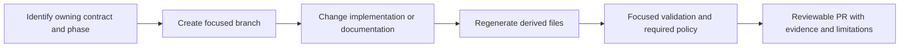

# Contributing to mainframe-env

Status: **Development contribution guide**

Contributions should preserve the project's deterministic-core, owned-contract,
bounded-resource, and fail-closed conformance rules. Read the
[project charter](docs/CHARTER.md), [architecture overview](docs/architecture/OVERVIEW.md),
and [verification strategy](docs/delivery/VERIFICATION-STRATEGY.md) before
changing a public or durable boundary.

## Development setup

Start with the [getting-started guide](docs/guides/GETTING-STARTED.md) to verify
your toolchain and run one local program. The repository pins Rust in
`rust-toolchain.toml` and commits `Cargo.lock`. Run commands from the checkout
root. Choose a focused package build/test while developing; the commands below
are the workspace integration entry points.

```bash
cargo build --workspace --all-features --locked
cargo test --workspace --all-features --locked --no-fail-fast
```

Some conformance suites additionally require PostgreSQL 18, a pinned CardDemo
checkout, a live Zowe client, cached IBM publication inputs, or a licensed IBM
environment. A skipped external test receives no evidence credit.

## Change workflow

Use a `codex/<topic>` branch from current `origin/main`. For documentation
contributions, begin with the [documentation authoring guide](docs/guides/README.md#maintain-documentation).
For a defect report, include the exact revision, command, sanitized fixture,
actual output, and expected behavior. Report security findings privately through
[SECURITY.md](SECURITY.md).



Find the owning phase in the [subsystem progress overview](docs/delivery/IMPLEMENTATION-STATUS.md)
and read its plan and progress record. Update that record after bounded work;
Cargo package versions and schema revisions remain build and compatibility metadata. Regenerate subsystem indexes
and navigation with `cargo xtask docs`.

1. Start from a clean branch and preserve unrelated user changes.
2. Identify the owning contract, provider, schema, and recovery boundary before
   editing. For IBM language or subsystem semantics, first search and read the
   relevant verified [cached IBM sources](docs/runbooks/IBM-DOCS-CACHE.md), then
   cite baseline/topic and catalog rows in the PR. Report source gaps explicitly.
3. Add a focused negative regression before or with a defect fix.
4. Regenerate derived files through `cargo xtask`; do not hand-edit generated
   Rust, catalogs, ledgers, or receipts.
5. Run the narrow affected tests, then the applicable gates below.
6. Update user-visible documentation and add a unique
   [`changes/unreleased`](changes/README.md) fragment in the same change. Do not
   edit `CHANGELOG.md` directly in parallel feature pull requests.
7. Keep implementation changes and source publication as separate decisions.

Install the repository-local documentation-manifest merge driver once per
clone before maintaining parallel worktrees:

```bash
python3 -B tools/setup_git_merge_drivers.py
```

Feature branches run `cargo xtask changelog --check` and continue to regenerate
the documentation manifest normally. Batch integration runs
`cargo xtask changelog` once to consume all fragments, update `CHANGELOG.md`,
and regenerate the manifest in one reviewed metadata commit.

## Verification scope

For every change, keep dependency/license policy and relevant documentation
checks. During development, select the narrowest meaningful test for the changed
behavior; expand only when a changed boundary or unresolved failure requires it.
The following is a command inventory for applicable gates, not a request to run
the entire list after every edit, commit, or PR operation. CI owns the selected
integration run; full and explicitly requested acceptance gates remain
required. See [the workflow](docs/runbooks/VERIFICATION-WORKFLOW.md).

| Change | Development validation |
|---|---|
| Prose/navigation | Documentation checks and policy; no unrelated runtime/oracle suite |
| Python/shell tooling | Affected tooling tests, shell syntax, source-input policy, docs |
| Rust behavior | Focused regression and affected package tests/lints |
| Shared/durable/public boundary | Affected consumers, compatibility, failure/recovery, backend parity |
| Oracle adapter, fixture, or semantic evidence | Relevant deterministic pilot first; required licensed/promotion gate at its acceptance boundary |

For a documentation change, the normal gate sequence is:

```bash
cargo xtask docs
cargo xtask docs --check
cargo xtask changelog --check
cargo xtask license-notices --check
cargo deny check
git diff --check
```

Preview changed Mermaid diagrams in a compatible renderer and verify runnable
examples when their commands or behavior change. Preserve generated navigation
markers and regenerate its registry-owned content. After each build/test/lint/
generator sequence, run `cargo clean` for this checkout and preserve receipts
outside disposable target directories. Do not clean shared or unrelated caches.

## Validation command inventory

```bash
cargo fmt --all -- --check
"$(tools/jenkins/select-python.sh)" -B tools/supply_chain.py check
cargo deny check
cargo xtask license-notices --check
cargo +1.95.0 check --workspace --all-targets --all-features --locked
cargo xtask spec --check
cargo xtask architecture-fast --check
cargo test --workspace --all-features --locked --no-fail-fast
cargo clippy --workspace --all-targets --all-features --locked -- -D warnings
RUSTDOCFLAGS='-D warnings' cargo doc --workspace --all-features --no-deps --locked
git diff --check
```

`cargo deny check` is mandatory for every change. License additions require an
explicit repository decision and complete distributable notice text; do not
silently waive a rejected dependency.

CI input changes must follow the reviewed process in
`docs/runbooks/CI-SUPPLY-CHAIN.md`. Floating actions, container tags, ambient
package installs, and unreviewed Jenkins plugins are rejected mechanically.

## Working-tree hygiene

Keep generated builds in `target/`, local bundles in `dist/`, and runtime state
in the ignored paths listed in `.gitignore`. Put personal exclusions in
`.git/info/exclude`; share repository-wide rules in `.gitignore`. Sanitized
environment templates such as `.env.example` and shared VS Code settings may
be committed. Python bytecode, local credentials, and service databases must
stay untracked.

Preserve both Cargo lockfiles, fuzz seed corpora, conformance fixtures/evidence,
and subsystem specifications. Avoid broad extension rules that hide these
inputs. Inspect ignored files before cleanup: local audit directories, generated
bundles, and unsupported offline experiments can contain useful work. Cleanup
should remove only identified disposable artifacts, not every ignored file.

## Public and durable changes

A public API, schema, effect encoding, artifact, checkpoint, session, store,
route, or migration change also requires:

- backward-compatibility and version review;
- malformed, bound, authorization, cancellation, and failure tests;
- restart, replay, rollback, and unknown-outcome tests when state can persist;
- parity across memory, SQLite, and PostgreSQL where the contract applies; and
- an ADR when ownership, dependency direction, or a stable boundary changes.

## Conformance evidence

Catalog presence is not semantic coverage. Every claimed result must retain its
row, obligation, gate, driver, candidate, fixture/environment, and oracle
identity through the shared Conformance IR. Local, modeled, GnuCOBOL, Hercules,
and historical results cannot grant licensed IBM differential credit.

Never commit proprietary IBM publication bodies, credentials, customer data,
raw secrets, local absolute paths, or a licensed oracle capture that the
repository policy requires to remain external.

## Reviewability

Keep modules and pull requests centered on one reason to change.
[ADR-0010](docs/decisions/0010-rust-module-review-budgets.md) enforces a hard
1,200-production-line maximum for new/non-exempt Rust modules; reviewed legacy
exceptions have exact non-growing ceilings and recorded stable split
boundaries. Large subsystem programs should use bounded work-package reviews
while incomplete behavior remains unreachable from the public profile; the
final integrated candidate must still pass the complete exit gate.

Security-sensitive findings should follow [SECURITY.md](SECURITY.md), not a
public issue.
