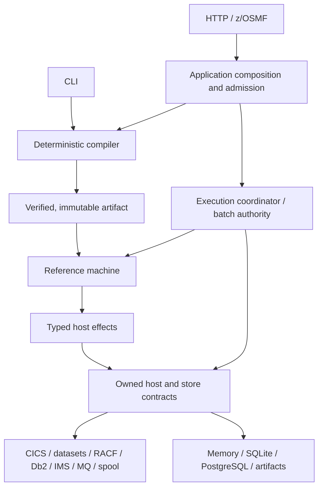

# mainframe-env

A Rust framework for compiling and executing bounded mainframe applications.
mainframe-env combines a deterministic COBOL compiler and interpreter with
owned contracts for CICS, JCL/JES, datasets, RACF/SAF, Db2, IMS, MQ, spool,
z/OSMF, and durable storage.

Use it to explore application behavior, build integration tools, and contribute
to mainframe compatibility work. Execution, resource limits, host effects, and
recovery have explicit owners, so an embedding application can compose providers
without moving language semantics into transport or storage adapters.

## Project status

| Item | Status |
|---|---|
| Distribution | Public source checkout; build with the pinned Rust toolchain |
| Work management | Named subsystems and phases |
| Implementation progress | [Subsystem progress](docs/delivery/IMPLEMENTATION-STATUS.md) |
| Production readiness | Not claimed |
| Licensed differential status | Pending where the owning subsystem record says so |

mainframe-env is an independent Apache-2.0 project. IBM documentation and
licensed systems serve as conformance authorities; local tests and modeled
results do not establish licensed IBM equivalence. Read the
[capabilities and limitations](docs/guides/CAPABILITIES.md) before selecting a
workload. The presence of a subsystem crate does not promise its entire API.

## Run your first program

Install Rust using the toolchain in [rust-toolchain.toml](rust-toolchain.toml)
(currently Rust 1.98.0), Git, and the platform's native linker/build tools. From
a source checkout:

```bash
git clone https://github.com/toreleon/mainframe-env.git
cd mainframe-env
cargo run --locked -p mainframe-env-cli --bin mainframe-env -- \
  run conformance/subsystems/platform/fixtures/cobol/HELLO.cbl --format fixed
```

The fixture prints a banner, `Hello, World!`, and `Goodbye!`. It runs locally
without a server, database, or licensed oracle. The
[getting-started guide](docs/guides/GETTING-STARTED.md) explains compilation,
inspection, COPY libraries, and troubleshooting.

## How it fits together



Semantic work stays deterministic; I/O, scheduling, persistence, and transport
sit behind owned contracts. The [architecture overview](docs/architecture/OVERVIEW.md)
and [current package map](docs/architecture/PACKAGE-MAP.md) explain the boundaries.

## Choose a path

| Goal | Start here |
|---|---|
| Evaluate the framework | [Getting started](docs/guides/GETTING-STARTED.md) and [capabilities](docs/guides/CAPABILITIES.md) |
| Embed it in a Rust application | [Embedding guide](docs/guides/EMBEDDING.md) |
| Start the development server | [Operations runbook](docs/runbooks/OPERATIONS.md) |
| Use CardDemo in your browser | [CardDemo application launcher](docs/runbooks/CARDDEMO-OPERATOR.md#run-and-use-the-application) |
| Understand mainframe terminology | [Glossary](docs/guides/GLOSSARY.md) |
| Contribute code or documentation | [Contributing](CONTRIBUTING.md) |
| Review public distribution | [Source distribution guide](docs/guides/DISTRIBUTION.md) |
| Find detailed contracts and subsystem plans | [Documentation portal](docs/README.md) |
| Report a vulnerability privately | [Security policy](SECURITY.md) |

## Build and verify

For a local CLI change, start with its focused suite:

```bash
cargo test --locked -p mainframe-env-cli
```

For workspace integration:

```bash
cargo build --workspace --all-features --locked
cargo test --workspace --all-features --locked --no-fail-fast
```

The [contribution guide](CONTRIBUTING.md) lists required policy checks and
validation by change type. Some integration gates require PostgreSQL, a pinned
CardDemo checkout, Zowe, or licensed IBM environments. Skipped gates receive no
evidence credit. The [verification strategy](docs/delivery/VERIFICATION-STRATEGY.md)
defines the complete assurance boundary.

## Repository map

| Path | Purpose |
|---|---|
| `crates/foundation/` | Source, diagnostics, encoding, and IR primitives |
| `crates/contracts/` | Compiler, execution, host, store, and coverage contracts |
| `crates/kernel/` | Compiler, interpreter, and application-package authorities |
| `crates/providers/` | Dataset, CICS, RACF, Db2, IMS, MQ, and spool implementations |
| `crates/apps/` | CLI, batch, and server composition |
| `crates/gateways/` | z/OSMF protocol translation |
| `crates/stores/` | Memory, SQLite, PostgreSQL, and artifact adapters |
| `crates/tooling/`, `xtask/` | Conformance, generation, and validation tooling |
| `conformance/` | Subsystem specifications, schemas, catalogs, fixtures, and tests |
| `docs/` | Guides, architecture, contracts, runbooks, and subsystem plans |

The superseded OpenMainframe workspace is an out-of-process compatibility
oracle, never a production source dependency. See
[compatibility and cutover](docs/delivery/COMPATIBILITY-AND-CUTOVER.md).

## License

mainframe-env uses the [Apache License 2.0](LICENSE). Project and third-party
attributions are in [NOTICE](NOTICE), with the approved decNumber ICU text in
[LICENSES/ICU.txt](LICENSES/ICU.txt). Dependency tooling generates target-specific
notices for the current build. Source publication does
not confer rights to IBM publications, customer data, or licensed oracle inputs.
