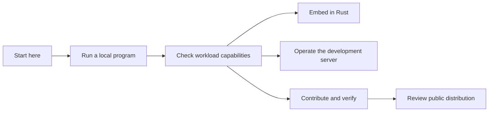

# mainframe-env documentation

This portal separates current operating guidance from normative architecture,
subsystem delivery records, and historical research. If two normative documents
conflict, use the precedence order below and record the conflict rather than
silently choosing one.

## Start here

New to the framework? Follow [getting started](guides/GETTING-STARTED.md),
then check [capabilities and limitations](guides/CAPABILITIES.md) against your
workload. The [glossary](guides/GLOSSARY.md) explains terms used throughout
the documentation. The [README](../README.md#project-status) describes the current source distribution
and subsystem management model.

| Goal | Document |
|---|---|
| Run a local COBOL program | [Getting started](guides/GETTING-STARTED.md) |
| Evaluate workload support | [Capabilities and limitations](guides/CAPABILITIES.md) |
| Embed the framework in Rust | [Embedding guide](guides/EMBEDDING.md) |
| Understand the product boundary | [Project charter](CHARTER.md) |
| Understand the system | [Architecture overview](architecture/OVERVIEW.md) |
| Build or test the workspace | [Verification strategy](delivery/VERIFICATION-STRATEGY.md) |
| Operate the development server | [Core-server operations](runbooks/OPERATIONS.md) |
| Track implementation progress | [Subsystem progress](delivery/IMPLEMENTATION-STATUS.md) |
| Prepare CICS application API work | [CICS application API progress](delivery/subsystems/cics/application-api-status.md) |
| Review subsystem risks | [Subsystem engineering review](reviews/SUBSYSTEM-REVIEW.md) |
| Contribute or report security issues | [Contribution guide](../CONTRIBUTING.md) and [security policy](../SECURITY.md) |
| Prepare public distribution | [Source distribution guide](guides/DISTRIBUTION.md) |

## Browse by subject

| Collection | What you will find |
|---|---|
| [Guides](guides/README.md) | Onboarding, capabilities, embedding, terminology and source distribution |
| [Architecture](architecture/README.md) | System boundaries, compiler/runtime flows and provider ownership |
| [Contracts](contracts/README.md) | Versioned persistence, transaction, effect interfaces |
| [Decisions](decisions/README.md) | Accepted design decisions and their superseding relationships |
| [Delivery](delivery/README.md) | Current subsystem plans/status, verification and compatibility policy |
| [Runbooks](runbooks/README.md) | Configuration, operations, recovery and environment-specific procedures |
| [Reviews](reviews/README.md) | Candidate-specific findings and follow-up boundaries |
| [Research](research/README.md) | Source coverage proposals and conformance investigations |
| [Implementation prompts](prompts/README.md) | Maintainer work instructions scoped to their original phases |

The generated navigation below is the complete registered contract/phase index.
Guides explain how to use those authorities; research, reviews and historical
records retain their original scope and do not silently redefine current support.

## Normative precedence

1. [Project charter](CHARTER.md)
2. Accepted or frozen architecture documents in [`architecture/`](architecture)
3. Versioned contracts in [`contracts/`](contracts)
4. Accepted architecture decisions in [`decisions/`](decisions)
5. Delivery, verification contracts in [`delivery/`](delivery)
6. Subsystem implementation prompts in [`prompts/`](prompts)
7. Runbooks, research, and status records

Machine-readable schemas, catalogs, and specifications under `conformance/` remain
authoritative for the exact identities and counts they own. Prose must not
silently override them. A later ADR overrides an earlier authority only when it
explicitly names that authority as superseded.

<!-- BEGIN GENERATED DOCUMENTATION NAVIGATION -->
## User and maintainer guides

- [Executable sandbox and agent setup](guides/MAINFRAME-SANDBOX.md)
- [Capabilities and limitations](guides/CAPABILITIES.md)
- [Embed mainframe-env in Rust](guides/EMBEDDING.md)
- [Getting started](guides/GETTING-STARTED.md)
- [Framework glossary](guides/GLOSSARY.md)
- [Review public source distribution](guides/DISTRIBUTION.md)
- [User and maintainer guides](guides/README.md)

## Documentation collections

- [Architecture reference](architecture/README.md)
- [Versioned contracts](contracts/README.md)
- [Delivery and verification](delivery/README.md)
- [Operations and verification runbooks](runbooks/README.md)
- [Research and source investigations](research/README.md)
- [Implementation prompts](prompts/README.md)

## Architecture and contracts

- [Project charter](CHARTER.md)
- [Architecture overview](architecture/OVERVIEW.md)
- [Package map](architecture/PACKAGE-MAP.md)
- [Compiler and IR](architecture/COMPILER-AND-IR.md)
- [COBOL runtime semantics](architecture/COBOL-RUNTIME-SEMANTICS.md)
- [Execution and durability](architecture/EXECUTION-AND-DURABILITY.md)
- [Security and capabilities](architecture/PLUGIN-AND-SECURITY.md)
- [Conformance IR](architecture/CONFORMANCE-IR.md)
- [Coverage authority](architecture/COVERAGE-AUTHORITY.md)
- [Dataset, VSAM, and AMS](architecture/DATASET-VSAM-AMS.md)
- [JES execution](architecture/JES-EXECUTION.md)
- [IBM MQ programming surface](architecture/MQ-PROGRAMMING-SURFACE.md)
- [MQ inquiry attribute source boundary](delivery/subsystems/mq/inquiry-source-boundary.md)
- [Application packages](architecture/APPLICATION-PACKAGES.md)
- [Batch controller registry](architecture/BATCH-CONTROLLER-REGISTRY.md)
- [CICS command routing](architecture/CICS-COMMAND-ROUTING.md)
- [CICS terminal control](architecture/CICS-TERMINAL-CONTROL.md)
- [Db2 application catalog](architecture/DB2-APPLICATION-CATALOG.md)
- [Host ABI source libraries](architecture/HOST-ABI-SOURCE-LIBRARIES.md)
- [Program and route registries](architecture/PROGRAM-AND-ROUTE-REGISTRIES.md)
- [Durable storage profile](contracts/DURABLE-STORAGE-PROFILE.md)
- [Canonical effect encoding](contracts/EFFECT-CANONICAL-V1.md)
- [Provider object-row persistence](contracts/PROVIDER-ROW-PERSISTENCE-V1.md)
- [Durable retention lifecycle](contracts/RETENTION-LIFECYCLE-V1.md)
- [Transaction participant contract](contracts/TRANSACTION-PARTICIPANT-V1.md)
- [Proposed named PROGRAM STATUS boundary](contracts/CICS-NAMED-PROGRAM-STATUS-V1.md)

## Architecture decisions

- [ADR-0001: Technology stack](decisions/0001-technology-stack.md)
- [ADR-0002: Deterministic core](decisions/0002-deterministic-core.md)
- [ADR-0003: Contract serialization](decisions/0003-contract-serialization.md)
- [ADR-0005: Historical package consolidation](decisions/0005-package-consolidation.md)
- [ADR-0006: CardDemo workload profile](decisions/0006-carddemo-profile.md)
- [ADR-0008: ICU license compliance](decisions/0008-icu-license-compliance.md)
- [ADR-0009: Current package topology](decisions/0009-current-package-topology.md)
- [ADR-0010: Rust module review budgets](decisions/0010-rust-module-review-budgets.md)
- [ADR-0011: Typed language HIR and semantic IR](decisions/0011-typed-language-hir-and-semantic-ir.md)
- [ADR-0012: Checked AMODE64 storage boundary](decisions/0012-checked-amode64-storage-boundary.md)
- [ADR-0013: CICS web service control boundary](decisions/0013-cics-web-service-control-boundary.md)
- [ADR-0014: Named-counter pool authority](decisions/0014-named-counter-authority.md)
- [ADR-0015: CICS operator reply boundary](decisions/0015-cics-operator-reply-boundary.md)
- [ADR-0016: CICS TCP/IP ingress context](decisions/0016-cics-tcpip-ingress-context.md)
- [ADR-0017: CICS immediate START target authority](decisions/0017-cics-immediate-start-target-authority.md)
- [ADR-0018: CICS START ATTACH lifetime](decisions/0018-cics-start-attach-lifetime.md)
- [ADR-0019: BTS lifecycle authority](decisions/0019-bts-lifecycle-authority.md)
- [ADR-0020: Conversation peer exchange ledger](decisions/0020-conversation-peer-exchange-ledger.md)
- [ADR-0021: Conversation ISSUE control staging](decisions/0021-conversation-issue-control-staging.md)
- [ADR-0022: ISSUE PASS target handoff](decisions/0022-issue-pass-target-handoff.md)
- [ADR-0023: BTS lifecycle authority](decisions/0023-bts-lifecycle-authority.md)
- [ADR-0024: Per-assertion oracle provenance](decisions/0024-per-assertion-oracle-provenance.md)
- [ADR-0025: Licence and provenance policy for IBM oracle evidence](decisions/0025-licence-and-provenance-policy.md)
- [ADR-0026: CardDemo run bundle](decisions/0026-run-bundle.md)
- [ADR-0027: CICS task ownership across logical program frames](decisions/0027-cics-logical-program-frames.md)
- [ADR-0028: Db2 typed catalog evolution](decisions/0028-db2-typed-catalog-evolution.md)
- [ADR-0028: Shared MQ handle-family kernel](decisions/0028-mq-shared-handle-kernel.md)
- [ADR-0029: Audited provider publication under a retained intent](decisions/0029-audited-provider-publication.md)
- [ADR-0029: Db2 core participant evolution](decisions/0029-db2-core-participant-evolution.md)
- [ADR-0030: Private MQ host lifecycle directory](decisions/0030-mq-host-lifecycle-directory.md)
- [ADR-0031: One selected MQ service authority](decisions/0031-mq-selected-service-authority.md)
- [ADR-0032: MQ program-to-machine frame handoff](decisions/0032-mq-program-machine-frame.md)
- [ADR-0033: Complete MQMD value primitive](decisions/0033-mq-full-md-value.md)
- [ADR-0033: MQ historical handle observation](decisions/0033-mq-historical-handle-observation.md)
- [ADR-0034: MQ root publication framework](decisions/0034-mq-root-terminal-publication.md)
- [ADR-0035: Volatile task-root MQI ABI aliases](decisions/0035-mq-root-scoped-abi-aliases.md)
- [ADR-0036: Explicit pending Conformance IR obligations](decisions/0036-conformance-pending-obligations.md)
- [Decision index and template](decisions/README.md)
- [ADR-0034: Bounded GSAM logical record addresses](decisions/0034-gsam-logical-address.md)
- [ADR-0031: IMS TM recovery publication and work settlement](decisions/0031-ims-tm-recovery-publication.md)
- [ADR-0035: Versioned selected database PCB feedback](decisions/0035-selected-pcb-feedback.md)
- [ADR-0037: Private IMS recovery retention fence](decisions/0037-private-ims-recovery-retention-fence.md)
- [ADR-0038: Real logical child physical-path key feedback](decisions/0038-logical-child-physical-key-feedback.md)
- [ADR-0039: Last remaining direct child SSA selection](decisions/0039-last-direct-child-ssa-selection.md)
- [ADR-0040: Private primary level witnesses and search boundary](decisions/0040-primary-level-position-search-boundary.md)
- [ADR-0041: First direct child SSA selection](decisions/0041-first-direct-child-ssa-selection.md)
- [ADR-0042: Private IMS TM output identity and local completion order](decisions/0042-ims-tm-output-identity-local-order.md)
- [ADR-0043: Checked provider read publication](decisions/0043-inquiry-checked-read-publication.md)
- [ADR-0044: Checked inquiry replay refusal settlement](decisions/0044-checked-inquiry-replay-refusal.md)
- [ADR-0033: Raw COBOL DL/I CALL and PCB binding contract](decisions/0033-cobol-dli-call-boundary.md)
- [ADR-0030: GSAM application record formats and owned length](decisions/0030-gsam-application-record-formats.md)
- [ADR-0032: Selected secondary checkpoint positions](decisions/0032-selected-secondary-checkpoint-position.md)
- [ADR-0036: Literal null SSA command slots](decisions/0036-null-ssa-command-slots.md)
- [ADR-0037: Running-step Program context transport](decisions/0037-running-step-program-transport.md)
- [ADR-0038: Private coordinator original dispatch extraction](decisions/0038-coordinator-original-dispatch-extraction.md)
- [ADR-0040: Batch run stop containment](decisions/0040-batch-run-stop-containment.md)
- [ADR-0043: Batch contained all-effect loan](decisions/0043-batch-contained-all-effect-loan.md)
- [ADR-0045: Batch prepared-selection observation](decisions/0045-batch-prepared-selection-plan.md)
- [ADR-0046: Bounded provider namespace prefetch](decisions/0046-batch-bounded-provider-prefetch.md)
- [ADR-0047: CardDemo participant ownership and batch completion](decisions/0047-carddemo-participant-completion.md)
- [ADR-0048: Persistent interactive CardDemo composition](decisions/0048-carddemo-interactive-application.md)
- [Executable application sandbox and agent boundary](decisions/0049-executable-agent-sandbox.md)
- [ADR-0028: Explicit BTS SET loan lifetime](decisions/0028-explicit-bts-set-loan-lifetime.md)
- [ADR-0029: COBOL storage-entry identity](decisions/0029-cobol-storage-entry-identity.md)
- [ADR-0030: Common CICS source condition authority](decisions/0030-cics-source-condition-authority.md)
- [ADR-0050: Boxed shared host-effect payloads](decisions/0050-host-effect-envelope-layout.md)
- [ADR-0051: Framed package identity and retained compatibility](decisions/0051-package-identity-framing.md)
- [ADR-0052: Borrowed CICS operation inputs](decisions/0052-cics-operation-contexts.md)

ADR-0009 supersedes ADR-0005 for current topology. Historical ADRs remain immutable records of the decisions they originally authorized.

## Delivery and development

- [Implementation roadmap](delivery/IMPLEMENTATION-ROADMAP.md)
- [Implementation status](delivery/IMPLEMENTATION-STATUS.md)
- [Unreleased changes and remaining work](delivery/UNRELEASED-STATUS.md)
- [Verification strategy](delivery/VERIFICATION-STRATEGY.md)
- [Compatibility and cutover](delivery/COMPATIBILITY-AND-CUTOVER.md)
- [z/OSMF compatibility API](delivery/ZOSMF-API.md)

Implementation progress is organized by subsystem and phase. Contract revisions and pinned IBM product baselines identify compatibility.

## Subsystem progress

- [Subsystem plans and acceptance contract](delivery/subsystems/README.md)
- [Subsystem dependencies and concurrency](delivery/subsystems/DEPENDENCIES.md)
- [Workload-profile track](delivery/subsystems/PROFILE-TRACK.md)
- [Subsystem implementation prompts](prompts/subsystems/README.md)
- [Subsystem project coordination](delivery/subsystems/GITHUB-PROJECT.md)
- [Coverage and conformance — Coverage authority](delivery/subsystems/coverage/foundation-status.md)
- [COBOL — Grammar and types](delivery/subsystems/cobol/structure-status.md)
- [COBOL — Execution semantics](delivery/subsystems/cobol/execution-status.md)
- [RACF / SAF — Commands and authorization](delivery/subsystems/racf/security-status.md)
- [Datasets / VSAM / AMS — Dataset services](delivery/subsystems/dataset/data-status.md)
- [JCL — Converter and planner](delivery/subsystems/jcl/planning-status.md)
- [JES2 and utilities — Jobs, spool and utilities](delivery/subsystems/jes/execution-status.md)
- [CICS — Application API](delivery/subsystems/cics/application-api-status.md)
- [CICS — SPI and FEPI](delivery/subsystems/cics/system-api-status.md)
- [z/OSMF — REST portfolio](delivery/subsystems/zosmf/rest-status.md)
- [Db2 — Engine and common SQL](delivery/subsystems/db2/core-status.md)
- [Db2 — Complete programming surface](delivery/subsystems/db2/programming-status.md)
- [IMS — DB / TM programming surface](delivery/subsystems/ims/programming-status.md)
- [IBM MQ — MQI programming surface](delivery/subsystems/mq/programming-status.md)
- [Cross-resource integration — Transactions and recovery](delivery/subsystems/integration/transactions-status.md)
- [Licensed certification — Differential certification](delivery/subsystems/certification/licensed-status.md)

## Operations

- [Core-server operations](runbooks/OPERATIONS.md)
- [Backup and restore](runbooks/BACKUP-RESTORE.md)
- [Capacity and recovery](runbooks/CAPACITY-AND-RECOVERY.md)
- [Local Jenkins](runbooks/JENKINS-LOCAL.md)
- [CardDemo operator guide](runbooks/CARDDEMO-OPERATOR.md)
- [CardDemo READACCT run bundle](runbooks/CARDDEMO-READACCT-BUNDLE.md)
- [CICS licensed pilot](runbooks/cics-licensed-pilot.md)
- [Conformance family rollout](runbooks/CONFORMANCE-FAMILY-ROLLOUT.md)

## Reviews and research

- [Subsystem engineering review](reviews/SUBSYSTEM-REVIEW.md)
- [Review index](reviews/README.md)
- [IBM official coverage roadmap](research/IBM-OFFICIAL-COVERAGE-ROADMAP.md)
- [Publication source probe](research/publication-source-probe.md)
- [CICS behavioral pilot](research/cics-behavioral-conformance-pilot.md)
<!-- END GENERATED DOCUMENTATION NAVIGATION -->

## Documentation governance

[`documentation-registry.json`](documentation-registry.json) identifies every
normative document, supplies the generated navigation above, and declares the
checked manifest location. It also owns subsystem phases, progress records,
prompts, target releases, and completion dependencies. Subsystem navigation and
indexes are generated from that mapping. Each normative document must state its status,
owner, scope, and first applicable mainframe-env version near its title.

Run `cargo xtask docs` after an intentional documentation change, then run
`cargo xtask docs --check`. The check verifies the generated
[`documentation-manifest.json`](generated/documentation-manifest.json), relative
links and anchors, documented xtask subcommands and options, normative metadata,
navigation, subsystem ownership and dependency consistency, and the
released/development version authorities.

## Document status vocabulary

| Status | Meaning |
|---|---|
| Proposed | Design input; not an implementation contract |
| Accepted | Normative decision for work in its stated scope |
| Implemented | Present in code with focused verification |
| Proven | Required cross-layer, failure, compatibility, and operational evidence passes |
| Historical | Immutable record of a prior candidate or decision |
| Superseded | Replaced by a named newer authority |

Every new normative document should state its status, owner or approving
authority, scope, and the version from which it applies. Historical records
should name their candidate and must not be rewritten as current truth.
