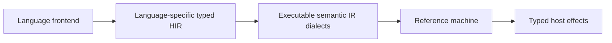

# Compiler and IR Architecture

Status: **Accepted by repository owner**
Owner: **compiler and IR maintainers**
Scope: **compiler stages, IR contracts, and publication pipeline**
Applies from: **mainframe-env current subsystem contracts**

## Goals

- Preserve exact source bytes, encoding, copybook/precompiler expansion, and
  provenance.
- Support analysis of incomplete programs without allowing incomplete state to
  become executable.
- Model language-specific meaning without forcing unrelated languages into one
  universal operation set.
- Make storage, aliasing, decimal behavior, control flow, conditions, and host
  effects explicit.
- Provide one reference path that can be interpreted and analyzed without a
  second semantic authority.
- Keep every compiler stage deterministic and bounded.

## Source model

`SourceBundle` owns the complete semantic input closure:

```text
primary source bytes
declared encoding and source format
copybooks/includes and exact bytes
precompiler inputs and versions
compiler options and dialect
logical paths and content identities
expansion/provenance graph
```

Source identity is computed from exact bytes and declared semantic metadata.
Physical absolute paths, timestamps, and directory enumeration order are not
semantic identity.

Host ABI copybooks are ordinary explicit source-library inputs. Their CICS,
Db2, or MQ provider owns exact bytes, version, license, and provenance; the
compiler neither embeds those assets nor chooses a subsystem generation.

Decoding does not discard byte provenance. Mainframe sources may originate in
EBCDIC or fixed-column formats, so diagnostics retain a mapping between logical
characters, original byte ranges, and expansion origins.

## Syntax strategy

The authoritative compiler frontend uses:

1. language-aware source preprocessing;
2. a handwritten lexer where column, encoding, or contextual state matters;
3. an event-based or recursive-descent parser;
4. a lossless Rowan-style concrete syntax tree;
5. typed AST wrappers over the lossless tree; and
6. an independent semantic model.

Tree-sitter may provide editor tooling, but its tree is not compiler authority.
Parser-combinator or generated-parser libraries may be used for bounded local
grammars and protocols, not imposed as a universal frontend framework.

## Stage guarantees

| Stage | Guarantee |
|---|---|
| `LosslessSyntax` | Represents every input token/trivia byte and recovery node |
| `ParsedProgram` | Typed syntax views exist; errors may remain in analyze mode |
| `SemanticProgram` | Names, layouts, types, scopes, calls, and effects resolved where possible |
| `VerifiedHir` | HIR invariants hold; unknown/recovery nodes explicitly non-executable |
| `LegalizedMir` | Every executable operation has a registered schema and backend route |
| `PublishedArtifact` | Immutable bytes and compatibility metadata committed atomically |

Typed dialect schemas attach their static validator through
`OperationSchema::semantic_contract`. The common verifier invokes that one
dialect-owned contract when constructing `VerifiedHir`, again when consuming a
`LoweredMir` into `LegalizedMir`, and while admitting serialized artifact bytes.
The compiler, artifact reader, and interpreter therefore do not carry separate
copies of decimal-plan or CICS-plan validation rules.

The HIR boundary intentionally uses storage-arena binding because executable
COBOL layout-definition operations do not exist there yet. At MIR and artifact
boundaries, each referenced slot must also have one exact
`mainframe.core.cobol@1.define` binding with the same storage identity, qualified
name, full extent, known category, and the required numeric/writable use.
`OperationSemanticContract::CobolLayoutDefinition` additionally validates every
executable definition's complete runtime-required ABI shape: required attribute
types, canonical boolean and size domains, section/category values,
PICTURE/digits/scale/sign coherence, numeric representation widths,
character/group/pointer category shapes, BYTE-LENGTH and object-class ownership,
LP-dependent pointer widths, OCCURS/static extent relationships, and bounded
DYNAMIC metadata. This same
dialect-owned schema is registered by compiler legalization, artifact admission,
and defensive `ReferenceMachine` admission; the interpreter retains defensive
decoding but is not a second static-rule authority. Each definition ABI is
decoded once into the verifier's bounded module index and reused by every plan
slot, so repeated references do not repeatedly parse PICTURE metadata. ODO
objects and ordered keys resolve through the owner-relative qualification
hierarchy before admission; key/index counts and statically known key extents
are bounded. `TYPEDEF` templates remain semantic-HIR declarations and are not
emitted as executable definitions or storage; only allocated `TYPE` instances
can bind runtime plans or ODO objects. The validator distinguishes storage
`REDEFINES`, level-66 `RENAMES` ranges, and level-88 condition associations
instead of treating every `alias_of` relation as the same overlay rule. Parent,
REDEFINES, and RENAMES definitions must resolve to the same declared storage
backing and offsets; a metadata-only alias over independent storage is rejected.
RENAMES preserves and verifies its range end and rejects an ODO within the
range. The supported level-88 numeric/alphanumeric subset is checked for
canonical operands, assignment class, extent, and increasing ranges by one
dialect validator shared with the frontend. The same validation covers plan wire version versus operation
major, operation identity, exact storage declarations, effects and runtime
imports, and the registered arithmetic-condition topology. Current values,
runtime subscripts, authorization, provider/resource generations, transaction
state, and checkpoint context remain runtime checks.

The bounded data-clause scanner resolves `OF`/`IN` qualification within the
emitted data-record hierarchy. An outer FD/SD file-name qualifier and the
high-to-low `::` spelling are not represented in the executable layout ABI;
those spellings fail before publication rather than falling back to token
interpretation. Carrying that owner metadata is a later #130 cutover, not part
of #140-#144.

Parsed and semantic construction is private to the compiler implementation.
The executable proof chain consumes verified HIR into lowered MIR and then
legalized MIR; publication encodes that legal module internally. Semantic
artifact identity uses `semantic-sha256:`, while the exact payload digest alone
uses the runtime `sha256:` artifact-reference namespace.

The current writer is artifact contract `mainframe-env.artifact@3`. It preserves
the separate semantic and content identities introduced by version 2 and adds
an exact `dialect_contracts` manifest set derived from the executable payload.
`mainframe-env.artifact@2` remains the historical pre-dialect-manifest contract.
For COBOL, both publication and read admission bind the manifest's effective
arithmetic, display-sign, and LP values to the immutable `config` operation in
the payload. Version 3 requires all three markers. The retained version-2 reader
applies only its documented LP(32)/compatible-sign defaults in the admitted
view and never rewrites historical bytes.
Its explicit reader validates the canonical binary envelope and executable
profile before deriving an in-memory dialect manifest; it neither rewrites the
payload nor fabricates a version-3 semantic identity. The release and current
conformance inventories therefore name version 3, while historical inventories
remain bound to their original versions.
Version 1 compiler outputs used a semantic digest in the `sha256:` namespace
and are not silently reinterpreted; they must be rebuilt so every executable
reference can be verified against the exact payload bytes.

Analyze mode may return partial syntax, AST, semantic, or HIR results with
diagnostics and completeness metadata. It may never construct a publishable or
executable artifact.

## Semantic execution boundary

[ADR-0011](../decisions/0011-typed-language-hir-and-semantic-ir.md) makes the
target boundary explicit:



`VerifiedHir` is a common proof-stage wrapper, not a universal language HIR.
COBOL, PL/I, HLASM, and REXX retain independent HIR types and verification
rules. They may reuse generic IR containers and semantic primitives without a
shared language enum or COBOL types leaking into another frontend.

For each migrated operation family, the frontend resolves statically knowable
grammar, reference identity, policies, and control edges. The executable form
must not require the machine to search statement strings for separators or
options. Runtime subscripts, values, authorization, resource state, provider
generation, transactions, and dynamic SQL remain runtime inputs.

## IR object model

The IR framework provides:

- typed, stable-width IDs backed by deterministic vector arenas;
- modules, regions, blocks, operations, operands, results, attributes, and
  source locations;
- explicit storage regions, extents, aliases, overlays, and references;
- structured and CFG control-flow forms;
- ordered effect declarations;
- namespaced operation and type identities with dialect-major versions;
- provenance chains from generated operations to original source bytes; and
- resource limits checked before allocation and during verification.

The in-memory IR does not depend on a persistence codec. Codecs are adapters
that translate through a validated envelope.

## Dialects

The common framework does not define a language enum. Dialects own operation
and type families. Shared primitives are deliberately narrow, while observable
language and subsystem semantics stay specialized, for example:

```text
cobol.hir                 language-specific analysis
memory.* / decimal.*      genuinely shared semantic primitives
string.* / control.*      genuinely shared semantic primitives
cobol.*                   specialized COBOL execution
cics.* / db2.* / ims.*   specialized host semantics
mq.* / dataset.*          specialized host semantics
```

The current shared decimal assignment boundary is
`mainframe.decimal@2.assign` with a
`mainframe-env.decimal-assignment-plan@2` payload. The plan, rather than its
producer name, selects an 18- or 34-digit/truncating arithmetic context, the explicitly
COBOL-owned numeric-storage ABI, captured-operand/receiver-local update rules,
the COBOL size-error condition contract, and per-receiver rounding. A receiver
that overflows is preserved when `ON SIZE ERROR` is declared and receives its
truncated result otherwise; successful sibling receivers commit before the
condition branch is selected. A bounded
`ledger.formula@1` adapter exercises this contract through ordinary IR
verification and reference-machine execution without importing COBOL HIR.
This proves reuse of the IR framework and declared arithmetic behavior, not a
universal HIR or a complete second language. The historical operation/plan @1
pair remains an exact, allowlisted COBOL compatibility route; version or policy
mismatches fail closed.

For `ADD CORRESPONDING`, COBOL HIR resolves pairs from the leaf name plus the
relative qualifier path below each selected group, requires uniqueness on both
sides, and excludes subordinate `FILLER`, `REDEFINES`, `RENAMES`, `OCCURS`,
index, and pointer-family items. The selected groups themselves are treated
separately: a valid table-group subscript remains on an explicit compatibility
route that preserves the selected occurrence, while a missing required
subscript or reference modification is rejected before publication. UTF-8
groups are currently outside the representable `ADD CORRESPONDING` typed slice;
that implementation limitation is an explicit compile-time rejection, not a
claim that the COBOL construct itself is invalid. Numeric `USAGE NATIONAL`
pairs are also rejected explicitly until a versioned storage ABI supports their
national-byte encoding; they must never be misclassified as an empty
corresponding set.

A language may retain a valid independent HIR while still sharing lifecycle,
diagnostics, effects, host capabilities, artifact publication, and execution
contracts.

An operation's dialect, name, and major version form one immutable semantic
identity. An incompatible operand shape or meaning uses a new identity or
major; an existing major is never reinterpreted based on which optional
attributes happen to be present.

## Operation catalog

Operation metadata is declared once in a readable, versioned catalog. A catalog
entry owns:

```text
operation identity and dialect version
operand/result constraints
attribute schema
effects and ordering
required host interfaces and capabilities
verification and legalization rules
supported reference-interpreter route
documentation and support state
```

Deterministic generation may produce Rust descriptors, schema documents,
registry entries, and support documentation. Generated
bindings are never the only readable statement of the contract.

Execution handlers and lowering implementations are written explicitly and
registered against catalog identities. The build fails when a supported
executable operation lacks verification, legalization, or a selected backend
route.

## COBOL organization

COBOL is large enough to require separate syntax and semantic/compiler
responsibilities. ADR 0005 keeps them as private modules in one platform.runtime-integration compiler
crate because they have no independent consumer or publication boundary.

```text
mainframe-env-compiler::syntax
  source formats
  preprocessor and COPY expansion
  lexer
  lossless CST
  typed AST

mainframe-env-compiler::{semantic,hir,lower}
  semantic analysis
  layout and storage
  HIR construction and verification
  lowering by operation family
  compiler plugin facade
```

Lowering is organized by domain:

```text
lowering/
  context.rs
  control.rs
  data.rs
  arithmetic.rs
  string.rs
  file.rs
  program.rs
  cics.rs
```

A `LoweringContext` owns builders, layouts, symbols, CFG state, limits,
diagnostics, and provenance. Domain modules do not reconstruct or bypass those
invariants.

## Non-program language paths

JCL lowers to an immutable typed job/workflow plan executed by JES and batch
services, not to an ordinary program for the reference machine. It is the
bounded second-frontend proof for the initial typed-HIR migration. BMS, CSD,
and similar resource DSLs remain separate subsystem-owned parser/resource
paths; their target is versioned resource artifacts consumed by the owning
subsystem, but this slice does not relabel their current in-memory models as
such. These paths reuse source, provenance, artifact, security, store, and
conformance contracts where justified without pretending to share a
programming-language HIR or execution loop.

## Reference backend

The deterministic MIR interpreter is the only platform.runtime-integration execution backend and the
semantic oracle. Symbolic, Cranelift, LLVM, and Wasm backends are post-platform.runtime-integration
decisions and introduce no platform.runtime-integration implementation obligation.

An optimized backend is promoted only when:

- every emitted operation is supported;
- exact semantic differential passes;
- overflow, encoding, decimal, alias, condition, and effect behavior matches;
- cancellation and resource limits remain observable; and
- fallback is explicit rather than automatic and silent.

If a native backend is added later, its types do not appear in public artifacts
and its API remains confined to an adapter crate.

## Artifact identity

Artifact identity is a SHA-256 digest over a canonical semantic manifest that
includes:

- exact source/dependency content identities;
- compiler and frontend generation;
- normalized compilation options;
- target and backend contract;
- IR contract and the exact executable `dialect_contracts` namespace/major set;
- precompiler and code-generation inputs; and
- required host interface versions.

The hash is not computed from ordinary Protobuf, JSON, Rust debug, or map
serialization output. Artifact payload bytes have their own integrity digest.

Artifact readers accept only documented IR envelope, dialect-major, and host
ABI combinations. Writers emit the current combination. Historical operation
majors remain executable through their registered handlers or fail with an
explicit compatibility error; new semantics never silently replace them.
