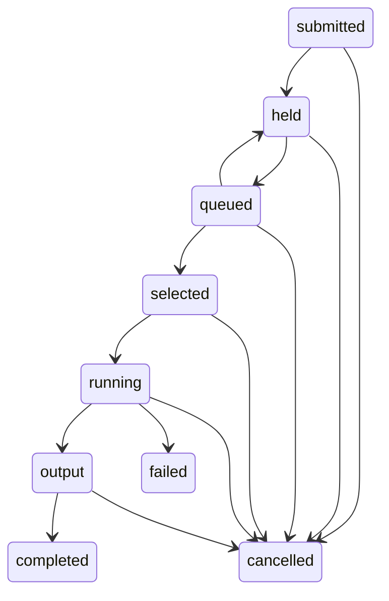

# JES execution, scheduling, spool, and utilities

Status: **Normative from mainframe-env jes.execution**
Owner: **JES, batch, and spool maintainers**
Scope: **JES execution, scheduling, spool, and utility behavior**
Applies from: **mainframe-env current subsystem contracts**

## Authority boundary

`mainframe-env-batch` owns deterministic JES-observable state transitions. It
does not own a second work queue, dataset catalog, lock table, security policy,
effect journal, checkpoint store, artifact store, or program catalog. Durable
job projections use `ProviderStateStore/jes-job`; asynchronous claims continue
through the common `WorkStore`; dataset DD effects use the dataset.data dataset
authority; and every admission, selection, execution, output, and control route
uses the racf.security SAF authority.

JCL remains a non-program language path under
[ADR-0011](../decisions/0011-typed-language-hir-and-semantic-ir.md): its
frontend produces an immutable typed `JobPlan` consumed by these JES/batch
authorities. The plan is not lowered to a pretend program operation or driven
through the ordinary reference machine. Individual registered program steps
may invoke that machine after JES has resolved the step and its typed DDs.

The public contracts are:

- `mainframe-env.jes-runtime@1` for class, initiator, queue, lifecycle, control,
  condition, and cancellation values;
- `mainframe-env.jes-durable-job@2` for the bounded durable job projection;
- `mainframe-env.jes-checkpoint@1` for restart-safe step/effect progress;
- `mainframe-env.jes-spool@1` and `mainframe-env.jes-output@1` for spool files
  and output groups;
- `mainframe-env.spool-request@2`, `mainframe-env.spool-result@2`, and
  `mainframe-env.spool-state@1` for the typed host-provider and its durable
  authority; and
- `mainframe-env.jes-utility-registry@1` for typed utility registrations.

## Lifecycle and scheduling

The projected lifecycle is:

No state may jump directly from queued to running or completed. Selection is a
durable transition naming the initiator. Eligible work is filtered by enabled
initiator, configured classes, initiator capacity, per-class capacity, and
priority range; it is then selected by descending priority and ascending JES
job number. A warm start returns a selected or running job to the execution
queue unless its bounded attempt limit is exhausted. A durable output-phase
job completes without re-executing program or dataset effects.

z/OSMF submission parses, authorizes, and durably admits the job and one typed
work record, then returns the accepted job identity while it is still active.
It never claims or executes work on the request thread. A fixed two-worker pool
claims only `mainframe-env-batch@1` records by priority and durable admission
order and must process whichever valid JES item it receives; workers do not
reject another principal's item or search for the submitting request's item.
Each work payload
binds the job ID, normalized owner, and bounded capability set. The worker
reconstructs a least-authority invocation for that owner and verifies it
against the durable job before dispatch, preserving multi-user isolation. The
invocation also binds the durable work ID so installed COBOL execution observes
cancellation changes made after dispatch.

The capability set comes only from the validated `JobPlan`: typed DDs,
recognized execution programs, and a durable installed-program binding.
Searching raw JCL, comments, or inline data for `EXEC SQL`, `EXEC DLI`, MQ, or
dataset spellings is prohibited. Db2, IMS, and MQ routing grants remain
insufficient on their own; each provider resolves and SAF-authorizes its exact
table, PSB/database, queue, or unit of work before dispatch.

All workers share a persisted Unix-millisecond logical clock. A wall-clock
advance moves it forward; an equal or regressed wall reading advances the
stored logical value by one. Claims, periodic heartbeats, deferrals,
cancellation, completion, and dead-letter transitions supply that clock plus
the lease ID and monotonic fencing epoch. A crashed worker leaves its lease for
expiry; a later process can reclaim it only at a higher epoch. Pool tasks run
blocking batch execution outside HTTP/runtime worker slots, retain a lease with
heartbeats, and stop claiming before graceful shutdown waits for in-flight
items. Queued durable items remain available to the next process.

Each step records `pending`, `allocating`, `running`, `disposing`, and one exact
terminal state. Bypassed-restart and skipped-condition states are explicit.
Completed steps retain their return codes across retry. An abended step retains
its code and permits only applicable `EVEN` or `ONLY` cleanup steps before the
job publishes the original abend. Return codes outside 0 through 4095 fail
closed rather than becoming successful output.

## DD, effect, and restart rules

DD resolution is a typed phase over the immutable jcl.planning plan. Allocation,
catalog, GDG, member, record, lock, and lifecycle effects are requests to the
dataset.data dataset authority. Mutations use stable job/step/effect identities. JES
checkpoints retain the completed-step set, monotonic effect sequence, temporary
and GDG resolution map, cancellation state, and an integrity digest. A retry
must replay recorded provider results or surface `unknown-outcome`; it may not
assume a lost acknowledgement means that no effect occurred.

Normal and abnormal DISP are evaluated only after the typed program outcome is
known. Concatenation remains ordered. Temporary datasets are scoped to the job
identity and are removed at their specified terminal disposition or bounded job
cleanup. Cross-resource outcomes remain explicit under the common UOW contract;
jes.execution does not claim the integration.transactions mixed-provider matrix.

`mainframe-env.jes-dd-allocation@1` classifies every accepted DD as dataset,
inline data, DUMMY, or SYSOUT before an effect is issued. Dataset status and
normal/abnormal dispositions are position-validated and defaulted explicitly;
invalid source combinations, output concatenations, temporary cataloging, and
abnormal PASS fail closed. OLD and MOD obtain exclusive dataset-wide ownership,
SHR obtains shared ownership, and duplicate references are folded into the most
restrictive single lock. The lock is owned by the submitting principal and
scoped by job identity in the shared dataset authority, so two jobs owned by the
same principal still conflict correctly.

New non-GDG datasets begin in the dataset authority's allocated state. CATLG
publishes the cataloged lifecycle state and UNCATLG returns it to allocated;
catalog listing omits allocated entries while direct allocated-name access
remains possible. MOD writes use the typed append request. Compatible
concatenations use the authority's bounded ordered concatenation request, while
mixed inline/member groups are read in declared order with the same aggregate
bound. PASS retains a job-scoped temporary allocation between steps, and a
terminal cleanup pass removes any remaining temporary datasets. A partial
allocation failure applies abnormal disposition to completed allocations and
releases every acquired lock before it is surfaced.

## Spool and output

Spool files and output groups have stable identities, exact job/step/DD
ownership, class, destination, writer/forms selection, counts, bounded
retention, and an explicit held/released/selected/complete/cancelled/purged
state. Large payloads use the common artifact/object-store boundary while SQL
metadata remains the durable authority. Output access and every state mutation
are SAF checked. Purge removes metadata and referenced payloads only after the
terminal transition succeeds; an indeterminate delete remains visible for
reconciliation.

The spool provider keeps bounded metadata and replay receipts in
`ProviderStateStore/jes-spool`. Each append creates an immutable
`mainframe-env.spool-chunk@1` artifact containing the exact record bytes and
then CAS-publishes its reference. A failed metadata publication deletes the
unpublished artifact; if compensation cannot be established it returns
`unknown-outcome`. Reads validate the artifact identity, media type, digest,
job, file, sequence, record count, and byte count before returning data.

At job terminal transition every file is sealed. Non-held output enters
awaiting-selection; held output remains held. Authorized controls provide the
only held-to-released, released-to-selected, selected-to-complete, reroute, and
purge transitions, and update the job projection by CAS. The SAF resource is
the active `JESJOBS` class with `JOB.<job-name>.<stable-spool-or-output-id>` so
authorization happens before artifact access or mutation. The product grants
only the matching typed `host.spool.read` or `host.spool.write` capability to
each request.

Purge first writes a durable `purge_pending` intent, then deletes all referenced
artifacts, and only then publishes the purged tombstone and removes terminal
job metadata. An artifact-delete failure leaves the intent visible and retryable
instead of claiming success. Retention cleanup uses the same authorized purge
path. Version-2 jobs containing legacy embedded records retain those bytes until
an authorized, idempotent provider migration completes and the job CAS clears
the embedded projection.

NJE and MAS are bounded routing and ownership abstractions over these same job,
work, and spool authorities. They are not a claim of physical JES2 sysplex,
SNA, printer, punch, or byte-for-byte spool implementation parity.

Every job records its submission kind and origin. External jobs retain an
external origin, internal-reader jobs retain the parent job and producing step,
and started tasks retain the authorized started-task name. Internal-reader
records are reparsed and admitted through the normal converter and durable job
authority; denied admission creates no child job. At the parent's claimed-work
boundary, each admitted internal-reader child receives one typed work record
using the child's own validated-plan capability set. This happens after the
parent's claimed run returns, so child ordering is deterministic and stricter
than z/OS, where an internal-reader child may start while its parent is still
running. Every child gets an admission attempt even if an earlier sibling
fails: a permanent failure (a capability outside the JES work allow-list or an
owner mismatch) cancels that child and verifies the cancellation before
continuing, while a transient failure (durable-store capacity or another
infrastructure problem) leaves the child queued with no work record and
releases the parent's own work for a later retry, bounded by that work's
`max_attempts`, instead of completing or dead-lettering it. Reclaiming an
already-admitted child validates its existing work record against the frozen
identity recorded at admission time, never against a fresh capability
recomputation, so a mutable registry change after admission cannot cancel or
duplicate it. Started-task start and stop use the `STARTED` SAF class, while
subsequent selection and job/output controls remain protected by the job
resource.

`mainframe-env.jes-topology@1` is the bounded NJE/MAS projection. Nodes expose
connected/enabled state and inbound capacity. MAS members name exactly one node
and expose enabled/active capacity. A queued or held job may be routed only to
available execution and output nodes; selection is then restricted to an
eligible member on the execution node. The selected member is recorded in the
same CAS-protected job projection as the lifecycle transition. It is an
operator-visible semantic owner, not a replacement for common `WorkStore`
claims, leases, retries, or cancellation.

Scheduler enablement and topology configuration have versioned single-writer
records in `ProviderStateStore/jes-scheduler` and
`ProviderStateStore/jes-topology`. `OPERCMDS` protects their start, stop, and
install controls. `JESJOBS` protects hold, release, cancel, class/priority
change, job routing, selection, output controls, access, and purge. Every
control validates its source state and all capacity/routing invariants before
publishing a CAS transition.

## Typed program and utility routing

The common program catalog resolves an external program name once into a typed
registration during job admission and retains it in the durable job projection.
JES dispatches only that registration: registered utility,
registered subsystem controller, or ordinary `ProgramService`. The execution
loop validates the step-to-registration binding and does not resolve or branch
on a raw program name. Unknown ordinary programs reach `ProgramService`;
cataloged unavailable routes fail explicitly. A missing or substituted durable
registration fails before any step effect.

The required utility identities are IEFBR14, IEBGENER, IEBCOPY, IEBCOMPR,
IEBDG, IEBEDIT, IEBUPDTE, IDCAMS, and SORT. Their typed families are allocation,
copy, compare, generation, edit, update, catalog, sort, and diagnostic. A
utility may emit an explicit condition or unavailable capability, but it may
not return a DD-count or command-name summary as semantic success.

IEFBR14 applies only typed allocation/DISP effects. IEBGENER and IEBCOPY copy
exact records from their selected input DD to output DD; IEBCOMPR returns CC 0
or 8 from byte-exact comparison. IEBDG implements a bounded deterministic
DSD/FD/CREATE record generator. IEBEDIT selects a bounded job or positional
range and optional step into SYSUT2. IEBUPDTE applies one explicit ADD/REPL
member body to the allocated SYSUT2 member. IDCAMS remains the typed
dataset/catalog command family, and SORT performs bounded record ordering and
OUTREC projection. Unsupported controls fail explicitly before output
mutation; diagnostic record counts are not used as proof of semantic success.

Batch `ProgramService` requests also carry an optional typed execution context
containing the validated job and step names. When a compiled COBOL module
declares the complete conventional PSA/TCB/TIOT linkage layout, the interpreter
uses that context and the allocated DD names to install one bounded synthetic
low-storage chain before execution. Modules that do not declare the layout are
unchanged; partial, disconnected, oversized, or malformed layouts fail closed.
The initializer patch is limited to the pointer field and preserves unrelated
COBOL `VALUE` data. This is an application-compatibility model for programs
that inspect TIOT names, not a physical MVS control-block or JES2 spool parity
claim.

## Evolution and recovery

Writers emit durable job version 2. Version 1 remains readable and migrates by
CAS, preserving all legacy fields and deriving pending step executions from the
immutable plan without running effects. A failed or conflicting migration
publishes no partial state. The finite reader range and rollback projection are
recorded in
`conformance/subsystems/jes/migrations/jes-durable-job-v1-to-v2.json`.

Step transitions publish the job projection first and then a digest-bound
`mainframe-env.jes-checkpoint@1` envelope through the common `CheckpointStore`.
An unavailable checkpoint acknowledgement is `unknown-outcome`; the running
job remains visible for warm recovery. A checkpoint may lag its job, but it may
not be ahead, name a nonterminal committed step, change principal/transaction,
or fail its payload/job-state digest. After restart, terminal steps are retained
and skipped, while incomplete steps return to pending below the bounded attempt
limit. Attempt exhaustion becomes terminal failure without reexecution.

Cancellation before selection terminates the queued job without starting a
step. A cancellation observed during execution records observed and completed
states in the step, job, output, and common checkpoint projections. Finalization
uses a cancellation-cleared control context for only the SAF-authorized cleanup
and terminal records; workload effects remain cancelled. Purge writes a job
intent before deleting spool artifacts and the common checkpoint. Any uncertain
cross-resource delete leaves that intent visible and retryable.

The supported full-state backup profile uses the SQLite authority with
provider-backed spool artifacts, so `VACUUM INTO` captures job, spool metadata,
artifact chunks, checkpoints, scheduler, and topology together. Restore must
pass database integrity plus every authority's open-time semantic validation
before serving data.

Licensed z/OS 3.2/JES2 observations remain a distinct oracle authority. Local
models, CardDemo, generated catalogs, or historical transcripts cannot produce
`differential=pass`. `cargo xtask jes-oracle --check` accepts only a schema-valid
16-scenario receipt from an attested licensed z/OS 3.2 JES2 environment whose
candidate digest matches the live repository. Under the user-approved
2026-09-04 development disposition, absence of that receipt leaves differential
credit at 0/16 and does not block jes.execution implementation completion; the unchanged
campaign remains a hard certification.licensed release-certification gate. Hercules, MVS 3.8J,
local models, and current-product observations receive zero licensed credit.
