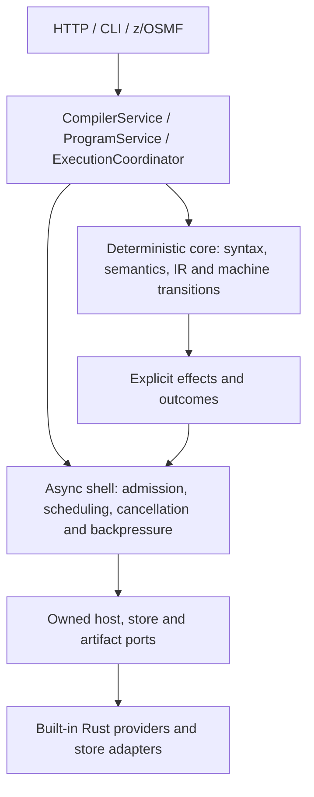
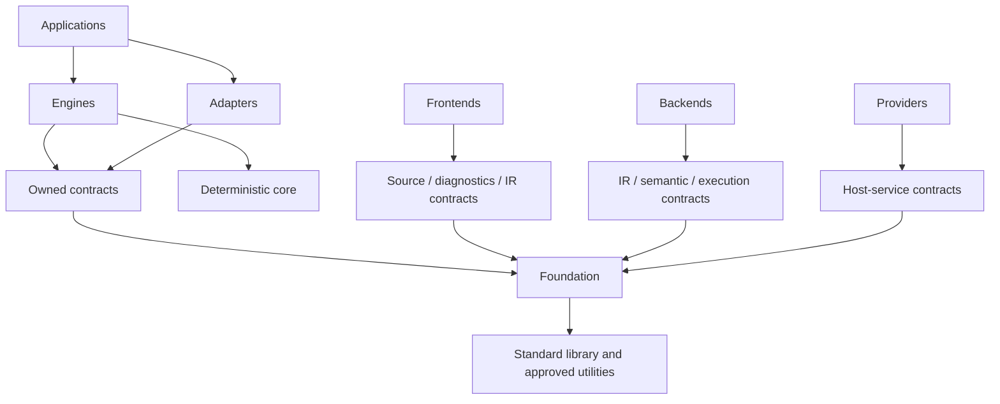
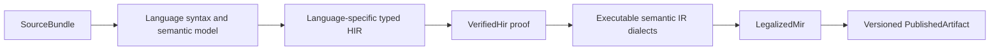

# Architecture Overview

Status: **Accepted by repository owner**
Owner: **architecture maintainers**
Scope: **system layers, dependency direction, and maintainability rules**
Applies from: **mainframe-env current subsystem contracts**

## Architectural style

mainframe-env uses a deterministic functional core surrounded by an
asynchronous hexagonal shell.



## Dependency rule

Dependencies point inward toward stable contracts and deterministic domain
types.



Arrows here mean permitted dependency direction. They describe architectural
roles, not additional crates; the [package map](PACKAGE-MAP.md) lists the
current workspace boundaries.

Prohibited edges include:

- frontend to backend;
- compiler or semantic core to Tokio/Axum/SQLx/Wasmtime;
- engine to a concrete store or provider;
- gateway to frontend AST or mutable provider internals;
- production profile to conformance, Gym, Wiki, TUI, or deployment tooling;
- plugin to global application state; and
- stable contract to generated application code.

## Core runtime model

The execution engine drives a serializable machine. A machine performs pure
work until it needs an external effect, suspends, completes, or fails.

```rust
pub enum MachineDrive {
    Continue,
    HostCall(EffectRequest),
    Invoke(ChildInvocation),
    Transfer(Transfer),
    Suspended(Suspension),
    Completed(Completion),
    Failed(ExecutionProblem),
}
```

The concrete Rust representation may change, but the semantic alternatives are
normative. Cancellation, timeout, overload, conditions, ABEND, transfer, and
infrastructure failure remain distinguishable.

## Core compiler model

Compiler stages are represented by distinct opaque types and language-owned
semantic models:



Frontend parsed and semantic stages remain compiler-private. The public proof
chain consumes verified HIR into lowered MIR, legalized MIR, and finally an
artifact whose bytes are encoded internally. A later stage cannot be
fabricated by supplying completeness, an identity, an unrelated source, or
arbitrary payload bytes.

Artifact identity has two non-interchangeable forms: `SemanticArtifactId`
describes source/compiler/manifest meaning and uses the
`semantic-sha256:` namespace; `ArtifactContentId` is the SHA-256 of the exact
published payload and is the only identity serialized as a runtime `sha256:`
artifact reference.

[ADR-0011](../decisions/0011-typed-language-hir-and-semantic-ir.md) prohibits a
universal language HIR. The generic IR is a multi-dialect container: shared
memory, decimal, string, control, and program primitives coexist with explicit
COBOL and subsystem operations. A migrated operation carries resolved operands
and policies instead of asking the machine or a provider to rediscover static
source grammar.

JCL follows a separate typed, versioned `JobPlan`/JES workflow and supplies the
current bounded second-frontend proof. BMS, CSD, and similar resource DSLs stay
on separate subsystem-owned parser/resource paths rather than entering the
ordinary program machine; standalone versioned serialization of their current
in-memory models remains a later resource-family slice.

## Conformance model

From cobol.structure onward, official catalog rows are connected to executable behavior
through the shared typed [Conformance IR](CONFORMANCE-IR.md). Behavioral tests
emit explicit `(row_id, obligation_id, gate, verdict)` events, and coverage
ledgers are derived from the complete mandatory-obligation set rather than
edited or inferred from broad workload success. The IR is a typed binding layer
over product-owned behavior, not a second semantic implementation.
Application profiles such as CardDemo remain integration consumers, not the
primary IBM conformance model.

## State scopes

Every mutable or durable object declares one scope:

| Scope | Examples | Ownership rule |
|---|---|---|
| Invocation | temporary compiler buffers | Destroyed at terminal result |
| Run unit | frames, DD bindings, transaction | One execution owner at a time |
| Session | terminal state, resume token | Suspended outside CPU workers |
| Region | CICS/provider region state | Provider-owned and capability-scoped |
| Singleton | registry publisher, config authority | Explicit single authority |
| Artifact | source, IR, executable, report | Immutable and content addressed |

Locks do not define scope. An object does not become concurrency-safe merely by
being placed behind `Arc<Mutex<_>>`.

## Product profiles and initial scope

The initial platform.runtime-integration release defined one product profile and one test profile.
Profiles are explicit dependency and capability closures, not informal sets of
Cargo features.

- **core-server**: COBOL, CICS, JCL/JES, dataset, RACF/security,
  z/OSMF, configuration, execution/compiler kernels, stores, and required
  observability;
- **conformance**: platform.runtime-integration core plus deterministic fixtures, differential oracle
  adapters, fuzz/property/model tests, and evidence generation.

Optional capability absence produces an explicit unavailable/unsupported
result. It never produces generic success.

Later accepted additions extend the workspace through versioned inventories.
The [current package map](PACKAGE-MAP.md) identifies all 26 packages; subsystem
[progress records](../delivery/IMPLEMENTATION-STATUS.md) identify their current
implementation boundaries. These initial profile definitions do not establish
completion of every later subsystem surface.

## Maintainability contract

- `lib.rs` files contain crate documentation, module declarations, and public
  re-exports, not implementation bodies.
- `pub(crate)` is the default visibility.
- A module has one primary reason to change.
- Large scenario suites live outside production modules.
- Generated code is isolated under `generated/` and has a readable normative
  schema or catalog as its source.
- Every crate README states ownership, non-goals, invariants, allowed
  dependencies, public surface, and verification entry points.
- [ADR-0010](../decisions/0010-rust-module-review-budgets.md) enforces a hard
  1,200-production-line limit for new/non-exempt Rust modules and exact,
  non-growing ceilings with stable split boundaries for existing exceptions.
- Generator-owned and test-only source handling, facade-only `lib.rs` files,
  and the CICS descriptor/handler-family layout are checked mechanically by
  `cargo xtask architecture-fast --check`.
- The [CICS command-routing contract](CICS-COMMAND-ROUTING.md) freezes the
  readable descriptor catalog and routes every typed operation through one of
  seven reviewed semantic-family modules.
- Architecture checks validate dependency direction and product-profile
  closures mechanically.
