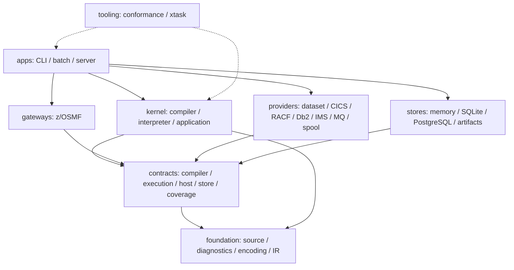

# Package map

Status: **Accepted; current topology governed by ADR-0009**
Owner: **architecture maintainers**
Scope: **current package ownership, dependency layers, and split boundaries**
Applies from: **mainframe-env current subsystem contracts**

## Scope rule

The current workspace owns compiler/execution infrastructure and bounded COBOL,
CICS, JCL/JES, dataset, RACF/SAF, z/OSMF, Db2, IMS, MQ, and spool surfaces.
Package presence does not establish complete subsystem support. Check
[capabilities](../guides/CAPABILITIES.md) and the owning
[progress record](../delivery/IMPLEMENTATION-STATUS.md) before selecting a workload.

The original platform.runtime-integration proposal was consolidated before implementation. This map
lists the accepted current packages rather than that superseded proposal;
[ADR-0005](../decisions/0005-package-consolidation.md) retains the historical
consolidation decision and [ADR-0009](../decisions/0009-current-package-topology.md)
governs the current topology.

## Package-boundary rule

A crate exists only when it enforces dependency direction, a versioned public
contract, an independently selected provider, or an application boundary.
Readability alone is handled with modules.

Module readability is governed by
[ADR-0010](../decisions/0010-rust-module-review-budgets.md) and the
[machine budget inventory](../../conformance/subsystems/cics/application/inventory/module-budgets.json).
New/non-exempt Rust modules have a hard 1,200-production-line maximum; an
oversized legacy module must retain its exact non-growing ceiling and split at
the recorded stable reason to change rather than creating an unjustified crate.

## Workspace directory map



Arrows summarize dependency direction by role. They are not an exhaustive Cargo
graph. Dashed arrows identify verification consumers; production packages do
not depend on tooling. The exact governed edges live in the machine inventories.

| Package reference | Layer | Source directory |
|---|---|---|
| [mainframe-env-source](../../crates/foundation/mainframe-env-source/README.md) | foundation | `crates/foundation/mainframe-env-source/` |
| [mainframe-env-diagnostics](../../crates/foundation/mainframe-env-diagnostics/README.md) | foundation | `crates/foundation/mainframe-env-diagnostics/` |
| [mainframe-env-encoding](../../crates/foundation/mainframe-env-encoding/README.md) | foundation | `crates/foundation/mainframe-env-encoding/` |
| [mainframe-env-ir](../../crates/foundation/mainframe-env-ir/README.md) | foundation | `crates/foundation/mainframe-env-ir/` |
| [mainframe-env-compiler-api](../../crates/contracts/mainframe-env-compiler-api/README.md) | contracts | `crates/contracts/mainframe-env-compiler-api/` |
| [mainframe-env-execution-api](../../crates/contracts/mainframe-env-execution-api/README.md) | contracts | `crates/contracts/mainframe-env-execution-api/` |
| [mainframe-env-host-api](../../crates/contracts/mainframe-env-host-api/README.md) | contracts | `crates/contracts/mainframe-env-host-api/` |
| [mainframe-env-store-api](../../crates/contracts/mainframe-env-store-api/README.md) | contracts | `crates/contracts/mainframe-env-store-api/` |
| [mainframe-env-coverage](../../crates/contracts/mainframe-env-coverage/README.md) | contracts | `crates/contracts/mainframe-env-coverage/` |
| [mainframe-env-store](../../crates/stores/mainframe-env-store/README.md) | stores | `crates/stores/mainframe-env-store/` |
| [mainframe-env-compiler](../../crates/kernel/mainframe-env-compiler/README.md) | kernel | `crates/kernel/mainframe-env-compiler/` |
| [mainframe-env-interpreter](../../crates/kernel/mainframe-env-interpreter/README.md) | kernel | `crates/kernel/mainframe-env-interpreter/` |
| [mainframe-env-application](../../crates/kernel/mainframe-env-application/README.md) | kernel | `crates/kernel/mainframe-env-application/` |
| [mainframe-env-dataset](../../crates/providers/mainframe-env-dataset/README.md) | providers | `crates/providers/mainframe-env-dataset/` |
| [mainframe-env-racf](../../crates/providers/mainframe-env-racf/README.md) | providers | `crates/providers/mainframe-env-racf/` |
| [mainframe-env-cics](../../crates/providers/mainframe-env-cics/README.md) | providers | `crates/providers/mainframe-env-cics/` |
| [mainframe-env-db2](../../crates/providers/mainframe-env-db2/README.md) | providers | `crates/providers/mainframe-env-db2/` |
| [mainframe-env-ims](../../crates/providers/mainframe-env-ims/README.md) | providers | `crates/providers/mainframe-env-ims/` |
| [mainframe-env-mq](../../crates/providers/mainframe-env-mq/README.md) | providers | `crates/providers/mainframe-env-mq/` |
| [mainframe-env-spool](../../crates/providers/mainframe-env-spool/README.md) | providers | `crates/providers/mainframe-env-spool/` |
| [mainframe-env-batch](../../crates/apps/mainframe-env-batch/README.md) | apps | `crates/apps/mainframe-env-batch/` |
| [mainframe-env-zosmf](../../crates/gateways/mainframe-env-zosmf/README.md) | gateways | `crates/gateways/mainframe-env-zosmf/` |
| [mainframe-env-server](../../crates/apps/mainframe-env-server/README.md) | apps | `crates/apps/mainframe-env-server/` |
| [mainframe-env-cli](../../crates/apps/mainframe-env-cli/README.md) | apps | `crates/apps/mainframe-env-cli/` |
| [mainframe-env-conformance](../../crates/tooling/mainframe-env-conformance/README.md) | tooling | `crates/tooling/mainframe-env-conformance/` |
| [xtask](../../xtask/README.md) | tooling | `xtask/` |

## Current governed topology

ADR-0005 described a 20-package consolidation target. The exact accepted platform.runtime-integration
machine inventory ultimately contains 24 workspace packages: the 20 boundary
packages in that target plus the server and CLI entry applications and the
conformance and xtask tooling packages. Later versioned additions introduced
`mainframe-env-coverage` (coverage.foundation) and `mainframe-env-spool` (jes.execution), so the current
workspace contains 26 packages.

The non-publishing `fuzz/` Cargo workspace is an isolated test driver rather
than a main-workspace package. Its nightly/libFuzzer dependencies, lockfile,
corpora, and generated artifacts do not enter a product package or release
closure; ADR-0008 records that boundary.

`conformance/subsystems/platform/inventory/packages.json` plus the versioned
`package-additions.json` files are the current machine authority. ADR-0005 is a
historical decision whose original count must not be used as current workspace
truth. [ADR-0009](../decisions/0009-current-package-topology.md) governs the
current topology and requires a new superseding decision for any package
addition, removal, layer move, or boundary-changing normal dependency.

IR codecs remain with `mainframe-env-ir`; CICS contracts remain with
`mainframe-env-host-api`; execution coordination remains with the interpreter
kernel; COBOL syntax, semantics, HIR, and lowering remain private modules of the
compiler kernel; JCL and JES share the batch state authority; and
memory/SQL/artifact adapters share the store package. These units do not require
independent platform.runtime-integration publication or provider selection boundaries. ADR 0005 records
the decision, and the exact accepted mapping and justification is
`conformance/subsystems/platform/inventory/packages.json`, its versioned additions, and
ADR-0009.

## Foundation packages

| Package | Owns | Must not depend on |
|---|---|---|
| `mainframe-env-source` | source bytes, IDs, formats, maps, COPY/precompiler provenance | language semantics, Tokio, stores |
| `mainframe-env-diagnostics` | stable diagnostic/problem DTOs and codes | Miette renderers, gateway types |
| `mainframe-env-encoding` | CCSID/EBCDIC conversion and collation primitives | compiler/execution engines |
| `mainframe-env-ir` | in-memory IR, verifier, versioned text/binary/envelope codecs | COBOL AST, backends |

Foundation encoding also owns `encode_ascii`, a bounded ASCII identity copy into
owned bytes. It preserves all 128 ASCII values, including controls, and rejects
non-ASCII before checking the caller's inclusive byte bound or allocating.
Fallible reservation has a distinct allocation error; no replacement, trimming,
CCSID mapping or locale selection occurs. This additive helper leaves CP037,
numeric primitives and the `mainframe-env.encoding@1` identity unchanged.

## Contract packages

| Package | Owns |
|---|---|
| `mainframe-env-compiler-api` | compiler stages, requests/results, legality, artifact descriptors |
| `mainframe-env-execution-api` | invocation, context, limits, outcomes, events, lifecycle identity, and the additive provider-neutral transaction participant descriptor |
| `mainframe-env-host-api` | dataset, program, JES/spool, terminal, security, clock, audit, and typed CICS requests/results |
| `mainframe-env-store-api` | execution, event, work, checkpoint, session, artifact metadata, idempotency stores |
| `mainframe-env-coverage` | immutable coverage evidence, typed Conformance IR, obligation/verdict projections and derived ledgers |

These packages expose only mainframe-env-owned types and remain independent of
Axum, Tokio, SQLx, concrete providers, and current-workspace crates.

## Kernel packages

### `mainframe-env-compiler`

Owns pipeline planning, compiler registration, pass execution, legality gates,
artifact fingerprinting, publication, and bounded caches.

### `mainframe-env-interpreter`

Owns the deterministic reference MIR machine and common execution coordinator:
admission, run units, machine driving, suspension/resume, cancellation,
host-effect sequencing, and transactional lifecycle journaling. It depends on
IR and execution/host/store contracts, never on COBOL syntax or concrete
providers/stores.

### `mainframe-env-application`

Owns content-addressed application manifests, atomic install selection, named
program generations, BMS/CSD resource forms, and validated dataset catalogs.
Dataset catalogs represent exact organization, record-format, record-length,
key, PDS member-extension, and GDG roll-policy metadata through host contracts;
they contain no provider state or local corpus paths.

## COBOL compiler modules

### `mainframe-env-compiler::syntax`

Owns source formats, preprocessing, COPY expansion, lexer, lossless CST, typed
AST, syntax diagnostics, and source provenance.

### `mainframe-env-compiler::{semantic,hir,lower}`

Owns semantic analysis, layouts, storage/alias meaning, HIR, verification,
lowering, and compiler integration. Its lowering modules are grouped by control,
data, arithmetic, strings, files, program control, and CICS.

## Batch package

### `mainframe-env-batch::jcl`

Owns JCL syntax, procedure/symbol expansion, DD and step model, conditions,
workflow plan, and dispatch through `ProgramService`. It does not instantiate
utility or COBOL implementations directly.

### `mainframe-env-batch::service`

Owns job lifecycle, admission, job/step identity, spool/SYSOUT, cancellation,
purge, status, and JES-facing host operations. JCL describes workflow; JES owns
job execution state.

### `mainframe-env-batch::controller`

Owns the bounded typed selector/plan contract and atomic installed-generation
registry. The server composition maps only a verified selected application
package's batch-controller section into this contract; JES never selects
application behavior by inspecting a workload name.

### `mainframe-env-batch::program`

Owns the generated common-program registry and typed builtin execution. The
same catalog supplies typed nested TSO and COBOL system-service selection to
the composing server; names never select behavior outside the registry.

## Provider packages

### `mainframe-env-dataset`

Owns the platform.runtime-integration dataset/catalog authority and storage adapters required by accepted
fixtures. Key-sequenced records are addressed by stable primary identity;
alternate-index paths retain ordered alternate/base identities and duplicate
policy. A record mutation and every affected index generation commit in one
provider-state transaction. Filesystem paths remain provider-private. Callers
use typed dataset host requests and DD bindings.

Seed installation consumes explicit bounded objects with declared fixed-record
lengths and SHA-256 identities. Dataset bytes, affected alternate indexes,
retained generation metadata, and the selected seed generation commit together;
compatible upgrade and rollback never consult the original local source path.

### `mainframe-env-cics`

Owns typed CICS provider behavior required by the platform.runtime-integration operation inventory,
including terminal/session, file, program control, conditions, transactions,
and EIB outcomes. The provider persists pseudo-conversational continuations,
transient-data records, and idempotent syncpoint intent/result decisions;
unresolved decisions remain unknown outcomes until explicit reconciliation.
Installed CICS FILE names resolve through a durable bounded alias catalog to
typed dataset or alternate-index names.
Protocol/UI implementations are not dependencies. CICS also owns the DFHAID
and DFHBMSCA compatibility source library; the compiler does not.

### `mainframe-env-racf`

Owns identity, authentication, SAF authorization, profiles, audit decisions,
and security conditions required by platform.runtime-integration. Callers never access its database or
locks directly.

### `mainframe-env-db2`

Owns the additive CardDemo static-SQL table, cursor, SQLCA, extraction, and
durable unit-of-work boundary. Interactive mutations remain staged until typed
commit or rollback; batch mutations use the same authority with batch commit
policy. Db2 owns its reached SQLCA compatibility source library.

### `mainframe-env-ims`

Owns the additive CardDemo HIDAM root/child hierarchy, PCB/PSB selection,
secondary index, DLI navigation and mutation, checkpoint, load/unload, and
durable commit/rollback boundary.

### `mainframe-env-mq`

Owns the additive CardDemo named queues, handles, trigger selection,
message/correlation identifiers, wait/no-message conditions, syncpoint gets and
puts, idempotent replay, unknown-outcome reconciliation, and restart state.
MQ owns its six reached CMQ* compatibility source members.

### `mainframe-env-spool`

Owns bounded durable JES spool metadata and immutable artifact-backed record
chunks, including append, read, seal, replay, restart, and intent-first purge.
JES scheduling and job lifecycle remain with the batch authority.

## Stores

| Package | Purpose |
|---|---|
| `mainframe-env-store` | bounded memory, SQLite/PostgreSQL metadata/state, and immutable local artifact adapters behind separate owned interfaces |

The MQ provider is an owned deterministic authority for the additive profile.carddemo
CardDemo profile, not an external broker adapter. Store state is authoritative;
in-process notifications are bounded and reconstructible.

## Gateway

### `mainframe-env-zosmf`

Owns route DTOs and IBM-compatible protocol translation for accepted platform.runtime-integration
information, job, dataset, and security/console surfaces. Handlers contain no
compiler, job, dataset, or RACF business authority. Official `/zosmf/*` and
custom `/mainframe-env/*` registration are generated from disjoint catalogs.

## Applications

### `mainframe-env-server`

Owns configuration loading, provider/store construction, readiness, lifecycle,
graceful shutdown, and Axum server startup.

### `mainframe-env-cli`

Provides local compilation, execution, and inspection over the owned services.
It does not embed an alternate execution path.

## Tooling

`mainframe-env-conformance` owns platform.runtime-integration fixtures, current-workspace oracle
adapters, differential reports, protocol tests, and evidence models. It is not a
production dependency.

`xtask` owns deterministic code generation, architecture/profile checks,
schema checks, and release evidence orchestration.

## Initial platform.runtime-integration exclusions

No platform.runtime-integration package or feature is created for:

```text
ADABAS, CLIST, crypto provider pack, deployment generator, DRDA,
Easytrieve, FOCUS, Gym product, HLASM, IDMS, ISPF, MVS,
Natural, networking/TN3270, PL/I, program-management experiments,
REXX, standalone SMF pack, symbolic execution, system commands,
TSO product, TUI, USS, Wiki, WLM product policy, Wasm plugins,
process plugins, Cranelift, LLVM, or multi-node distribution.
```

A runtime dependency is admitted only when an accepted platform.runtime-integration selector reaches it
through the target architecture and no smaller owned contract satisfies the
need.

## Initial migration matrix

Before implementation, only current packages/selectors contributing to the platform.runtime-integration
surface receive migration rows:

```text
current package and selector
accepted platform.runtime-integration fixture
observable current behavior
mainframe-env target package
reimplement | port algorithm | replace | retire
compatibility oracle command
cutover/removal condition
owner
```

Out-of-scope current packages are recorded once as `excluded_from_v1` and are
not analyzed selector by selector.
