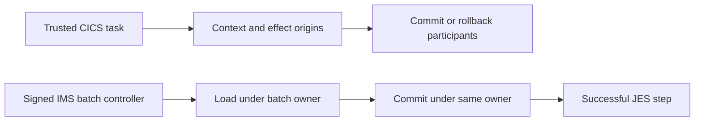

# ADR-0047: CardDemo participant ownership and batch completion

Status: Implemented for the owned local workload
Owner: CICS, Batch, and CardDemo maintainers
Scope: CICS nested participant dispatch and package-owned batch controllers
Applies from: mainframe-env current subsystem contracts

## Decision

The trusted CICS dispatcher makes its default local execution context explicit
when it attaches nested and outer effect origins. It preserves the actor, run
unit, explicit DPL context, and both origin identities. It rejects caller-supplied
reserved origins and checks the binding budget before cloning. Participant
decoders retain their existing validation.

A successful owned IMS batch load commits under the same run owner before JES
reports success. Load rejection does not commit; commit failure fails the step.
The DFSRRC00 launcher delegates SYSIN only to a signed controller declaring that
input. The selected purge controller accepts one bounded control record with
the pinned expiry, checkpoint, and debug settings; other controls fail before
scheduling or mutation.

The Db2 launcher parses a bounded DSN session, comments, continuation lines,
FREE commands, and one RUN PROGRAM command with the selected utility controls.
It validates the complete session before dispatch and retains package-owned
program selection. This does not add a general TSO interpreter or external
Db2 subsystem discovery.

The CardDemo harness explicitly selects MQ client ownership for standalone
request/reply work and CICS coordinator ownership for authorization work.
Fixtures do not mint reserved nested origins; the CICS dispatcher owns them.

## Validation and limits

Regressions cover context preservation, forged origins, loader commit ordering,
load/commit failure, undeclared SYSIN, extra purge controls, DSN continuations,
and rejected mixed or unknown commands. The real pinned CardDemo workloads
exercise these contracts through the public application and JES routes.

Use an optimized runner for complete workloads; durable statement output can
exceed the unchanged two-minute job limit in an unoptimized build. See the
[operator runbook](../runbooks/CARDDEMO-OPERATOR.md).

Offline reference lookup used the pinned CICS SYNCPOINT ROLLBACK, COBOL GO TO,
Db2 DSN command, IMS completion, and MQCMIT topics. Their external cache is
unavailable in this workspace. The retained source identities are unchanged;
these local fixes and workload runs add no licensed IBM equivalence credit.
