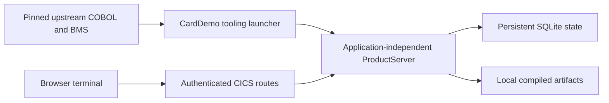

# ADR-0048: Persistent interactive CardDemo composition

Status: Implemented for local development
Owner: CardDemo and application maintainers
Scope: Application launcher and browser terminal
Applies from: mainframe-env current subsystem contracts

## Decision

`xtask carddemo-serve` starts a persistent development instance of the pinned
upstream base online application. Its workload-specific composition stays in
CardDemo tooling. `ProductServer`, providers and the public gateway retain their
existing application-independent contracts.

Startup validates the clean upstream corpus, compiles its existing source
closures, installs online programs and maps, and opens a dedicated SQLite store
and local artifact directory. The existing seed-generation and installation
identities govern initial provisioning. A launcher-owned SQLite completion marker
is published after authority and program installation; reopen validates the
installed program identity and retains edited datasets and transport identities
without reseeding them.
The process serves until Ctrl-C or SIGTERM and drains product workers on exit.

The browser submits launch, input, resume and disconnect operations to the
existing authenticated CICS gateway. It renders anonymous labels and named
fields from the upstream BMS source and reads live field protection from the
terminal stream. It masks password fields and preserves terminal AIDs. DOM text
and input values render application content without HTML interpolation.

The browser provides separate regular and administrator transport workspaces,
using the existing demonstration identities and RACF permits. Upstream
application sign-on still runs through `CC00`; selecting a workspace grants no
additional application identity. These known demo credentials and plaintext
HTTP are intended for a local loopback listener.

## Scope and verification

The launcher serves the 18-program, 17-transaction base online application.
Reports write the owned `JOBS` transient queue. The batch cycle and Db2, IMS and
MQ extensions retain their separate workload commands. Certification commands
remain finite checks and are not used as the live server.

Verification uses Chromium against the running HTTP service for sign-on,
customer and administrator screens, dynamic field protection and persistent
edits across restart. Corpus bytes remain external and unchanged. Local
application use does not establish licensed IBM equivalence.

See the [operator guide](../runbooks/CARDDEMO-OPERATOR.md) for launch and sign-on
instructions.
