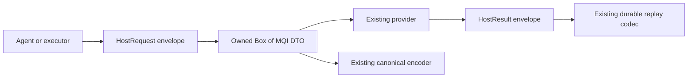

# ADR-0050: Box the largest shared host-effect payloads

Status: Accepted implementation; scoped compatibility validation passed
Owner: Shared host-contract maintainers
Scope: In-process HostRequest and HostResult representation
Applies from: mainframe-env current shared host contracts

## Decision

Store only the outer MQI request and result DTOs in exclusively owned `Box`
payloads. Keep their public nested fields and the existing request/result
vocabulary. Constructors use `Box::new`; consumers that need ownership move the
DTO out of the box. Borrowed validation and encoding use the original DTO.

This changes Rust enum construction and nested patterns before public release.
It is a shared API migration, separate from mechanical lint fixes. Rust memory
layout is not the canonical effect or durable storage format under
[ADR-0003](0003-contract-serialization.md). No stable native ABI is introduced.

The explicit canonical encoders retain the existing domains, variant names,
field ordering and bytes. Replay readers retain their existing versions; there
is no codec or storage migration from boxing. Independent byte/digest vectors
and retained replay tests must establish that compatibility before acceptance.
No new MQI dispatch, participant behavior or conformance credit follows.

## Resource tradeoff

The largest inline MQI payloads currently inflate every request/result enum.
Boxing reduces the inline envelope to the largest remaining variant and gives
each MQI DTO one fixed-size heap allocation. Moving its buffers preserves their
ownership; deep Clone allocates another DTO and clones the existing buffers.
Actual enum, DTO and effect sizes are measured on the pinned target.

A smaller inline enum does not establish lower total MQI memory usage. Allocator
overhead, simultaneous clones and existing variable buffers remain. Encoded byte
limits do not bound all heap overhead. `Box::new` can fail through the allocator;
its allocation does not return `HostProblem::ResourceExhausted`. Existing bounds,
canonical preflight and replay admission remain unchanged.

## Acceptance

Strict host-package Clippy must pass without suppressions. All affected
constructors and match consumers compile, and package tests preserve negative
validation, independent canonical vectors, retained replay and owned unboxing.
Target-specific size observations remain external execution output, not a new
portable ABI promise. Formatting, module, dependency, documentation and changelog
checks apply to the final integrated diff.

The integrated candidate passed all five consumer-package compile checks, strict
host Clippy, 355 host tests, typed MQI and replay regressions, and the three local
MQ conformance source-binding checks. Independent canonical vectors and retained
codec readers remain unchanged. The pinned Linux x86_64 measurement reduced
HostRequest from 864 to 352 bytes and HostResult from 656 to 264 bytes; MQI DTO
sizes stayed 864 and 656 bytes. These observations do not promise a native ABI
or lower total heap usage. Full Foundation acceptance remains pending.
