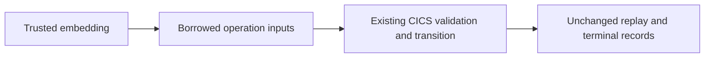

# ADR-0052: Group borrowed CICS operation inputs before public release

Status: Accepted design; implementation pending
Owner: CICS runtime and embedding maintainers
Scope: BTS mutation inputs, partition submission and explicit receipt retention
Applies from: mainframe-env current public provider hardening

## Decision

Use one borrowed `BtsReplayContext` for the existing run unit, execution,
principal, replay key and request digest arguments of `define_child`,
`remove_subtree` and `mutate_process`. Use one borrowed `CicsPartitionInput` for
the existing AID, partition name, data and cursor arguments of
`submit_partition_input`. Session, principal, CSRF and time remain explicit.
Neither input context implements a durable codec or grants authority.

This changes public Rust call construction before public release. Every caller
must group the same contiguous expressions in the same evaluation order.
Validation order, lifetimes, transition closure, replay identity and refusal
conditions remain unchanged. Existing serialized BTS and terminal records,
host requests, ABI bytes and independent expectations remain unchanged.
No generic operation language or public native layout guarantee is introduced.

Expose the existing `prune_issue_device_receipts` function through the CICS
facade, alongside the existing explicit conversation retention operation. The
trusted embedding supplies its store, safe watermark and protected keys.
The existing bounded algorithm remains unchanged: no background invocation,
automatic watermark, operator HTTP route or new command is added. Its deletions
are individually conditional; this does not promise an atomic whole-scan prune.
Malformed or conflicting retained records remain failures, not deletion credit.

## Acceptance

Migrate all actual callers and public exports. Strict dependency-inclusive CICS
Clippy, affected BTS/partition/replay/retention tests and server caller
compilation must pass without suppression or weakened assertions. Exercise
receipt retention through the public export with the same watermark and
protected-key controls. Mechanical repairs and this approved API migration
remain limited to the named CICS slice. The three unready CICS rows, licensed
gates and future private composition remain pending.
