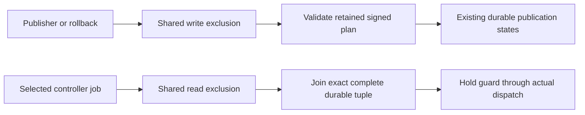

# ADR-0053: Fence selected controller execution against publication

Status: Accepted design; implementation pending
Owner: application publication and batch maintainers
Scope: same-process selected controller admission and publication prevalidation
Applies from: mainframe-env current public provider hardening

## Decision

Share one `Arc<std::sync::RwLock<()>>` between ProductServer and BatchService,
injected before admission. Selected TSO/IMS controller dispatch takes `try_read`
before resolving the retained controller and holds it through the complete
synchronous program and participant operation. Stage, publication, rollback,
recovery, executable mapping installation and existing exclusive selected IMS/TM
operations take `try_write`. Contention returns `IdempotencyConflict`; poisoning
returns `InfrastructureFailure`. A callback cannot block waiting for its own
read guard. No guard crosses an async suspension, no read-to-write upgrade or
nested acquisition is permitted, and no fairness guarantee is added.

BatchService constructs a borrowed `BatchPublicationWrite` context from its own
actual write guard. It has private fields, no public constructor or cloning, and
exposes only the existing controller installation/rollback operations. Existing
public mutators acquire this context; server lock-held publication and recovery
helpers borrow it instead of reacquiring. Existing constructors remain available;
an additive shared-exclusion constructor is accepted. Standalone selected package
controllers also require explicit durable complete publication state.

Admission carries the selected registry's actual application/generation/identity
and joins that exact tuple to the existing durable publication row. Check row
namespace, key, positive store version, contract, bounded decoding and complete
terminal section states before effects. Controllers must be Applied; Db2/IMS
must be Applied or legitimately NotApplicable. Missing historical IMS defaults
to NotApplicable. Absent, malformed, partial or mismatched state refuses and
cannot fall through to a built-in utility. Ordinary utilities without selected
controllers retain their existing route.

Relocate the existing publication DTO, enums, namespace and contract unchanged
to a private application module with narrow exports. Preserve field order,
enum spellings, unknown-field serde behavior and missing-IMS default. Keep the
server receipt/store wrapper in their current owners. Batch gains one direct
workspace application dependency; the application kernel gains no store/provider
dependency. Publication and installer schema repairs remain a separate slice.

## Prevalidation and executable identity

Before Prepared or any provider/selection write, build one bounded plan from
the verified retained handle. Reuse complete registry validation on a prospective
clone, signed SQL catalog/declaration closure, existing IMS metadata/TM validation
and the existing pure secondary validator. SQL declarations require the exact
signed Data catalog; absence is NotApplicable only when all SQL obligations are
absent. Decode once and preserve ordered columns/keys and current normalization.

Approve narrow read-only Db2 install validation by reusing the existing locked
prospective snapshot, catalog application and state validation without persistence.
Actual installation repeats current-state checks. Rollback prevalidation must
reuse retained-selection rules rather than forward-only generation checks.
Expose existing pure Db2/IMS validators only as needed; add no IBM semantics.
Runtime provider/CAS failures remain explicit fenced recovery states.

ProgramCall controllers must execute their signed immutable artifact. Refuse
names registered by the actual DefaultProgramRouter, using one narrow private
query of its existing supported-program list. Do not let a built-in bypass the
signed artifact. Declarative IMS utility plans need not be compiled executables;
external artifacts may be deployed later but missing/substituted artifacts must
refuse at execution. Preserve existing immutable object and mapping CAS rules.

## Acceptance and limits

Consume the sealed @3 framing candidate. Preserve the initial real-route
5-pass/6-failure reproduction and its 48 hook cuts. Exercise complete install,
retry, explicit rollback and recovery controls; malformed SQL/partial publication
refusals before mutation; actual registered-name/artifact refusals; paused real
dispatch versus publication, concurrent readers and recursive writer refusal.
Then execute the separately bounded SQLite process/restart cuts with exact
hook counts and retained logs. Setup or compilation failures earn no credit.

Support one publishing ProductServer per store. The fence is local to cooperating
instances, not distributed atomicity, hostile-store authentication or provider
transaction atomicity. Raw store/provider writers remain a trusted embedding
responsibility. The 64 KiB state bound applies before decoding after the store
materializes its row; it is not a process heap quota. Stale cached tuples refuse.
Excluded private/licensed tasks, source skips and the three unready CICS rows
remain unchanged. Broad Foundation acceptance remains pending.
