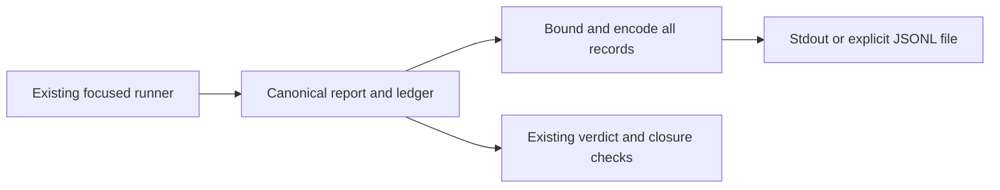

# ADR-0054: Emit focused conformance through the canonical report owners

Status: Accepted design; implementation pending
Owner: conformance tooling maintainers
Scope: focused xtask output transport
Applies from: mainframe-env current public tooling hardening

## Decision

Use one private xtask adapter borrowing `ConformanceRunReport`. Emit each event
through `VerdictEvent::canonical_json` in existing batch order, followed by the
report's existing `DerivedConformanceLedger::canonical_json`, with one LF per
record. Do not rederive a ledger, invent verdicts, wrap records, truncate reports
or infer closure from successful emission.

Default focused stdout is canonical JSONL; human summaries and focused check
success go to stderr. Add `--output PATH` for the same bytes in one file, leaving
stdout empty. Relative paths follow process cwd; a literal `-` is a filename.
Parents must already exist. Reject output without a focused subsystem/replay,
and reject output with IMS candidate preparation. Preserve selection/refusal and
pending gates. Aggregate commands and candidate summaries are outside this
canonical report transport. JCL's implicit target files are replaced by explicit
output selection; consumers use existing record schema discriminators.

Emit actual reports before existing verdict/closure/ancillary refusal so failures
retain their evidence. A refusal without a report creates no synthetic report.
Staging success is only an I/O result; existing owner checks determine acceptance.

## Bounds and publication

Preflight borrowed report cardinalities, required canonical shape and projected
wire size with checked arithmetic before calling allocating canonical APIs.
Use existing ConformanceLimits, a conservative 512 MiB single-record projection
bound and a 64 MiB exact total staged JSONL bound including LFs. Conservatively
refused otherwise-fitting inputs are an explicit CLI limit. Required six-gate
maps must be present before the canonical owner indexes them. No second coverage
or semantic closure validator is added. Serializer scratch is not a heap quota.

Encode every record before touching a sink, using fallible capped staging.
Encoding/allocation/budget refusal leaves sinks untouched. Stdout write/flush
errors return nonzero; a visible stream prefix cannot be rolled back. File output
uses a create-new sibling, at most 32 name attempts, write/flush/sync/close and
same-filesystem rename. Refuse nonregular/symlink destinations; preserve an old
file on pre-rename failure. Clean only the adapter's temporary sibling and report
cleanup failures. Never delete an old file to force replacement. This adds no
directory durability or concurrent-writer fencing guarantee.

## Acceptance

Preserve the six old-CLI output failures and four refusal controls. Verify all
focused routes through the real CLI, canonical event/ledger bytes, terminal
ledger order, empty/pending refusals, later encoding failure without mutation,
exact/over budgets, file replacement/cleanup and stdout I/O failure. Preserve
official identities and all independent expectations. Source skips earn zero
credit; no private/licensed implementation or Foundation completion is implied.
