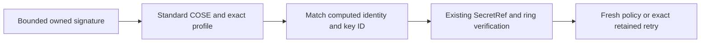

# ADR-0055: Use a bounded COSE_Mac0 profile for current package authentication

Status: Accepted design; dependency and implementation acceptance pending
Owner: application trust and embedding maintainers
Scope: current package MAC envelope and finite retained verification
Applies from: mainframe-env current public package hardening

## Decision

Preserve the existing symmetric HMAC-SHA256 trust model and ring provider.
Adopt coset 0.4.2, defaults disabled, subject to actual lock/feature/source,
license/advisory and MSRV acceptance. The inspected archive checksum is
`1eb98d5e9155e2cf7cd942c8b3033097d4563b6fb0a00b9caecb74669555c058`.
Foreign COSE/CBOR types remain private and never enter owned durable DTOs.
This provides MAC authentication, not public-key signing or nonrepudiation.

The owned algorithm name is `cose-mac0-hmac256@1`. Require tag 17, protected
algorithm 5 (HMAC 256/256), a protected UTF-8 control-free key ID of 1..64 bytes,
an empty unprotected header, the exact computed 71-byte package identity as
attached payload, and a 32-byte tag. External AAD is the fixed 28-byte
`mainframe-env.package-auth@1`. Reject unknown/critical/duplicate headers,
detached or mismatched payloads, trailing data and alternate CBOR encodings.
Canonical comparison must clear coset's retained original protected bytes before
reencoding; verify the MAC against the actual original protected bytes.
Use the nondeprecated payload verification API, never a panic-prone absent
payload convenience method or raw-MAC fallback.

Bound encoded signatures to 256 bytes and decoded envelopes to 192 bytes before
base64/CBOR parsing. Current canonical maximum is 243 encoded/182 decoded bytes.
Use unpadded canonical base64. Library parsing, profile checking and identity/key
ID matching precede secret resolution. The input cap bounds parsing work; it is
not an allocator-wide heap quota. Preserve existing SecretRef key lengths of
32..4096 bytes. Keep configured legacy key IDs up to 128 bytes, while the new
profile has its explicit 64-byte limit. Never truncate keys or rotate implicitly.

## Ownership and compatibility

One private application codec exposes narrow owned-signature functions using a
caller-supplied MAC/verification callback. It has no SecretResolver, trust map,
signing service or foreign public types. Server trust resolves its existing
SecretRefs inside verification. Current conformance and server fixture producers
reuse the same wire codec; existing identity framing remains unchanged.

Add a default pure fresh-algorithm policy query to PackageSignatureVerifier,
preserving source compatibility for existing trusted injected verifiers. Its
default permits their own explicit policy; production HmacSha256PackageTrust
permits only the current COSE profile for fresh admission. Verification itself
dispatches explicitly between current COSE and retained `hmac-sha256@1`.
Legacy raw tags are capped at 43 encoded bytes before decoding and must decode
to 32 bytes. Every unsupported profile fails closed without fallback.

Trusted retained raw @2 and pre-profile raw @3 packages keep their original
bytes, identities and signatures and are reverified under current trust.
If either incoming or retained signature is legacy, an existing-generation
retry requires complete owned-package equality. Raw-to-COSE migration and
COSE-to-raw downgrade are not implicit retries. Fresh production admission
requires @3 and the current profile. Recovery/commit/rollback retain explicit
legacy verification without resigning. Verify once per existing owner operation;
the pure policy query must not resolve secrets or perform a second MAC.

## Acceptance and removal

Preserve independently assembled RFC profile/MAC_structure vectors and literal
tags; do not derive expectations from the codec. Test canonical boundary sizes,
duplicate/trailing/deep/claimed-length inputs, all closed-header/payload/AAD/key
refusals before secret lookup, current/legacy trust rotation and revocation,
exact retained recovery/retry and both downgrade directions. Existing explicit
budget and @2/@3 identity regressions remain unchanged.

Accept the exact resolved dependency graph and feature union before frozen
checks. No unrelated lock upgrade, copied third-party fixture or new crypto
primitive is authorized. Run affected owner tests/lint and mandatory dependency
policy; report actual MSRV limits. Replacing coset later retains owned profiles
and frozen vectors and removes dependencies only when unused. It never enables
legacy fallback. Publication, schema, source, licensed and full Foundation
acceptance remain separate pending gates.
