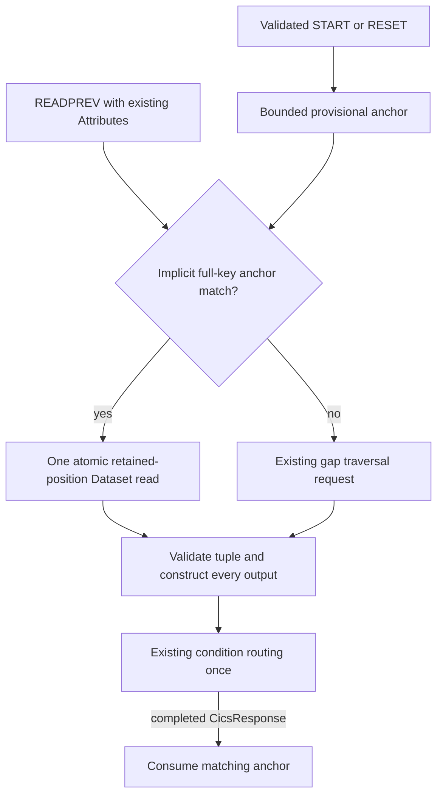

# ADR-0056: CICS first reverse read at a retained browse position

Status: Accepted bounded design; scoped implementation verified.
Owner: CICS, Dataset and shared host-contract maintainers
Scope: ordinary full-key first reverse read in an implicit owned browse
Applies from: mainframe-env current public source checkout

## Problem and decision

The existing Dataset browse cursor is a gap. Its old `ReadNext` request decrements the
index before reverse selection and increments it after forward selection. In particular,
START GTE CC followed by an old reverse read returns BBY2 with base identity BB. That
existing assertion and every old canonical request vector remain unchanged.

The retained CICS TS 6.x READPREV reference requires an existing key for the first
READPREV after STARTBR. A full-key first reverse read therefore needs a separate
observation at the retained anchor. Add `DatasetRequest::ReadBrowsePosition` with exactly
three fields: dataset, cursor, and expected_key. It requires `host.dataset.read`, carries
no mutation or idempotency key, and returns the existing Browse result shape.

Under the existing Dataset state lock, the provider binds the cursor to its dataset,
requires a keyed dataset and exact full key width, checks the snapshot logical key at
the current gap, and resolves the live body through that snapshot's retained base
identity. Success and refusal leave the cursor, snapshot vector and gap unchanged.
It creates no second cursor, cached payload, fresh key lookup, or hidden extra read.
Alternate-key duplicates retain their original base identity even after a new duplicate
is inserted. Body changes are visible; this is not a content snapshot.

## CICS ownership and completion

The existing Run owns one cursor per dataset. A provisional anchor map is bounded by
those owned browses. STARTBR and RESETBR use their existing single delegate without an
extra Attributes call. GENERIC, full FF sentinels, update/token, remote/addressing modes,
and any explicit REQID or CURSOR.REQID are excluded from the new branch, including
explicit zero. Only the implicit existing single-cursor context is selected.

READPREV reuses its existing Attributes delegate to require keyed metadata, an exact
full-width seed, the same owned cursor, and a supplied RIDFLD exactly equal to that seed.
It then issues exactly one positioned read. Other cases keep their existing delegate
and traversal semantics. Changed RIDFLD, generic searches, general direction changes,
and multiple browse contexts are not newly implemented.

START, RESET and END replies must contain a nonempty cursor of at most the existing
HostLimits name cap (128 bytes) and a fully empty record/identity/key tuple. RESET and
END must bind the existing owned cursor. Positioned reads require a complete tuple,
matching cursor and seed key; an empty positioned reply is a refusal, never ordinary
EOF. Ordinary reads accept a complete tuple or a correctly bound fully empty EOF.
Seed keys stay within the existing request record-byte cap. Bad provider replies do
not manufacture local ownership; their possible physical effects remain qualified.

File control offers a local completion candidate only after decoding and construction
of the response and every RIDFLD, TOKEN and LENGTH output succeed. A valid retrieved
LENGERR still consumes the opportunity. A correctly bound ordinary empty EOF offers a
candidate before the unchanged condition policy runs. The existing invoke_run owner
runs condition routing once, then commits only after an Ok CicsResponse. Handled,
Respond, NoHandle and ignored EOF consume; unhandled default EOF retains the seed.
Malformed replies, pre-dispatch refusals, unknown outcomes, selected empty replies and
construction failures retain it. Handling a construction error into Ok ERROR cannot
invent a completion candidate. A completed ineligible ordinary read also consumes the
opportunity. Keeping metadata does not roll back a physically advanced gap.

Known cursor effects have a separate boundary. A validated START replacement clears
the old dataset seed together with recording the new cursor; a new seed is published
only after completed construction. This does not retire the replaced old cursor.
A bound fully empty END reply proves known retirement, so owner and seed are cleared
together at the existing known-success point even if later response construction fails.
Such a later error remains a reported partial known effect. Refusal, unknown or invalid
END replies retain both maps. A failed RESET response does not imply physical snapshot
rollback. Implicit task-drop/cancellation retirement remains a separate pending gate.

## Compatibility and limits

Old request encoding, domain framing, results and gap assertions are preserved. The
new distinct canonical variant encodes cursor, dataset and expected_key in that order.
The existing HostRequest and digest domains remain unchanged. This is an additive Rust
enum variant: downstream exhaustive matches need a new arm even though old wire bytes
are stable. There is no API removal, schema/catalog expansion or dormant activation.

The request travels through the existing host port, retaining actor, grant, provider
generation, deadline and cancellation admission. The inherited nested boundary supplies
`actor.deadline_tick - 1` as its logical observation tick. Direct host guard controls do
not prove trusted real-clock expiry inside nested CICS; that clock gap is not repaired
here. No deadline, cancellation or origin metadata is stripped.

The local completion rule does not establish atomicity across later replay persistence,
audit retention, transport serialization, fault injection or CommandLease completion.
Existing RESET replay remains owned by the outer CICS path. The new read is nonmutating
and adds no replay history or public response fields. Explicit ENDBR controls prove
only their known owned teardown, not general task retirement or native IBM compatibility.

## Reference and validation scope

The already retained offline reference is
`SSJL4D_6.x/reference-applications/commands-api/dfhp4_readprev.html`, SHA-256
`f0ce4b309ab7b3869225fac927e6a717c925dd4d34fbbc6a7493c05b726820ab`,
particularly the existing-key and first/reposition wording in retained read lines 52–59.
The retained STARTBR topic is `dfhp4_startbr.html`, SHA-256
`bff4e45c5c6be404323460eab6e2a89a925b6f78815da6ee61e56d7c85988914`.
These are reference sources, not licensed execution receipts.

The source slice contains four shared contract controls, five Dataset controls,
eight CICS guard methods and eight composed public-CICS-API controls using real Dataset
and RACF on one ProductServer store. The composed controls preserve the seven genuine
original RED outcomes and the separately corrected duplicate-anchor RED producer.
Thirty-seven distinct scoped controls pass across separately retained producers;
strict lint passes for Host API, Dataset, CICS and Server. The final two corrected
guards run on the checked source; thirty-five unchanged controls retain explicit
producing-input equivalence. Historical failures and the earlier resource stop
remain separate. These development receipts are not clean-candidate CI or full
application acceptance.
Missing supplementary bodies remain skipped with zero lookup, official or licensed credit.
