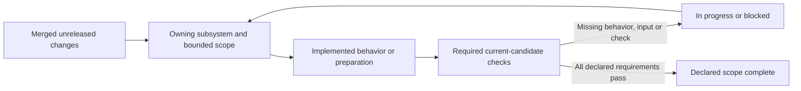

# Unreleased changes and remaining work

Status: **Merged bounded changes recorded; full framework acceptance incomplete**

Changes awaiting changelog integration live in
[`changes/unreleased/`](../../changes/unreleased/). Their categories describe
what changed. Current implementation and acceptance belong to the subsystem
progress records below. A merged fragment, generated identity, typed route or
passing helper test does not complete an entire subsystem.

## Status vocabulary

| State | Meaning |
|---|---|
| Proposed | No implementation of the declared scope has been accepted |
| Preparation implemented | Source, schema, parser, private kernel or harness exists; runtime/whole-row acceptance remains pending |
| In progress | Some executable bounded scope exists; the parent's required checks or behavior remain incomplete |
| Blocked | A named dependency or required external input prevents the next acceptance step |
| Local implementation complete | The recorded local scope passed its declared checks; pending licensed work and current-candidate checks remain explicit |
| Complete | All required checks for the item's declared scope passed; this does not complete a larger parent automatically |

## Subsystem review

| Owner | Current scope | Missing acceptance or next boundary |
|---|---|---|
| [Coverage](subsystems/coverage/foundation-status.md) | Shared catalog/Conformance IR, identities, packages and verdict/ledger machinery implemented | Validate the intended candidate; generated infrastructure grants no automatic subsystem credit |
| [COBOL grammar/types](subsystems/cobol/structure-status.md) | CB-301–CB-306 bounded recognition/type/diagnostic implementation recorded | Current phase checks; executable and licensed behavior belong to later gates |
| [COBOL execution](subsystems/cobol/execution-status.md) | CB-401–CB-406 local execution/checkpoint scope recorded complete | Licensed IBM differential; evaluate option/form boundaries for each workload |
| [RACF/SAF](subsystems/racf/security-status.md) | Local command/security database, decisions, audit and recovery implementation recorded | Current candidate/backend checks and licensed differential |
| [Datasets/AMS](subsystems/dataset/data-status.md) | DAT-601–DAT-606 local dataset/allocation/VSAM/AMS scope recorded | Current candidate/backend checks and licensed differential |
| [JCL](subsystems/jcl/planning-status.md) | Local converter/planner and immutable job-plan contracts implemented | Licensed differential; planner recognition does not execute JES behavior |
| [JES/utilities](subsystems/jes/execution-status.md) | Local job/spool/registered utility scope implemented | Licensed differential and workload-specific program registration |
| [CICS application](subsystems/cics/application-api-status.md) | 260 typed routes, zero legacy, three unready; bounded runtime and frame/storage preparation | CICSMESSAGE, GETNEXT TIMER, ISSUE COPY; full frame/storage/lifecycle/security/recovery and licensed acceptance |
| [CICS SPI/FEPI](subsystems/cics/system-api-status.md) | 269 SPI/39 FEPI identities; private partial grammar for 266 SPI/39 FEPI; no public admission | Three unresolved SPI source/form joins and all public runtime/acceptance gates; 0/269 SPI and 0/39 FEPI accepted |
| [z/OSMF](subsystems/zosmf/rest-status.md) | ZMF-1101 operation normalization and generated contracts implemented | ZMF-1102–ZMF-1106 routes/backend acceptance; CICS SPI/FEPI dependency remains incomplete |
| [Db2 core](subsystems/db2/core-status.md) | Existing signed static SQL plus bounded public syntax/type/value/default surfaces | Generic binder/catalog/relational execution, runtime producer/value and full transaction/backend acceptance |
| [Db2 programming](subsystems/db2/programming-status.md) | Plan and catalog scope recorded; phase blocked on core acceptance | DB2-1301–DB2-1306 advanced programming behavior and licensed differential |
| [IMS](subsystems/ims/programming-status.md) | Bounded metadata/packages, selected DB/SSA/PCB/TM dispatch and DB-batch recovery implemented | Raw CBLTDLI framing, complete PCB/context/organization matrices, TM recovery and participant acceptance; official/licensed credit remains zero |
| [MQ](subsystems/mq/programming-status.md) | Private selected and configured installed finite MQI flows, kernels and publication/replay prerequisites | All 26 complete-call profiles remain Pending; native cold-connect failure, complete lifecycle/concurrency/recovery, MQINQ and participant acceptance |
| [Cross-resource integration](subsystems/integration/transactions-status.md) | Early participant contracts and scoped CICS/MQ/IMS composition | Complete prepare/commit/backout/heuristic/unknown mixed-resource and backup/restore matrix; provider dependencies remain incomplete |
| [Licensed certification](subsystems/certification/licensed-status.md) | Shared external environment/harness contracts and synthetic validation implemented | Authorized environments, reviewed adapters/normalization, exact-candidate authentic captures and all licensed campaigns |
| [Sandbox and CardDemo](../guides/MAINFRAME-SANDBOX.md) | Native/container launcher, CLI/MCP, online CardDemo and packaging improvements implemented | Cube KVM/template execution unvalidated; online profile does not install batch or Db2/IMS/MQ extensions; complete workload acceptance is separate |

## Verification limits

- The configured native MQ cold-connect test
  `physical_reopen_genuine_cold_connect_fences_old_native_points_and_aliases`
  failed both on pre-PR389 main and its reviewed candidate. Keep it marked as
  a known failure until repaired and rerun; successful warm-flow tests do not
  close this cold-recovery obligation.
- Strict workspace Clippy has baseline diagnostics. The repaired PR389 casts
  have no remaining changed-file warnings; that focused result does not mean
  the strict workspace gate passed.
- Offline CICS source freshness is unavailable in the current workspace at
  `SSJL4D_6.x/applications/designing/dfhp37p.html`. Provision authorized matching
  bytes through the [cache runbook](../runbooks/IBM-DOCS-CACHE.md) before claiming
  that source gate passed. A public metadata/synthetic-fixture repository does
  not supply the private publication archive or every application supplement.
- Licensed campaigns, PostgreSQL campaigns, full CardDemo execution and Cube
  deployment require their own configured inputs and declared scope. Historical
  component results retain their producing identities and are not fresh passes.

## Maintain the record

Keep implementation gaps in their owning progress document. Add missing
change fragments when code or documentation changes, preserving the three-field
schema. Update the documentation registry when a phase gains a progress record,
then run `cargo xtask docs` and the affected checks. Generated indexes derive
their status from those records. Keep execution logs and receipts outside Git;
do not consume all fragments merely to mark a bounded feature implemented.
