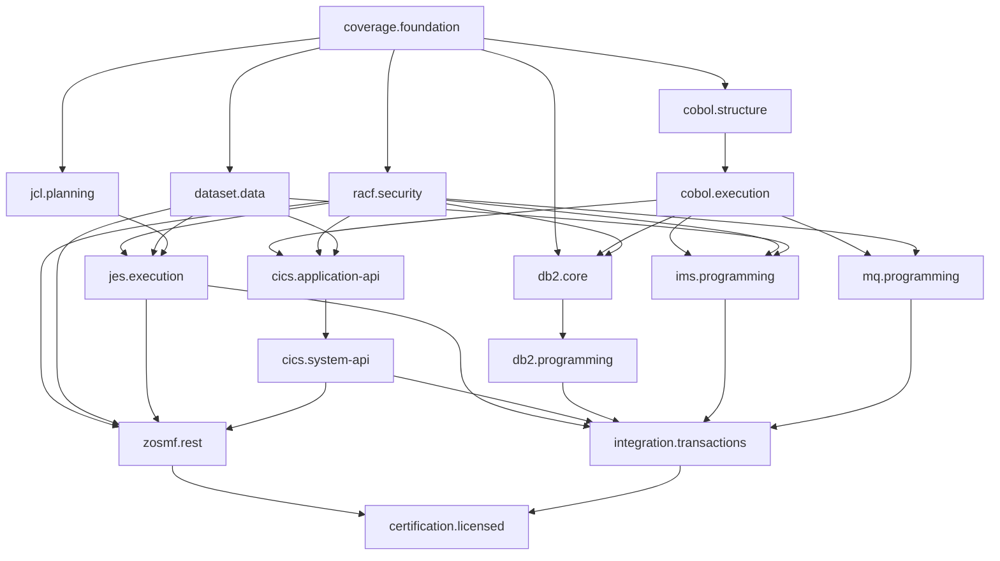

# Subsystem dependencies

Status: **Accepted subsystem sequencing**

The registry defines completion dependencies. An edge means the receiving phase
consumes accepted behavior from the preceding phase. Catalog preparation and
private parser work may proceed within a plan's declared boundaries before all
dependencies complete; public behavior requires the consumed contracts to pass.

## Completion dependencies

<!-- BEGIN GENERATED SUBSYSTEM INDEX -->
| Subsystem phase | Completion dependencies |
|---|---|
| [coverage.foundation](coverage/foundation-plan.md) | Accepted initial baseline |
| [cobol.structure](cobol/structure-plan.md) | coverage.foundation |
| [cobol.execution](cobol/execution-plan.md) | cobol.structure |
| [racf.security](racf/security-plan.md) | coverage.foundation |
| [dataset.data](dataset/data-plan.md) | coverage.foundation |
| [jcl.planning](jcl/planning-plan.md) | coverage.foundation |
| [jes.execution](jes/execution-plan.md) | racf.security, dataset.data, jcl.planning |
| [cics.application-api](cics/application-api-plan.md) | cobol.execution, racf.security, dataset.data |
| [cics.system-api](cics/system-api-plan.md) | cics.application-api |
| [zosmf.rest](zosmf/rest-plan.md) | racf.security, dataset.data, jes.execution, cics.system-api |
| [db2.core](db2/core-plan.md) | coverage.foundation, cobol.execution, racf.security |
| [db2.programming](db2/programming-plan.md) | db2.core |
| [ims.programming](ims/programming-plan.md) | cobol.execution, racf.security, dataset.data |
| [mq.programming](mq/programming-plan.md) | cobol.execution, racf.security |
| [integration.transactions](integration/transactions-plan.md) | jes.execution, cics.system-api, db2.programming, ims.programming, mq.programming |
| [certification.licensed](certification/licensed-plan.md) | zosmf.rest, integration.transactions |
<!-- END GENERATED SUBSYSTEM INDEX -->

## Integration discipline

Keep ownership of language, provider, host, persistence, and transport contracts
explicit. Merge one bounded slice with its regressions. Revalidate consumers when
shared contracts change. Cross-resource recovery depends on participating
providers; a provider's private transaction cannot establish aggregate atomicity.
