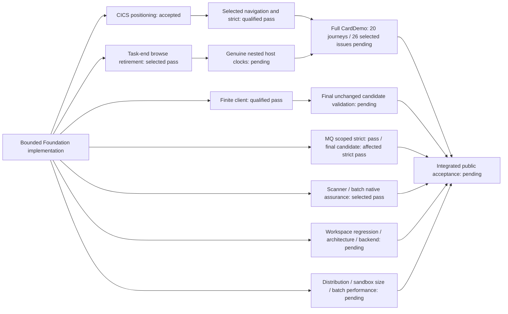

# Coverage and conformance — Coverage authority progress

Subsystem: **coverage**

Phase: **foundation**

Status: **Bounded implementation accepted; integrated acceptance pending**

## Scope and acceptance boundary

Foundation owns pinned catalogs, six independent coverage gates, semantic
identities, package trust/install runtime, subsystem ABI libraries, program/route
registration and cross-subsystem validation. Qualified scoped results below apply
to their producing inputs and reviewed source/environment equivalence. Importing
source or sealing a package does not establish a fresh clean-candidate CI pass.

Public implementation excludes licensed/private-only work and the three unready
CICS rows **CICSMESSAGE**, **GETNEXT TIMER** and **ISSUE COPY**. Preserve their
identities, specifications, fixtures, tests and pending gates. Missing supplemental
IBM bodies remain **user-skipped/unavailable, zero credit**; do not refresh/re-pin
or repeat unchanged missing-source requests. Independent public validation with
available inputs remains required. Detailed execution evidence stays external.

The original **IBM MQ 9.4 MQI semantic baseline is unavailable**, separately
from user-skipped supplementary topics. New MQI semantic implementation is
blocked and earns zero credit until that required baseline is available; selected
local contract/infrastructure controls do not replace the semantic source gate.

## Work packages

| Package | Accepted bounded scope | Remaining boundary |
|---|---|---|
| CV-201 | Nine pinned baseline manifests, normalized catalogs and locator membership | Preserve source identities and denominators; unavailable bodies give zero credit |
| CV-202 | Six independent gates, immutable coverage/snapshots, continuity, schema bindings and package-state projections | Structural schemas supplement typed identity/topology/derived-count validation; integrated gates remain required |
| CV-203 | Generated semantic identities/handler registry and repaired bindings | Registration is not runtime credit; selected routes require actual observations |
| CV-204 | Bounded packages, atomic generation selection/rollback, framed @3 identities, canonical COSE_Mac0 authentication and publication fencing | Fresh authentication uses `cose-mac0-hmac256@1`; retained @2/raw identities verify without rewriting. MAC gives neither nonrepudiation nor arbitrary snapshot authentication. Process-local fencing/file-SQLite recovery do not prove distributed exclusion/backend parity |
| CV-205 | Generic Db2 install/rollback, retained generations and seed-at-capacity controls | Current backend/application obligations; same-process reopen is not a process crash |
| CV-206 | Installed typed batch controllers and duplicate-root/root-width admission | Actual signed package/publication selection precedes effects; retain integration gates |
| CV-207 | Provider-owned CICS/Db2/MQ source libraries, bindings and bounded materialization | Preserve ABI bytes/licensing/source identities; local tests are not licensed equivalence |
| CV-208 | Official/custom route and common-program registration, scanner and typed policy | Preserve namespaces and ownership; registration does not establish execution coverage |
| CV-209 | Scoped lint/layout/tooling/conformance, runtime and compatibility prerequisites below | Workspace/MSRV, application, backend, live-client, distribution/performance and integrated exit remain pending |

The nine baselines retain **1,506 mandatory identities**. Every applicable
`recognized`, `validated`, `executed`, `conditioned`, `recovered` and `differential`
gate must pass before a row is complete. Numerators/denominators belong to their
catalog/applicability/verdict owners. The five VSAM normalization rows retain
zero-publication credit; the original z/OSMF heading denominator stays frozen,
with endpoint normalization under its separate source-bound projection.

## Current bounded results

| Slice | Current behavior or qualified result | Acceptance boundary / next step |
|---|---|---|
| Lint and mechanical layout | Affected Host/store/batch/execution/CICS/server/conformance repairs and floor/output owners implemented | Workspace all-target/all-feature Clippy with warnings denied, compilation and rustdoc with warnings denied pass at clean `069ce5d9`; workspace regression, architecture and integrated acceptance remain pending |
| MQ layout and requested-size consistency | Canonical count mismatch is refused before retained intent lookup; 31 selected controls pass | Bounded request consistency does not establish complete MQ lifecycle/recovery |
| MQ publication and binding slices | Retained seven publication-fence and fifteen binding controls pass on their qualified producer. Fixture-only import/profile/storage/lifecycle setup moved behind test ownership; production rich-store marker and unsupported-admission diagnostics retained. Scoped development producer: **492 passes** (452 unit, 32 integration, eight compile-fail doctests), zero failures/ignored/filtered; five-package clean-candidate strict also passes with zero diagnostics at `3a061944` | The full MQ suite is qualified development evidence with concurrent unrelated source edits. Its original 24-diagnostic failure remains historical. The fresh workspace producer `b7d9ff93` passed the MQ provider suites but failed the server cold-reconnect control. At `7893a2d3`, the unchanged control reports `MECOORD0001 / UnknownOutcome / Execute` before a host reply: zero passes, one failure, no ignores. Diagnostic visibility preserves the existing completion, cold-epoch and alias assertions; it does not repair or waive the failure. Original MQI baseline remains unavailable; full public lifecycle/concurrency/recovery/profile acceptance remains pending |
| PostgreSQL selection | Twelve live controls pass within the TCP-only loopback scope | Current backend/global/application obligations remain pending; synthetic restart is not public-corpus or crash recovery closure |
| STRING and figurative comparisons | Seven STRING controls and eight figurative controls pass; unchanged pointer/UNSTRING and ordinary comparison behavior preserved | Full grammar, IBM differential and application acceptance remain pending |
| Symbolic BMS input storage | Eight new and seventeen existing methods pass; affected strict lint passes; raw/non-BMS and independent literals preserved | Ordinary symbolic-group scope only; no full provider/layout/wire/application acceptance |
| Candidate cleanliness | Recorder requires clean committed tracked/untracked source at launch and completion; ignored targets/external output remain allowed | No continuous attestation; final selected candidate gates still required |
| Command supervision and census rescan | Finite timeout/output, retained leader authority, sole wait and actual error/log binding implemented. The rescan candidate has **167 focused passes, zero skips** | Qualified Linux/tooling scope; no universal process absence, portable containment or host-escape proof. The mutation owner at `069ce5d9` overrides both Cargo target and build directories in a fresh owned archive, checks identities around source writes, retains command logs and requires leader-exit/group closure plus receipt retention before cleanup. Seventy-two affected Python controls and one real descendant-timeout probe pass as development evidence. The retained clean `069ce5d9` tooling suite passes 1,032 tests with one existing skip. Filesystem and group checks are observations, not atomic containment; escaped descendants remain outside the launched-group boundary; native mutation results remain blocked by the retained current campaign: its fresh unchanged baseline passes in 210 seconds and two reference mutants are killed; the third is invalid because the existing 50 ms group census allowance expired. Restoration/cleanup are refused and the snapshot is retained. The campaign fails with zero acceptance credit; its CICS/MOVE/arithmetic/compiler groups are unexecuted. The earlier 20-kill/five-baseline result remains historical at `b7d9ff93`, without current ownership or global acceptance credit |
| Optional client input admission | Finite retained @1 / additive @2 readers, twelve fixed roles and full archive/SRI/tree/manifest/state checks; 33 focused controls pass | Ordinary CI's eight required tools unchanged; upstream signatures/source-build attestation and host-qualified runtime/bootstrap limits remain explicit |
| Finite client command and action layout | Ten fixed actions, exact scalars/settings/JCL/readonly mounts, empty child environment, raw captures and local CLI/debug-log policy implemented | Fixed roles/membership/modes/links/output limits remain; no arbitrary argv, scripts/plugins or host mount widening |
| Command-local byte/tree authority | Single-use PRE proof skips only redundant POST archive parsing; both POST archive fences remain held. Directory-authority scope has 112 selected passes, old bodies/pins/default validation preserved | All current bytes/state still verified. No persistent, metadata-only or cross-action admission cache; no atomic/continuous filesystem snapshot or live time-limit credit from byte diagnostics |
| Sandbox build parallelism and native setup ownership | Existing build owner retains two Rust/Git jobs. Setup adds frozen offline build, fresh checkout-owned targets, external producer logs/artifact hashes, source start/end identity checks, exact ownership cleanup and failure-aware readiness. **36 Python boundary controls pass**, zero failures/skips; build fixtures are synthetic and earn zero runtime credit | Native setup/retained producer result: Clean `d3ff8818` setup passes with fresh frozen/offline release artifacts, unchanged source/lock identities, independently checked installed/retained hashes and actual owned-target removal. The rebuilt installed verifier passes all eleven documented checks, including account use, durable card update/restart, independent data, deploy/rollback/reset, failed-deploy preservation, authenticated dataset/JES operations and foreground cleanup. The separate development instance passes HTTP/frontend and populated-account smoke checks; real stdio MCP initialization, discovery and status pass with nineteen tools. The earlier clean `069ce5d9` setup pass and account-map verifier failure remain retained separately. This is bounded native Linux development readiness; full CardDemo, image build/size and actual batch/memory acceptance remain pending. A runtime-help probe establishes packaging only; it does not replace application acceptance |
| Batch-controller source assurance | Scanner now refuses unbalanced token scopes before test-item exclusion and preserves valid macros, comments and literals. Malformed scopes are refused before test exclusion, and linked child modules remain production owners. Current selected Python boundaries pass within the 76-control clean selection at `3a061944`; historical 43-Python evidence and the zero-completed-test Rust timeout retain their producing identities | Seven native scanner controls pass; five policy mutation controls and eleven selected batch controls pass at `3a061944`. The actual batch-controller gate and affected strict lint pass. Mutation anchors now follow the production file-control owner without changing the 20 mutation behaviors or five baseline commands. Required publication still selects a verified package handle and record identity before installing typed controllers. Lexical admission of 1,079 source files supplies no native or hardcode-gate credit; retained artifact/context cleanup supplies no execution credit |

## Application prerequisites

| Slice | Current status | Continuing acceptance boundary |
|---|---|---|
| Selected transaction navigation | Corrected sixteen-control producer passes. Current test-only repair has **seven fresh named passes**, zero failures/skips; **nine controls retain qualified prior reuse**. Affected conformance strict lint passes with zero selected-package warnings/errors. The former MQ fixture/layout diagnostics were repaired within their mechanical ownership scope; historical warning logs retain their original producer. Exact cleanup succeeds | Selected CD.J06 comparisons only, with empty issue observations. AIX probes are first-party evidence rather than full application AIX coverage. Source-equivalent development results are not root clean CI or full CardDemo closure; integration and current final-candidate validation remain required |
| CICS first reverse positioning | Bounded repair accepted: **37 distinct scoped controls** pass across qualified scopes, with separate affected Host API/Dataset/CICS/server strict success | Task-end retirement and existing provider/server positioning selections pass at `3a061944`. Genuine nested host clock/cancellation boundaries and full application closure remain pending |
| CICS task-end browse retirement | Confirmed STARTBR owners retain the creating actor and replaced cursors; normal/abnormal cleanup records per-cursor progress. Lower-level RETURN does not end root task ownership. Ambiguous/unbound ordinary and automatic END replies retain ownership and prevent redispatch; known predispatch refusals remain retryable. Ten provider controls and two real ProductServer root RETURN/public abort controls pass at `3a061944`, with eight provider and eight server positioning regressions passing | Affected CICS/server strict passes in the five-package selection. Semantic source review uses pinned STARTBR/ENDBR/RETURN/ABEND bodies from `ibm-cics-ts-6x-2026-08-31`. Earlier failures remain externally retained at their original source identities. Preserve original actor, per-cursor progress, SAF/grant/generation/cancellation/deadline checks and unknown ownership; genuine nested clocks and full application acceptance remain pending |
| Selected local LINK fixture | The static local-LINK control now installs an admitted compiled CICS child with its enabled program definition and valid COMMAREA reply. Its original LENGTH/DATALENGTH, EIBFN, copyback and suspension assertions pass at `97e5adcd`: one selected pass, no ignores/failures | Pinned LINK review uses `ibm-cics-ts-6x-application-api-sources-b-2026-09-10`, `dfhp4_link.html`; existing malformed-schema/oversized-COMMAREA refusals remain unchanged. This fixture correction gives no genuine nested-clock or full application closure |
| Symbolic BMS numeric input storage | Clean `d3ff8818` passes all thirteen selected BMS storage controls and all 261 interpreter library tests, with zero failures/ignores. Affected interpreter/conformance all-target/all-feature Clippy with warnings denied and pinned Rust 1.95 MSRV checks pass. Fixed unsigned scale-zero numeric DISPLAY input copies validated terminal bytes; short numeric prefixes preserve surplus storage and omitted fields remain untouched. Unknown names, wrong schemas and malformed/overlong counts refuse before selected mapped writes | Pinned RECEIVE MAP, DFHMSD and DFHMDI review uses `ibm-cics-ts-6x-application-api-sources-b-2026-09-10`: `dfhp4_receivemap.html`, `dfhp47j.html`, `dfhp47g.html`. Source and controlled raw-storage tests grant no COBOL numeric parsing/arithmetic or licensed credit; the COBOL baseline remains unavailable. Existing text fitting stays explicit. The subsystem checker printed pass/exit zero, but its recorder failed the existing process-group census deadline; that gate remains failed with zero credit and no unchanged retry or bound increase |
| Finite public-client compatibility | One real authenticated fixture passes: ten waited SDK actions, one terminal poll, twelve HTTP observations, exact seven-byte IEFBR14 content, five protected-state equality checks and joined cleanup. Thirteen pure controls and affected conformance strict pass | Bounded compatibility on a qualified development producer. Final clean-candidate validation, broader routes/profiles and official/licensed acceptance remain pending. The exact three-string caller-echo exception retains all other disclosure, server-wire, state and time assertions |
| Full-profile observation candidate | Seven synthetic comparator/API controls pass in the clean `069ce5d9` conformance suite, checking matching bytes, skipped/duplicate comparisons, separate issue/journey tokens, merge refusal and text bounds | These are synthetic admission controls, zero product execution credit. The full profile remains unexecuted/ignored; ordered Db2 PS-byte comparisons and actual state-token observations remain unproved. No rollback, VSAM or complete IMS CD.J17/J18 / CD-025 acceptance. Retain NAV/client registrations and validate the integrated producer; successful-path shutdown does not close failure-path cleanup |

Selected navigation preserves the existing sixteen controls and frozen
raw/source/CSD/map identities: thirteen initial zero fields versus reentered
spaces; PF5-only rows 42–51 versus ordinary 41–50; lexical TDESC01 refusal; full
PF7 rows 41–50/page 1/reached-top with twelve READPREV calls (eleven NORMAL plus
ENDFILE primary 20), then already-top with zero reads. Preserve full tuples,
readonly state, NOTFND 13/80, no extra READ and TAMT001–010. Partial page 2 is not
accepted. Tokens require every intended comparison and shutdown and the actual
observation seam; a selected CD.J06 result supplies no issue token.

The finite client retains actual ProductServer/MemoryStore/HTTP forwarding,
held loopback port, second valid principal, five-second readiness, **120-second
phase and inclusive ten-second actions**, fixed calls/at most twelve polls,
independent JSON/content/state/refusal assertions and exact owned cleanup.
Query status does not establish named-status route coverage; lookup refusal is
not direct spool403; selected content is not full DD inventory or profile parity.
No npm/scripts/plugins/global lookup, new pins/downloads, ambient credentials or
host mount widening. Stop at a genuine prerequisite; do not weaken oracles or
limits, retry unchanged failures or substitute version/readiness probes.

## Reproducible verification

Use the pinned tools and the diff-selected owners in the
[verification workflow](../../../runbooks/VERIFICATION-WORKFLOW.md) and
[Jenkinsfile](../../../../Jenkinsfile). These are commands/selectors, not reported
fresh results. Confirm nonzero selected tests and inspect actual warning ownership.
Run expensive gates only in their declared scope with reviewed resources; preserve
output externally and clean the exact owned target after required retention.

| Owner / gate | Existing command or selector |
|---|---|
| Supervisor controls | `"$MAINFRAME_ENV_PYTHON" -B -m unittest discover -s tools/tests -p test_ci_assurance.py` |
| Scanner controls | `"$MAINFRAME_ENV_PYTHON" -B -m unittest tools.tests.test_production_scanner tools.tests.test_typed_semantic_boundaries` |
| Selected NAV controls | `cargo test --frozen --offline -p mainframe-env-conformance --lib carddemo::transaction_navigation_tests:: -- --test-threads=1` |
| Affected conformance strict | `cargo clippy --frozen --offline -p mainframe-env-conformance --all-targets --no-deps -- -D warnings` |
| MQ strict | `cargo clippy --frozen --offline -p mainframe-env-mq --all-targets --no-deps -- -D warnings` |
| Architecture / batch / full application | `cargo xtask architecture-fast --check`; `cargo xtask batch-controllers --check`; `cargo xtask carddemo-full --check` |
| Docs / API / dependency policy | `cargo xtask docs --check`; `"$MAINFRAME_ENV_PYTHON" -B tools/check_public_api_docs.py`; `cargo deny check` |
| Workspace / MSRV | `cargo test --workspace --all-features --locked --no-fail-fast`; `cargo clippy --workspace --all-targets --all-features --locked -- -D warnings`; `cargo +1.95.0 check --workspace --all-targets --all-features --locked` |

At clean producer `069ce5d9`, the owning conformance library reports **412 passed, zero failed, five ignored**, xtask reports **204 passed, zero failed/ignored**, and Python tooling executes 1,033 tests with **1,032 passed and one existing skip**. Three embedded conformance child summaries explain the recorder's larger generic count; no raw aggregation is an accepted workspace floor. Formatting, changelog, docs, subsystem/API/module/typed policies, workspace all-target/all-feature Clippy with warnings denied, compilation, rustdoc with warnings denied and Rust 1.95.0 compilation pass.

The fresh workspace producer `b7d9ff93` failed 46 tests: 40 lacked the available pinned CardDemo corpus environment, two used stale ledger digests, two used stale xtask fixtures, one used an invalid LINK fixture and one failed MQ cold reconnect. The corrected independent suites and LINK selection pass at their retained producers; the MQ failure remains. The failed workspace gate earns **zero 260-test floor credit** and is not rerun with unchanged blocking inputs. Architecture remains blocked by unavailable pinned `SSNAQ8_11.1.0/reference-api/r_dump.html`, with zero credit and no refresh or re-pin. Earlier supply-chain/license/spec/COBOL results remain input-equivalent historical evidence at `83714b92`; external cached legal bytes were not newly attested, and old candidate-bound outputs are not relabeled.

Selected scanner, batch and task-retirement inputs at `3a061944` remain unchanged through `b7d9ff93` under retained input-equivalence review. Subsequent sealed changes restore source-bound ledger/fixture digests, repair the selected LINK fixture, expose the actual MQ cold-reconnect refusal, isolate mutation build ownership and repair numeric DISPLAY symbolic BMS input. Later checks remain scoped to their actual producers. Original receipts keep their actual producer; subsequent scoped checks are attributed separately.
Historical compile, fixture and source-assurance failures remain external and
supply no pass-floor credit. Every added bounded package is sealed and checked against its exact allowlist. The completed earlier workspace task targets were removed after external retention. The failed mutation snapshot and the latest BMS validation target remain retained after command-group census refusals; exact external paths and owner records are retained in the handoff. Cleanup earns no product execution credit.

The existing CI planner selects additional affected spec/schema/catalog/coverage,
semantic identity, package/ABI/program/route/dehardcoding/profile and runtime
architecture checks. Use its recorder for actual candidate-bound test floors;
a raw aggregate count does not establish a CI floor. Optional Linux client
inputs do not make ordinary cross-platform CI require Node or bubblewrap.

## Integrated exit: pending

| Required gate | Exact remaining obligation |
|---|---|
| Workspace / MSRV / docs/API | The clean `069ce5d9` producer passes workspace strict lint, compilation, pinned MSRV, public API, rustdoc and docs checks. The workspace regression gate and **at least 260 actually passing tests from its successful summaries** remain required; ignored/skipped/filtered/zero-test selections supply no floor credit |
| Architecture / source / schema / profile | Current affected catalogs, six coverage gates, semantic identities, package/batch/ABI/program/route/dehardcoding/schema/profile/inventory and runtime architecture owners; H1 application hardcodes/string exceptions remain exactly zero |
| MQ | Clean-candidate affected strict passes at `3a061944`; the full 492-test result remains qualified development evidence. The fresh workspace producer `b7d9ff93` passed the MQ provider suites but failed the server cold-reconnect control. At `7893a2d3`, the unchanged control reports `MECOORD0001 / UnknownOutcome / Execute` before a host reply: zero passes, one failure, no ignores. Diagnostic visibility preserves the existing completion, cold-epoch and alias assertions; it does not repair or waive the failure. Full applicable public behavior/profile gates remain unresolved, and the original pinned MQI semantic baseline remains unavailable; fixture exclusion grants no public lint exemption or semantic credit |
| Full CardDemo | Installed-data closure for **20/20 journeys with 114/114 observations and 26/26 selected issue rows with 105/105 acceptance requirements**, plus applicable isolation/load/backup/restore/restart/denial/rollback/cancellation; no generated token or selected physical probe fills absent observations |
| Backend / client | Current store/backend/global obligations and final unchanged-candidate authenticated client checks; qualified PostgreSQL/finite client results do not complete these or official route/profile compatibility |
| Distribution / performance | Current legal/input/dependency/distribution checks, existing finite image build/size and sandbox verifier, actual CardDemo batch measurement and separate memory-scaling measurement; no current performance closure or invented threshold |

Use implemented `cargo xtask work-package-seal` and its `--check` for bounded
ownership; generated trailers are not execution credit. Keep logs, failed
outcomes, producer/equivalence details and immutable raw receipts external.
Official/licensed differentials and excluded private/unready rows retain their
pending states. Foundation is not globally complete.
