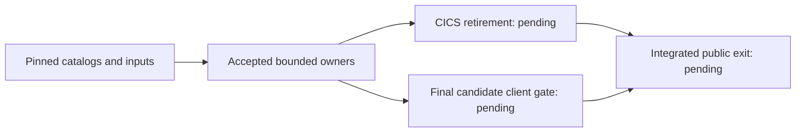

# Coverage and conformance — Coverage authority progress

Subsystem: **coverage**

Phase: **foundation**

Status: **Bounded implementation accepted; integrated acceptance pending**

## Scope and acceptance boundary

Foundation owns official catalogs, six independent coverage gates, semantic
identities, package trust/install runtime, subsystem ABI libraries, program/route
registration and cross-subsystem validation. Thirty-seven bounded packages are
sealed. The accepted positioning dependency is commit
`29d55cbc8183ca7274e30dc6f6079b2e29e501e7`; its scoped results do not complete
the Foundation exit gate.

Public work excludes licensed/private-only implementation and the three unready
CICS rows **CICSMESSAGE**, **GETNEXT TIMER** and **ISSUE COPY**. Preserve their
identities and pending gates, all specifications/fixtures/tests, compatibility
readers and existing source pins. Missing supplemental bodies remain
**user-skipped/unavailable, zero credit**; do not refresh/re-pin or repeat unchanged
missing-source requests. Independent available-input public validation remains
required.

Raw commands/results, failed producers, source-equivalence comparisons and retained
executables stay external. Reuse requires relevant-input/source/environment
equivalence; a dirty-development result is not a new clean-candidate CI execution.
Never relabel old failures, add coverage for generated registration, or infer
official/licensed compatibility from internal fixtures.

## Work packages

| Package | Accepted bounded scope | Remaining boundary |
|---|---|---|
| CV-201 | Nine pinned baseline manifests, normalized catalogs and locator membership | Preserve source identities and denominators; unavailable bodies give zero credit |
| CV-202 | Six independent gates, immutable coverage/snapshots, continuity, schema bindings and package-state projections | Structural schemas supplement typed identity/topology/derived-count validation; integrated gates remain required |
| CV-203 | Generated semantic identities/handler registry and repaired bindings | Registration is not runtime credit; selected routes require actual observations |
| CV-204 | Bounded packages, atomic generation selection/rollback, framed @3 identities, canonical COSE_Mac0 authentication and publication fencing | Fresh authentication uses `cose-mac0-hmac256@1`; retained @2/raw identities verify without rewriting. MAC gives neither nonrepudiation nor arbitrary snapshot authentication. Process-local fencing/file-SQLite recovery do not prove distributed exclusion/backend parity |
| CV-205 | Generic Db2 install/rollback, retained generations and seed-at-capacity controls | Current backend/application obligations; same-process reopen is not a process crash |
| CV-206 | Installed typed batch controllers and duplicate-root/root-width admission | Actual signed package/publication selection precedes effects; retain integration gates |
| CV-207 | Provider-owned CICS/Db2/MQ source libraries, bindings and bounded materialization | Preserve ABI bytes/licensing/source identities; local tests are not licensed equivalence |
| CV-208 | Official/custom route and common-program registration, scanner and typed policy | Preserve namespaces and ownership; registration does not establish execution coverage |
| CV-209 | Scoped lint/layout/tooling/conformance, runtime and compatibility prerequisites below | Workspace/MSRV, strict MQ, application, backend, live-client, distribution/performance and integrated exit remain pending |

The nine baselines retain **1,506 mandatory identities**. Every applicable
`recognized`, `validated`, `executed`, `conditioned`, `recovered` and `differential`
gate must pass before a row is complete. Numerators/denominators belong to their
catalog/applicability/verdict owners. The five VSAM normalization rows retain
zero-publication credit; the original z/OSMF heading denominator stays frozen,
with endpoint normalization under its separate source-bound projection.

## Current bounded results

| Slice | Accepted result and qualification | Pending dependency |
|---|---|---|
| Host/store/batch/execution/CICS/server/conformance lint and mechanical layout | Declared affected repairs and floor/conformance-output owners implemented | Whole-workspace strict lint and current integrated validation |
| MQ mechanical layout / original-request size consistency | Size binding refuses inconsistent canonical counts before retained intent lookup; 31 selected controls pass; old methods/literals preserved | Strict MQ retains **25 original dormant production diagnostics**, zero new/changed-owner diagnostics. Import/decoder/lifecycle/fence/profile duties and full MQ lint remain pending; old full-package results predate fixture-only changes |
| Journey closure / date-and-duplicate transactions | Closure authority/transport and selected comparisons implemented | Navigation/AIX application observation and all 20/26/105 acceptance requirements |
| PostgreSQL selection / TCP-only loopback owner | Twelve live controls pass on the qualified source-equivalent producer; clean producer/native identities retained | Global/backend/current affected acceptance. Host loader/timezone qualification, prior cleanup failures and one PID-1 defunct child remain; synthetic CardDemo restart is not public-corpus closure |
| STRING references | Seven frozen native controls, layout baseline and unchanged pointer/UNSTRING preservation pass; strict affected lint/integration checks pass | Existing resolver/qualification boundary remains; no full grammar, IBM differential or navigation acceptance |
| Figurative byte comparisons | Eight frozen native controls, 44-fixture method counted as one, and three interpreter controls pass; ordinary identifier/literal/numeric behavior preserved | Full grammar/differential/application acceptance |
| Symbolic BMS input storage | Eight final controls and seventeen existing regression methods pass; raw/non-BMS guards, literals/compiled fixture bytes and old methods preserved; strict affected lint passes | Fixed ordinary symbolic-group scope only; Legacy guard is static proof, not a separately executed variant. No provider/full-layout/wire/application acceptance |
| Candidate cleanliness | Recorder checks clean committed tracked/untracked source before launch and at completion; ignored targets/external logs remain valid | No continuous attestation; final selected candidate gates still required |
| Optional command supervision | Current error/log binding, retained leader authority, sole wait and finite timeout/output teardown accepted; 82 unique controls observed across separate qualified producers | Linux procfs/exclusive wait/kernel/escape and earlier PID-1 zombie limitations remain; not one relabeled green campaign or portable containment proof |
| Optional client inputs | Strict retained @1 / finite @2 lock readers, twelve fixed roles, bounded archive/SRI/tree/manifest admission; 33 focused controls pass | Eight required CI tools unchanged. Node signatures unverified; Zowe SRI is not source-build attestation; bwrap/libraries and namespace bootstrap remain host-qualified |
| Finite client command | Ten fixed actions, exact scalars/settings/JCL/readonly mounts, empty child environment, raw captures and actual-reap semantics accepted; qualified private PID/proc full136 tooling pass | Host full136 census failure remains a failure; namespace pass is tooling evidence, not host absence or client containment |
| Client action layout / logs | Exact local `node_modules/@zowe/cli` layout/debug-log policy; qualified full146 tooling pass with final identifier-only equivalence | Real client workload separate; finite membership, modes/links and log caps unchanged |
| Command-local validation cost | Private single-use PRE proof avoids only redundant POST archive parsing; affected96 / integrated106 controls pass | Every current byte still hashed, both POST archive fences held; no persistent/metadata-only/cross-action cache or allowance change |
| Command-local tree directory authority | 112 selected controls pass, including thirteen new controls; old bodies/pins/default validation preserved. Held ancestors/root/package, fresh manifest, closing order and raw leaf-fd ownership accepted | Bounded namespace admission, not atomic/continuous filesystem snapshot, native containment or live action acceptance |
| Sandbox build parallelism | Build owner explicitly passes jobs2 to Rust/Git image builds; scoped policy checks pass | Current image build/size, sandbox correctness, batch speed and workload measurement |
| Public status/prompt consistency | Subsystem/phase terminology, implemented sealer and source/coverage boundaries retained | Current docs/API/architecture/schema/profile/distribution exit checks |
| Batch-controller source assurance | **Failed** on unchanged preexisting inputs: the check expects an obsolete single-file source location and a removed apply-method name | A separate owner-aware assurance repair is assigned and pending. Preserve the gate and independent controller requirements; the failure is neither waived nor counted as passing |

The latest **single instrumented byte-only diagnostic** completed/reaped exit0,
owner error null, with unchanged inputs/source: PRE **6.170227912s**, POST
**2.503510612s**, profile whole **8.679312400s**, owner whole **8.900773228s**.
Each phase verifies **10,216 leaves /42,715,208 tree bytes**. Canonical calls are
root2/manifest1/member0 per phase, role14 PRE/12 POST; archive parser opens2/0.
All original hash/SRI/state/namespace/manifest checks, archive outer fences,
descriptor closure and single-use proof observations pass. These inclusive,
overlapping instrumented measurements are one attribution result, not a controlled
speedup benchmark or proof of a live **10-second action /120-second fixture**.

## Application prerequisites and current scope

| Owner / slice | Current state | Exact continuing boundary |
|---|---|---|
| Transaction navigation comparator/tests | **Fourteen passes and two failures** in the latest sixteen-control producer; compile/test owner elapsed **294.74 seconds**, exit/reap 101, no owner error. Twenty-six real fixtures capture 102 HTTP exchanges and 73 Dataset state captures, with unchanged protected state and exact shutdown/target cleanup | Detail refusal rejects a 79-byte test literal against the source-correct 78-byte ERRMSG; a separate receipt-binding assertion observes no navigation token. Source-only corrections are approved, but fresh sixteen-control validation remains pending. The earlier eleven-pass/five-failure producer and other failures retain separate identities |
| CICS first reverse positioned-read prerequisite | **Sealed bounded repair; 37 distinct scoped controls have qualified passing results**, comprising 25 new controls and 12 preserved baselines across separate producers. Two changed exact CICS methods have actual passes; 35 controls retain qualified unchanged-input reuse. Separate strict lint passes for Host API, Dataset, CICS and server, with all guard bodies and helper callers preserved | Navigation acceptance, task-end browse retirement and nested host clock/cancellation boundaries remain pending. Original seven genuine first-read failures, one setup failure, separately corrected duplicate failure, earlier compile/lint failures and producer 04 target-cap breach stay distinct; no single full campaign or global CICS acceptance is claimed |
| CICS task-end browse retirement | Separate source-only authority design and two standalone real ProductServer control proposals; current release omits tracked browse cleanup | Source proposals for root RETURN and public abort remain unapplied and unexecuted; they use existing APIs independently of positioning repair. Implementation and normal/abnormal public retirement acceptance remain pending. Preserve per-cursor progress, original actor, SAF/grant/generation/cancellation/deadline checks and unknown ownership; no Drop suppression, fabricated privilege or unconditional retirement claim |
| Finite public-client compatibility fixture | **Native 04 passes the one exact fixture: 1 pass, 0 failures, 0 ignored and 400 filtered; 81.81 seconds.** It reuses the successful fixed13 executable without compiling. Ten SDK actions are waited, with one terminal poll and twelve real HTTP observations. Exact seven-byte IEFBR14 content, all five protected-state equality checks and joined cleanup pass. The separate corrected pure controls retain 13 passes, 0 failures and 0 ignored | This is bounded finite compatibility on a qualified development producer, not global, official/licensed or final clean CI acceptance. Initial thirteen controls retain seven passes and six first-positive failures; native 01–03 remain failed producers. The exact three-string SDK caller-echo exception preserves all other disclosure, server-wire, state and time assertions. Strict affected conformance lint passes on the mechanically repaired and formatted source; twenty-five old MQ dependency warnings remain separate. The prior eight-error lint producer remains a failure. The pure/live results retain their earlier producer with reviewed behavior equivalence. Final-candidate validation and broader route/profile compatibility remain pending |

The sealed positioning repair passes its selected module budget, formatting,
frozen dependency policy, schema, specification, coverage, semantic identity,
package, ABI, program, route, dehardcoding, documentation and changelog gates.
Its qualified separate producers do not constitute one full campaign. The
batch-controller source-assurance failure remains a distinct pending gate.

The latest navigation producer is bound to unchanged source before retention and
after cleanup. Both refusal-message literals contain one excess trailing space:
the pinned BMS and copybook declare 78 bytes, independently requiring each
27-byte message plus 51 spaces. Compiler, MOVE, SEND MAP and the retained field
frames preserve 78 bytes. Remove only those two excess spaces under the approved
source scope; retain exact field equality. The separate receipt-binding correction
must reach the existing observation seam before any navigation token is credited.
Neither correction has a fresh passing producer.

Native 04's finite-client pass retains its unchanged successful producing source,
actual owner/caller exit 0 and reap 0. Cleanup joined serve, shut down ProductServer,
refused the former listener and left workers, active requests and sessions at zero
with no cleanup failures. Its restored executable was removed after verified use;
the successful fixed13 storage is retained. That prior pass remains qualified
separately from current strict lint, which passes after five clone-to-slice,
two conditional and one return-expression repairs plus formatting. All literal
values and thirteen selectors remain unchanged; old guard bodies are not claimed
byte-identical. The prior eight-error lint remains a distinct failure. Current
strict owner exits/reaps 0 in 72.42 seconds with no owner error; 34 emitted metadata
artifacts pass physical restoration checks before exact target cleanup. The 25
old MQ warnings are separate dependency diagnostics. Pure and live results are
qualified by reviewed behavior equivalence, without a fresh execution claim. Earlier native 01–03 and initial thirteen-control
failures remain immutable. Task-end retirement and genuine nested host clocks
remain public gaps; no full Foundation acceptance follows.

Remaining navigation acceptance retains the existing sixteen controls, frozen
raw/source/CSD/map identities and jobs2 on one exact owned target. Preserve thirteen
initial zero fields versus reentered spaces; PF5-only rows 42–51 versus ordinary
rows 41–50; lexical TDESC01 refusal; full PF7 rows 41–50, page 1 and reached-top
message with twelve READPREV calls (eleven NORMAL plus ENDFILE primary 20), followed
by second PF7 already-top with zero reads. Preserve full tuples, state, NOTFND
13/80, no extra READ and amount names TAMT001–010. Partial page 2 is not accepted. Physical AIX probes are separate first-party evidence, not application
AIX coverage. Token binding remains conditional on all intended comparisons and
shutdowns passing and the intended observation seam being reached.

The accepted finite client scope retains its test-only
conformance registration/private fixture/fragment ownership, real
ProductServer/MemoryStore/local artifacts, held loopback port, joined shutdown,
actual HTTP forwarding and second valid principal. Preserve five-second readiness,
120-second phase, inclusive ten-second actions, fixed calls/at most twelve polls,
independent JSON/selected seven-byte STEP1:SYSPRINT/state/refusal assertions and
exact owned directory/listener cleanup. Query status is not named-status route
coverage; lookup refusal is not direct spool403; selected content is not full DD
inventory or official z/OSMF profile parity. No npm/scripts/plugins/global lookup,
new pins/downloads, credentials/ambient profiles or host mount widening.

Stop at a genuine prerequisite and retain its actual producer/outcomes/cleanup;
do not retry unchanged inputs, weaken oracles, expand the 10/120-second limits or substitute
version/readiness probes. Shared clean-candidate acceptance remains separate.

## Integrated exit: pending

| Required gate | Current obligation |
|---|---|
| Workspace and test floor | Current unchanged candidate workspace/all-features regression and strict lint; **at least 260 actually passing tests**. Ignored/skipped/filtered/zero-test selections do not fill the floor |
| MSRV / public docs/API | Current pinned MSRV workspace check, public API ratchets/rustdoc/docs; no scoped worker total substitutes for these gates |
| Architecture / source / schema / profile | Current affected catalog/coverage/semantic identity/package/batch/ABI/program/route/dehardcoding/schema/profile/inventory and runtime architecture owners; H1 application hardcodes/string exceptions remain exactly zero |
| Strict MQ | Resolve/validate all 25 remaining public production diagnostics under their owners; private exclusion is not a lint exemption |
| Full CardDemo | Actual installed-data closure for **20/20 journeys, 26/26 transaction requirements, 105/105 issue acceptance requirements**, plus applicable isolation/load/backup/restore/restart/denial/rollback/cancellation. No generated token or selected physical probe fills missing observations |
| Backend | Current affected store/backend/global obligations; qualified twelve-control PostgreSQL scope alone does not complete them |
| Live client | The bounded authenticated workload passes on the qualified development producer with current-byte admission, independent content/refusal/state and cleanup assertions. Current unchanged final-candidate validation and clean CI acceptance remain required; the scoped fixture does not complete official route or full profile compatibility |
| Public distribution and performance | Current legal/input/dependency/distribution checks; existing finite image build/size and sandbox verifier, actual CardDemo batch owner, separate memory-scaling measurement. No fresh performance closure or invented size/time threshold |

Use existing gate owners/selectors from the Foundation plan, common execution
contract and CI workflow. Tool/contract/conformance/input changes still select
their affected policies; optional Linux client inputs do not expand ordinary
cross-platform CI's eight required tools. Full affected checks require the actual
unchanged candidate; accepted scoped evidence may be reused only with explicit
relevant-input/environment equivalence, never rewritten as current execution.

Use implemented `cargo xtask work-package-seal` for exact allowlists/generated
trailers and its `--check`; no hand-hashed substitute or new controller ledger.
Seals record bounded ownership, not product execution. Final public gates,
official/licensed differentials and excluded private rows keep their genuine
pending states. Foundation is not globally complete.
