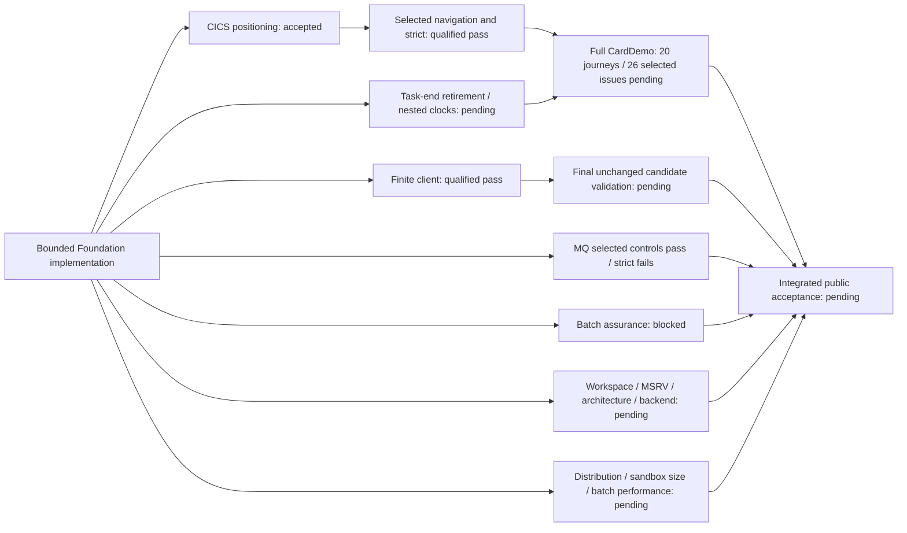

# Coverage and conformance — Coverage authority progress

Subsystem: **coverage**

Phase: **foundation**

Status: **Bounded implementation accepted; integrated acceptance pending**

## Scope and acceptance boundary

Foundation owns pinned catalogs, six independent coverage gates, semantic
identities, package trust/install runtime, subsystem ABI libraries, program/route
registration and cross-subsystem validation. Qualified scoped results below apply
to their producing inputs and reviewed source/environment equivalence. Importing
source or sealing a package does not establish a fresh clean-candidate CI pass.

Public implementation excludes licensed/private-only work and the three unready
CICS rows **CICSMESSAGE**, **GETNEXT TIMER** and **ISSUE COPY**. Preserve their
identities, specifications, fixtures, tests and pending gates. Missing supplemental
IBM bodies remain **user-skipped/unavailable, zero credit**; do not refresh/re-pin
or repeat unchanged missing-source requests. Independent public validation with
available inputs remains required. Detailed execution evidence stays external.

The original **IBM MQ 9.4 MQI semantic baseline is unavailable**, separately
from user-skipped supplementary topics. New MQI semantic implementation is
blocked and earns zero credit until that required baseline is available; selected
local contract/infrastructure controls do not replace the semantic source gate.

## Work packages

| Package | Accepted bounded scope | Remaining boundary |
|---|---|---|
| CV-201 | Nine pinned baseline manifests, normalized catalogs and locator membership | Preserve source identities and denominators; unavailable bodies give zero credit |
| CV-202 | Six independent gates, immutable coverage/snapshots, continuity, schema bindings and package-state projections | Structural schemas supplement typed identity/topology/derived-count validation; integrated gates remain required |
| CV-203 | Generated semantic identities/handler registry and repaired bindings | Registration is not runtime credit; selected routes require actual observations |
| CV-204 | Bounded packages, atomic generation selection/rollback, framed @3 identities, canonical COSE_Mac0 authentication and publication fencing | Fresh authentication uses `cose-mac0-hmac256@1`; retained @2/raw identities verify without rewriting. MAC gives neither nonrepudiation nor arbitrary snapshot authentication. Process-local fencing/file-SQLite recovery do not prove distributed exclusion/backend parity |
| CV-205 | Generic Db2 install/rollback, retained generations and seed-at-capacity controls | Current backend/application obligations; same-process reopen is not a process crash |
| CV-206 | Installed typed batch controllers and duplicate-root/root-width admission | Actual signed package/publication selection precedes effects; retain integration gates |
| CV-207 | Provider-owned CICS/Db2/MQ source libraries, bindings and bounded materialization | Preserve ABI bytes/licensing/source identities; local tests are not licensed equivalence |
| CV-208 | Official/custom route and common-program registration, scanner and typed policy | Preserve namespaces and ownership; registration does not establish execution coverage |
| CV-209 | Scoped lint/layout/tooling/conformance, runtime and compatibility prerequisites below | Workspace/MSRV, strict MQ, application, backend, live-client, distribution/performance and integrated exit remain pending |

The nine baselines retain **1,506 mandatory identities**. Every applicable
`recognized`, `validated`, `executed`, `conditioned`, `recovered` and `differential`
gate must pass before a row is complete. Numerators/denominators belong to their
catalog/applicability/verdict owners. The five VSAM normalization rows retain
zero-publication credit; the original z/OSMF heading denominator stays frozen,
with endpoint normalization under its separate source-bound projection.

## Current bounded results

| Slice | Current behavior or qualified result | Acceptance boundary / next step |
|---|---|---|
| Lint and mechanical layout | Affected Host/store/batch/execution/CICS/server/conformance repairs and floor/output owners implemented | Current whole-workspace strict lint and integrated validation remain required |
| MQ layout and requested-size consistency | Canonical count mismatch is refused before retained intent lookup; 31 selected controls pass | Bounded request consistency does not establish complete MQ lifecycle/recovery |
| MQ publication and binding slices | Six source owners preserve 22 selected controls: seven publication-fence and fifteen binding controls; all 22 pass | **Strict MQ fails with 24 mapped diagnostics**, zero unmapped diagnostics. Repair public production owners; private exclusion is not a lint exemption. Full MQ lifecycle/concurrency/recovery/profile acceptance remains pending |
| PostgreSQL selection | Twelve live controls pass within the TCP-only loopback scope | Current backend/global/application obligations remain pending; synthetic restart is not public-corpus or crash recovery closure |
| STRING and figurative comparisons | Seven STRING controls and eight figurative controls pass; unchanged pointer/UNSTRING and ordinary comparison behavior preserved | Full grammar, IBM differential and application acceptance remain pending |
| Symbolic BMS input storage | Eight new and seventeen existing methods pass; affected strict lint passes; raw/non-BMS and independent literals preserved | Ordinary symbolic-group scope only; no full provider/layout/wire/application acceptance |
| Candidate cleanliness | Recorder requires clean committed tracked/untracked source at launch and completion; ignored targets/external output remain allowed | No continuous attestation; final selected candidate gates still required |
| Command supervision and census rescan | Finite timeout/output, retained leader authority, sole wait and actual error/log binding implemented. The rescan candidate has **167 focused passes, zero skips** | Qualified Linux/tooling scope; no universal process absence, portable containment or host-escape proof. Integrate reviewed source and validate affected current policies |
| Optional client input admission | Finite retained @1 / additive @2 readers, twelve fixed roles and full archive/SRI/tree/manifest/state checks; 33 focused controls pass | Ordinary CI's eight required tools unchanged; upstream signatures/source-build attestation and host-qualified runtime/bootstrap limits remain explicit |
| Finite client command and action layout | Ten fixed actions, exact scalars/settings/JCL/readonly mounts, empty child environment, raw captures and local CLI/debug-log policy implemented | Fixed roles/membership/modes/links/output limits remain; no arbitrary argv, scripts/plugins or host mount widening |
| Command-local byte/tree authority | Single-use PRE proof skips only redundant POST archive parsing; both POST archive fences remain held. Directory-authority scope has 112 selected passes, old bodies/pins/default validation preserved | All current bytes/state still verified. No persistent, metadata-only or cross-action admission cache; no atomic/continuous filesystem snapshot or live time-limit credit from byte diagnostics |
| Sandbox build parallelism | Existing build owner sets two Rust/Git build jobs | Current image build/size, sandbox correctness and actual batch measurement remain pending |
| Batch-controller source assurance | Fresh scanner selection has **43 Python passes**, zero skips. Required artifact/context preservation and exact cleanup completed | Rust ten-test selection **timed out with zero completed tests**. Later Rust scanner controls, normal executable, batch gate and strict remain unreached; resource closure supplies no test credit |

## Application prerequisites

| Slice | Current status | Continuing acceptance boundary |
|---|---|---|
| Selected transaction navigation | Corrected sixteen-control producer passes. Current test-only repair has **seven fresh named passes**, zero failures/skips; **nine controls retain qualified prior reuse**. Affected conformance strict lint passes with zero selected-package warnings/errors; 25 MQ dependency warnings remain separate. Exact cleanup succeeds | Selected CD.J06 comparisons only, with empty issue observations. AIX probes are first-party evidence rather than full application AIX coverage. Source-equivalent development results are not root clean CI or full CardDemo closure; integration and current final-candidate validation remain required |
| CICS first reverse positioning | Bounded repair accepted: **37 distinct scoped controls** pass across qualified scopes, with separate affected Host API/Dataset/CICS/server strict success | Task-end retirement, genuine nested host clock/cancellation boundaries and full application closure remain pending |
| CICS task-end browse retirement | **Two genuine semantic failures** from real ProductServer controls: root RETURN and public abort leave the captured browse cursor live at AA01/AA/AA. Known fixture teardown retires the cursor and joins shutdown | No passing retirement result. Production repair and normal/abnormal retirement acceptance remain pending. Preserve original actor, per-cursor progress, SAF/grant/generation/cancellation/deadline checks and unknown ownership; no Drop suppression or fabricated privilege |
| Finite public-client compatibility | One real authenticated fixture passes: ten waited SDK actions, one terminal poll, twelve HTTP observations, exact seven-byte IEFBR14 content, five protected-state equality checks and joined cleanup. Thirteen pure controls and affected conformance strict pass | Bounded compatibility on a qualified development producer. Final clean-candidate validation, broader routes/profiles and official/licensed acceptance remain pending. The exact three-string caller-echo exception retains all other disclosure, server-wire, state and time assertions |
| Full-profile observation candidate | Source preparation preserves public receipts, observes four selected state-comparison tokens and uses a frozen public Db2 oracle for ordered fixed-width PS rows; seven comparator/API controls written | Controls/full profile remain unexecuted. No rollback, VSAM or complete IMS CD.J17/J18 / CD-025 acceptance. Retain NAV/client registrations and validate the integrated producer; successful-path shutdown does not close failure-path cleanup |

Selected navigation preserves the existing sixteen controls and frozen
raw/source/CSD/map identities: thirteen initial zero fields versus reentered
spaces; PF5-only rows 42–51 versus ordinary 41–50; lexical TDESC01 refusal; full
PF7 rows 41–50/page 1/reached-top with twelve READPREV calls (eleven NORMAL plus
ENDFILE primary 20), then already-top with zero reads. Preserve full tuples,
readonly state, NOTFND 13/80, no extra READ and TAMT001–010. Partial page 2 is not
accepted. Tokens require every intended comparison and shutdown and the actual
observation seam; a selected CD.J06 result supplies no issue token.

The finite client retains actual ProductServer/MemoryStore/HTTP forwarding,
held loopback port, second valid principal, five-second readiness, **120-second
phase and inclusive ten-second actions**, fixed calls/at most twelve polls,
independent JSON/content/state/refusal assertions and exact owned cleanup.
Query status does not establish named-status route coverage; lookup refusal is
not direct spool403; selected content is not full DD inventory or profile parity.
No npm/scripts/plugins/global lookup, new pins/downloads, ambient credentials or
host mount widening. Stop at a genuine prerequisite; do not weaken oracles or
limits, retry unchanged failures or substitute version/readiness probes.

## Reproducible verification

Use the pinned tools and the diff-selected owners in the
[verification workflow](../../../runbooks/VERIFICATION-WORKFLOW.md) and
[Jenkinsfile](../../../../Jenkinsfile). These are commands/selectors, not reported
fresh results. Confirm nonzero selected tests and inspect actual warning ownership.
Run expensive gates only in their declared scope with reviewed resources; preserve
output externally and clean the exact owned target after required retention.

| Owner / gate | Existing command or selector |
|---|---|
| Supervisor controls | `"$MAINFRAME_ENV_PYTHON" -B -m unittest discover -s tools/tests -p test_ci_assurance.py` |
| Scanner controls | `"$MAINFRAME_ENV_PYTHON" -B -m unittest tools.tests.test_production_scanner tools.tests.test_typed_semantic_boundaries` |
| Selected NAV controls | `cargo test --frozen --offline -p mainframe-env-conformance --lib carddemo::transaction_navigation_tests:: -- --test-threads=1` |
| Affected conformance strict | `cargo clippy --frozen --offline -p mainframe-env-conformance --all-targets --no-deps -- -D warnings` |
| MQ strict | `cargo clippy --frozen --offline -p mainframe-env-mq --all-targets --no-deps -- -D warnings` |
| Architecture / batch / full application | `cargo xtask architecture-fast --check`; `cargo xtask batch-controllers --check`; `cargo xtask carddemo-full --check` |
| Docs / API / dependency policy | `cargo xtask docs --check`; `"$MAINFRAME_ENV_PYTHON" -B tools/check_public_api_docs.py`; `cargo deny check` |
| Workspace / MSRV | `cargo test --workspace --all-features --locked --no-fail-fast`; `cargo clippy --workspace --all-targets --all-features --locked -- -D warnings`; `cargo +1.95.0 check --workspace --all-targets --all-features --locked` |

The existing CI planner selects additional affected spec/schema/catalog/coverage,
semantic identity, package/ABI/program/route/dehardcoding/profile and runtime
architecture checks. Use its recorder for actual candidate-bound test floors;
a raw aggregate count does not establish a CI floor. Optional Linux client
inputs do not make ordinary cross-platform CI require Node or bubblewrap.

## Integrated exit: pending

| Required gate | Exact remaining obligation |
|---|---|
| Workspace / MSRV / docs/API | Current unchanged-candidate regression and strict lint, pinned MSRV, public API/rustdoc/docs and **at least 260 actually passing tests**; ignored/skipped/filtered/zero-test selections supply no floor credit |
| Architecture / source / schema / profile | Current affected catalogs, six coverage gates, semantic identities, package/batch/ABI/program/route/dehardcoding/schema/profile/inventory and runtime architecture owners; H1 application hardcodes/string exceptions remain exactly zero |
| MQ | Current strict failure with 24 mapped diagnostics and full applicable public behavior gates remain unresolved; private exclusion cannot waive public lint |
| Full CardDemo | Installed-data closure for **20/20 journeys with 114/114 observations and 26/26 selected issue rows with 105/105 acceptance requirements**, plus applicable isolation/load/backup/restore/restart/denial/rollback/cancellation; no generated token or selected physical probe fills absent observations |
| Backend / client | Current store/backend/global obligations and final unchanged-candidate authenticated client checks; qualified PostgreSQL/finite client results do not complete these or official route/profile compatibility |
| Distribution / performance | Current legal/input/dependency/distribution checks, existing finite image build/size and sandbox verifier, actual CardDemo batch measurement and separate memory-scaling measurement; no current performance closure or invented threshold |

Use implemented `cargo xtask work-package-seal` and its `--check` for bounded
ownership; generated trailers are not execution credit. Keep logs, failed
outcomes, producer/equivalence details and immutable raw receipts external.
Official/licensed differentials and excluded private/unready rows retain their
pending states. Foundation is not globally complete.
