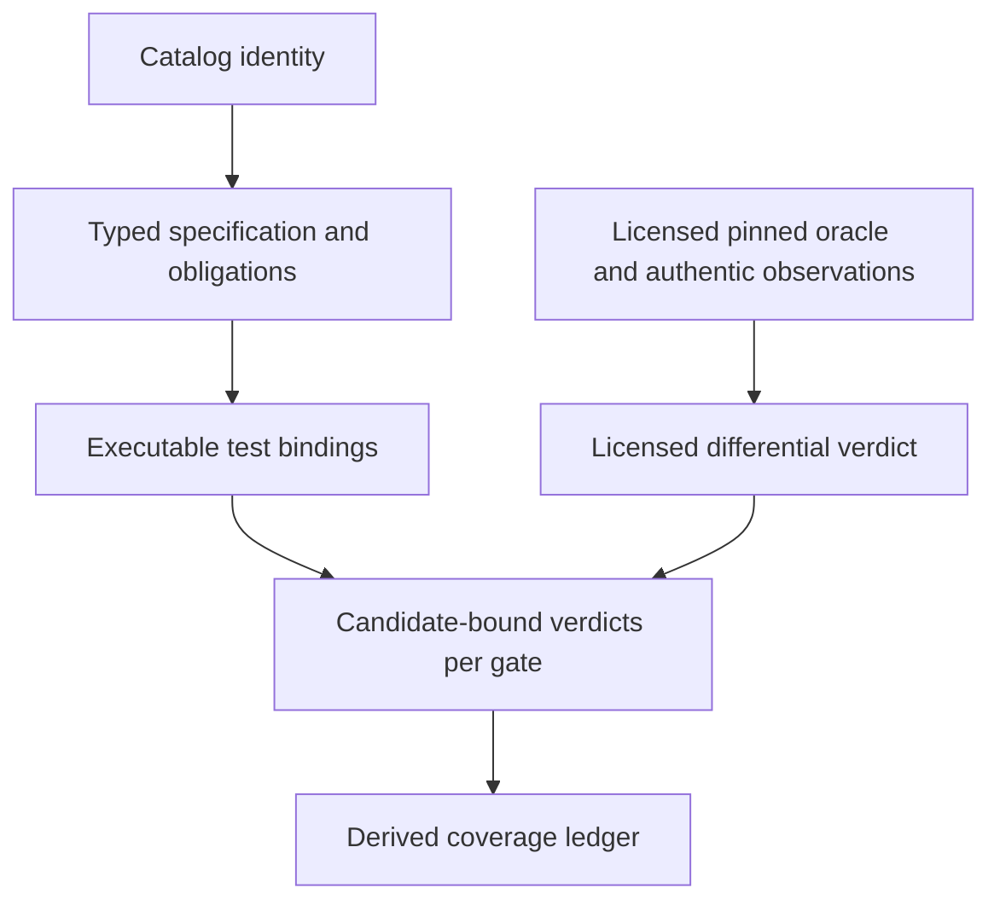

# Capabilities and limitations

mainframe-env implements bounded language and subsystem surfaces. A recognized
catalog entry, an analyzable statement, an executable operation, a local test,
and a licensed differential result represent different levels of evidence.

The [root status table](../../README.md#project-status) and
[subsystem progress](../delivery/IMPLEMENTATION-STATUS.md) identify the current
source checkout and implementation phases.

## Evaluate a workload

| Surface | Starting point | Boundary to check |
|---|---|---|
| COBOL | [Compiler](../architecture/COMPILER-AND-IR.md), [runtime](../architecture/COBOL-RUNTIME-SEMANTICS.md) | Analysis can precede executable lowering and runtime support |
| CICS | [Routing](../architecture/CICS-COMMAND-ROUTING.md), [status](../delivery/subsystems/cics/application-api-status.md) | Operation, resource, terminal, task, and recovery support |
| JCL / JES | [Execution](../architecture/JES-EXECUTION.md), [JCL status](../delivery/subsystems/jcl/planning-status.md), [JES status](../delivery/subsystems/jes/execution-status.md) | Converter/planner, program registration, and utility controls |
| Datasets / VSAM / AMS | [Architecture](../architecture/DATASET-VSAM-AMS.md), [status](../delivery/subsystems/dataset/data-status.md) | Organization, record format, indexes, DD bindings, and utilities |
| RACF / SAF | [Security](../architecture/PLUGIN-AND-SECURITY.md), [status](../delivery/subsystems/racf/security-status.md) | Authentication, authorization, profiles, and audit |
| Db2 | [Application catalog](../architecture/DB2-APPLICATION-CATALOG.md), [core status](../delivery/subsystems/db2/core-status.md) | Parser slices do not establish execution or whole-row coverage |
| IMS | [Provider](../../crates/providers/mainframe-env-ims/README.md), [status](../delivery/subsystems/ims/programming-status.md) | Metadata, PCB/PSB binding, navigation, TM, and recovery slice |
| MQ | [Programming](../architecture/MQ-PROGRAMMING-SURFACE.md), [status](../delivery/subsystems/mq/programming-status.md) | MQI operations, handle ownership, syncpoint, and replay |
| z/OSMF | [API](../delivery/ZOSMF-API.md), [status](../delivery/subsystems/zosmf/rest-status.md) | Registered routes with accepted backend behavior |
| Storage | [Durable profile](../contracts/DURABLE-STORAGE-PROFILE.md) | State durability, artifact placement, migrations, and retention |
| Mixed transactions | [Participant contract](../contracts/TRANSACTION-PARTICIPANT-V1.md), [status](../delivery/subsystems/integration/transactions-status.md) | Private provider commits do not establish cross-resource atomicity |

Identify every reached language operation, host service, resource definition,
source library, and durable boundary in your application. Check each against
its current status and mandatory evidence. Run a bounded fixture before
expanding to a complete workload.

## What success means

This is the evidence model, not a claim that every row has passed. Local,
modeled, GnuCOBOL, Hercules, and historical observations retain their own
provenance. They cannot substitute for licensed IBM evidence. Exact counts
and identities belong to versioned catalogs and ledgers in `conformance/`.
See [Conformance IR](../architecture/CONFORMANCE-IR.md).

## CardDemo workload boundary

The framework's CardDemo conformance profile declares 20 local journeys across
base CICS, the batch cycle, Db2, IMS, and MQ authorization, plus 26 transaction
requirements and 105 issue acceptance requirements. Full current-candidate
closure remains pending; selected local comparisons do not complete it. The
complete gate also requires memory isolation/overload, SQLite backup/restore,
and PostgreSQL restart. Use the optimized runner described in the
[operator runbook](../runbooks/CARDDEMO-OPERATOR.md); the unoptimized statement
cycle can exceed the job deadline.

The profile retains its declared substitutions, including the bounded owned
`CDV1` source for an upstream orphan and z/OSMF transport for FTP/JES helpers.
It does not execute native archives or establish licensed IBM equivalence.
Run the complete gate against your candidate and follow the
[profile track](../delivery/subsystems/PROFILE-TRACK.md) for acceptance requirements.

The executable sandbox's `carddemo-online` profile installs the online CICS
application. It does not install the application batch cycle or Db2, IMS, and MQ
extensions used by that conformance composition. JES built-in utility submission
does not imply application batch support. Check
[sandbox profiles](MAINFRAME-SANDBOX.md#profiles-and-capabilities) before selecting
agent operations; use the subsystem workload commands for broader acceptance.

## Operational limits

The standalone server is a development composition requiring valid configuration,
explicit secret references, a durable first administrator, and passing readiness
checks. Metrics are exposed through an in-process API; there is no standalone
exporter. Retention uses privileged embedding APIs or offline commands and has
no HTTP endpoint or background scheduler.

Memory state cannot provide restart recovery. SQLite uses local artifacts;
PostgreSQL requires the shared artifact authority. Follow the
[operations](../runbooks/OPERATIONS.md),
[backup](../runbooks/BACKUP-RESTORE.md), and
[capacity](../runbooks/CAPACITY-AND-RECOVERY.md) runbooks for your profile.

Repository publication does not establish production readiness, exactly-once
execution, full IBM API coverage, or licensed equivalence. The
[security policy](../../SECURITY.md) describes the current support boundary.
