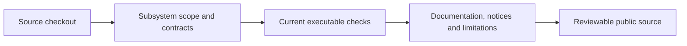

# Public source distribution

The public framework is built from the repository. Read
[capabilities](CAPABILITIES.md) and [subsystem status](../delivery/IMPLEMENTATION-STATUS.md)
before choosing a workload. Historical release archives, tags, and execution
receipt collections have been removed. First-party workspace packages and
the standalone fuzz package start at `0.1.0`. Dependency and toolchain pins remain
reproducibility inputs; contract schema and artifact compiler-generation identities
remain compatibility metadata, independent of Cargo package versions.

Create a fresh sandbox instance when moving from historical builds. Retained batch
continuation records bind the runtime package identity; the reset does not migrate
those records. Artifact compatibility fixtures retain their original identities.

Subsystem scope and CardDemo workload requirements retain their specifications
without old release-status or receipt claims. Content-addressed application-package
fixtures keep their declared versions and digests as compatibility test inputs.

For agent use, build the [executable sandbox bundle or container](MAINFRAME-SANDBOX.md).
The bundle includes the compiler, CardDemo runtime, Python controller, pinned
CardDemo reference, and complete legal notices for their normal dependency closure.
The container also retains its bundled Git source archive and GPL license.
Build the container locally from its digest-pinned bases; no published image is
assumed by these instructions.

## Review the public source

- Execute the [quick start](GETTING-STARTED.md) from the current checkout.
- Check capabilities and pending licensed work against each owning subsystem.
- Verify documentation links, generated indexes, and Mermaid rendering.
- Review LICENSE, NOTICE, dependency notices, CONTRIBUTING, and SECURITY.
- Keep credentials, customer data, licensed publication bodies, and oracle
  observations outside the distributed tree.

## Validate the checkout

```bash
cargo xtask docs
cargo xtask docs --check
cargo xtask subsystems --check
cargo xtask changelog --check
cargo xtask license-notices --check
cargo deny check
git diff --check
```

These checks validate documentation, tracking, and dependency policy. Run the
additional subsystem and runtime checks required by the diff, following the
[verification strategy](../delivery/VERIFICATION-STRATEGY.md).



Record unavailable environments and pending licensed checks in the owning status
record. Local success does not establish production readiness or IBM equivalence.

## Migration from historical layouts

Conformance inputs now live under `conformance/subsystems/` and workload profiles
under `conformance/profiles/`. Use `cargo xtask subsystems --check` to validate the
named phases and dependencies. Historical release commands and receipt archives
have been removed; run the applicable verifier against the current checkout.

Moved paths and renamed metadata change input and projection hashes. Canonical
identities that embed those hashes also change, even when the underlying IBM
source facts and runtime framing stay the same. Keep schema-version checks and
reject stale replay bindings; do not relabel historical execution receipts as
results from the new layout. Synthetic fixtures remain zero-credit test inputs.
