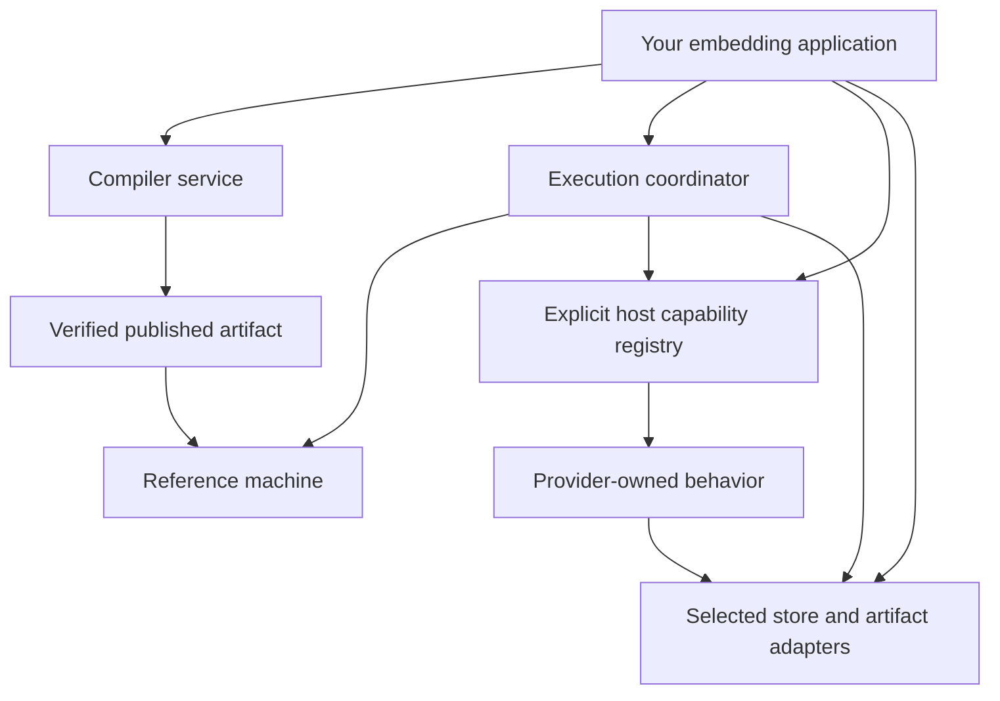

# Embed mainframe-env in Rust

Compose the framework using workspace crates from a reviewed source revision.
The public distribution is source-based; this guide does not assume published
crates.io packages or stable pre-1.0 APIs. Keep the source revision, lockfile,
toolchain, and contract versions together.

## Choose the integration boundary

| Need | Owned surface | Starting point |
|---|---|---|
| Construct inputs | Source bytes, logical libraries, format, encoding and bounds | [Source](../../crates/foundation/mainframe-env-source/README.md) |
| Compile COBOL | Compiler requests, stage proofs and published artifacts | [Compiler API](../../crates/contracts/mainframe-env-compiler-api/README.md), [compiler](../../crates/kernel/mainframe-env-compiler/README.md) |
| Execute an artifact | Invocation, machine drive actions and typed outcomes | [Execution API](../../crates/contracts/mainframe-env-execution-api/README.md), [interpreter](../../crates/kernel/mainframe-env-interpreter/README.md) |
| Supply host services | Typed requests/results and capability registration | [Host API](../../crates/contracts/mainframe-env-host-api/README.md) |
| Supply persistence | Execution, work, event, checkpoint, session and artifact interfaces | [Store API](../../crates/contracts/mainframe-env-store-api/README.md), [store](../../crates/stores/mainframe-env-store/README.md) |
| Compose the product | Providers, identity, admission and readiness | [Server](../../crates/apps/mainframe-env-server/README.md) |
| Translate transport | Route DTOs and application-service calls | [z/OSMF](../../crates/gateways/mainframe-env-zosmf/README.md) |

The [CLI implementation](../../crates/apps/mainframe-env-cli/src/main.rs) is
a small compilation/local-execution example. Use the server composition for
hosted execution and durable recovery. Generate API docs for exact signatures:

```bash
cargo doc --workspace --all-features --no-deps --locked
```

## Compose through contracts



The compiler owns syntax, semantics, HIR, lowering, and publication. The machine
evaluates executable semantic IR. The coordinator owns admission and effect
sequencing; providers own subsystem state and operations. Gateways translate
protocols without becoming semantic authorities.

Supply bytes, declared format/encoding, logical paths, and ordered libraries
explicitly. Provider ABI libraries remain provider-owned. Validate artifact
content identity and compatibility before admission, then propagate principal,
grants, deadlines, limits, idempotency, and run-unit identity to every effect.

## Preserve the execution boundary

Handle completion, conditions, suspension, transfer, ABEND, cancellation,
timeout, rejection, exhaustion, and infrastructure/provider failures distinctly.
Persist intent before durable mutations and preserve unknown outcomes until
service-specific reconciliation. Transport failure does not prove that a
mutation failed.

An adapter implements an owned interface rather than importing frontend ASTs
or provider-private databases. New providers preserve bounds, authorization,
canonical effect identity, idempotency, recovery, and generation pinning. Read
[execution and durability](../architecture/EXECUTION-AND-DURABILITY.md),
[security](../architecture/PLUGIN-AND-SECURITY.md), and the
[contracts index](../contracts/README.md) before changing these boundaries.

For durable embedding, validate migrations and artifact placement, bootstrap
identity, poll worker health, implement redacted observability, and rehearse
backup/restore. The [operations runbook](../runbooks/OPERATIONS.md) describes
the reference server's behavior and limits.
