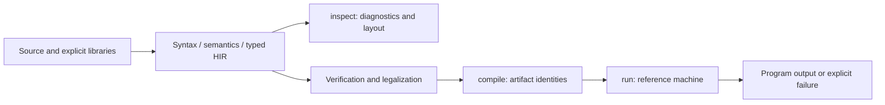

# Getting started

This guide uses the current source checkout. Run these commands from the
repository root unless stated otherwise. See [source distribution](DISTRIBUTION.md)
for public scope and review checks.

## Prerequisites

- Git and Rust with the pinned toolchain in
  [rust-toolchain.toml](../../rust-toolchain.toml). Rustup selects it inside the
  checkout. The declared MSRV is a compatibility gate, not the contributor
  toolchain.
- Native build tools and a linker for your platform. All-feature builds include
  dependencies with native compilation requirements.
- Registry access for the first Cargo build.

PostgreSQL, Jenkins, CardDemo, and a licensed IBM system are unnecessary for
the local HELLO path. They are needed only for their integration gates.

```bash
git clone https://github.com/toreleon/mainframe-env.git
cd mainframe-env
rustup show active-toolchain
cargo run --locked -p mainframe-env-cli --bin mainframe-env -- --help
```

## Inspect, compile, and run

The included [HELLO fixture](../../conformance/subsystems/platform/fixtures/cobol/HELLO.cbl)
is fixed-format COBOL. Pass its format explicitly:

```bash
cargo run --locked -p mainframe-env-cli --bin mainframe-env -- \
  inspect conformance/subsystems/platform/fixtures/cobol/HELLO.cbl --format fixed

cargo run --locked -p mainframe-env-cli --bin mainframe-env -- \
  compile conformance/subsystems/platform/fixtures/cobol/HELLO.cbl --format fixed

cargo run --locked -p mainframe-env-cli --bin mainframe-env -- \
  run conformance/subsystems/platform/fixtures/cobol/HELLO.cbl --format fixed
```

`inspect` prints semantic/layout information and diagnostics. Read its diagnostics;
a zero exit code does not prove that the program is executable. `compile`
reports artifact content and semantic identities, byte count, and diagnostic
count. It does not write a native executable or an output file. `run` compiles
the source and executes the artifact through the local reference machine.

The run displays a `zOS-clone Hello World` banner retained in the original
fixture, followed by `Hello, World!` and `Goodbye!`. Banner text is fixture data.



## Use your own source and COPY libraries

The CLI reads UTF-8 source and defaults to free format. Select `--format fixed`
for fixed-column input. All three commands accept repeatable library arguments:

```bash
cargo run --locked -p mainframe-env-cli --bin mainframe-env -- \
  compile path/to/PROGRAM.cbl --format fixed \
  --library path/to/copybooks --library path/to/shared-copybooks
```

Replace the paths with your source and library directories. Their explicit
order controls member resolution; directory entries are sorted deterministically.
Symlinks, ambiguous members, missing directories, and source bounds fail
explicitly. Supplying a library also appends the CICS, Db2, and MQ provider-owned
ABI libraries. Physical paths and timestamps do not define source identity.

The local CLI has a limited execution composition. Resolving a subsystem
copybook does not register that subsystem's runtime services. Programs requiring
host services need the [server](../runbooks/OPERATIONS.md) or an
[embedding application](EMBEDDING.md).

## Check your checkout

```bash
cargo test --locked -p mainframe-env-cli
git diff --check
```

For contributor policy and integration gates, follow
[CONTRIBUTING.md](../../CONTRIBUTING.md). After build/check sequences, clear
disposable Cargo artifacts with `cargo clean` in this checkout; retain useful
receipts outside its target directory.

## Common problems

| Symptom | Next step |
|---|---|
| Toolchain is missing | Install the exact pinned version; check `rustup show active-toolchain` |
| Linker or native dependency build fails | Check platform build tools and the failing dependency's output |
| Fixed-format source has unexpected diagnostics | Pass `--format fixed` and preserve source columns |
| COPY member cannot be found | Supply `--library`; check spelling, duplicates, and source format |
| Analysis passes but executable compilation fails | Read unsupported-operation diagnostics and subsystem status |
| A host operation is unavailable in `run` | Use a composition registering the required host capability |
| Cargo cannot fetch dependencies | Check registry access and Cargo configuration |

Continue with [capabilities](CAPABILITIES.md), the
[architecture](../architecture/OVERVIEW.md), or the
[development server runbook](../runbooks/OPERATIONS.md).
