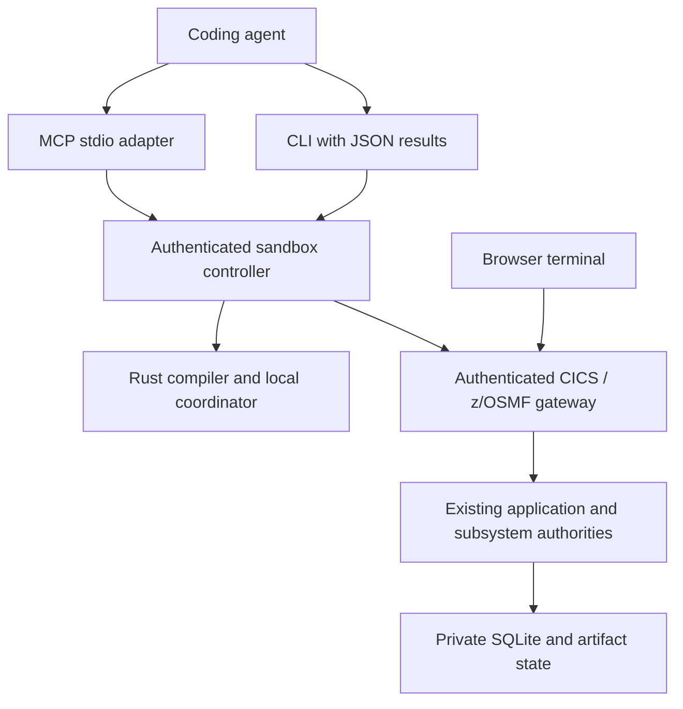
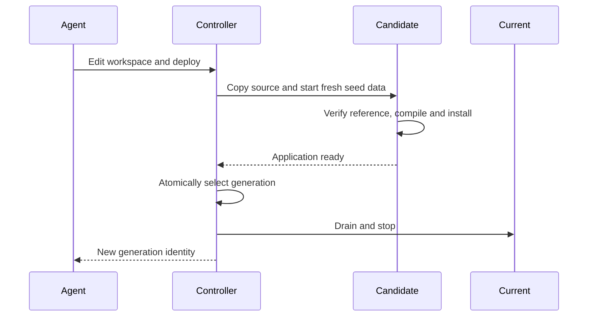

# Mainframe Sandbox

Status: Implemented for native and container execution; Cube VM validation pending
Owner: Application and developer tooling maintainers
Scope: Executable profiles, lifecycle and agent access
Applies from: mainframe-env current subsystem contracts

Mainframe Sandbox is an executable workspace for compiling, running and modifying
supported mainframe applications. The `mainframe-env` Rust framework supplies
language and subsystem behavior. The sandbox composes workspaces, processes,
application profiles and agent access around those existing authorities.

## Set up and run

Native execution requires Linux, Python 3.12.13, the pinned Rust 1.98.0 toolchain,
Git 2.50.1 and native build tools. Setup builds a relocatable bundle, includes
complete target-filtered third-party notices, and checks out the pinned AWS
CardDemo sample. Runtime startup verifies that reference checkout. Setup clears
the checkout's Cargo target after preserving its executables and notices.

```bash
bin/mainframe-sandbox setup --destination "$PWD/dist/sandbox"
dist/sandbox/bin/mainframe-sandbox serve \
  --instance "$PWD/.tmp/sandbox/carddemo" --profile carddemo-online
```

If the pinned upstream sample is already available, pass `--corpus /path/to/carddemo`
to setup. It creates a separate reference clone and leaves the supplied checkout
untouched. The installed bundle runs from any working directory and requires no
Cargo installation or runtime downloads.

Open <http://127.0.0.1:8080>, connect and sign on with `USER0001` / `PASSWORD`.
View account `00000000050`, or use card `0500024453765740`. The administration
workspace uses `ADMIN001` / `PASSWORD`. These are the upstream sample's local
demonstration identities. See the [CardDemo operator guide](../runbooks/CARDDEMO-OPERATOR.md)
for application behavior and transport credentials.

`serve` stays in the foreground. Ctrl-C, SIGTERM or `stop` drains the owned runtime
and closes the controller. An instance directory has one controller owner;
concurrent startup and destruction of a running instance are rejected.

## Profiles and capabilities

| Profile | Installed behavior |
|---|---|
| `cobol` | Compiler, analysis and standalone local execution; includes `HELLO.cbl` |
| `carddemo-online` | 18 COBOL programs, 17 transactions, 17 BMS maps, seed datasets, RACF demonstration identities, persistent SQLite and browser/CICS terminal access |

The online profile also exposes authenticated dataset routes and JES built-in
programs. Reports enqueue the owned `JOBS` transient queue. The application batch
cycle and Db2, IMS and MQ extensions retain their separate workload commands;
their installation is not part of this profile. An agent should read
`sandbox_status` before selecting a workload.

Account view has a known SSN display formatting gap in its `STRING` expression
with reference modification. This remains COBOL subsystem compatibility work.

Native mode isolates application state and owns child processes. Linux containers
or Cube MicroVMs supply the operating-system boundary for agent shell commands.
The native directory layout does not confine an agent's existing shell access.



## Agent operations

CLI commands emit JSON. All tool calls use the same controller operation layer:

```bash
dist/sandbox/bin/mainframe-sandbox status --instance "$PWD/.tmp/sandbox/carddemo"
dist/sandbox/bin/mainframe-sandbox call cobol_compile \
  --instance "$PWD/.tmp/sandbox/carddemo" \
  --arguments '{"path":"app/cbl/COACTVWC.cbl"}'
```

Paths are relative to the instance's `workspace/`. Traversal, absolute source
paths and source-path symlinks are rejected. Agents can use their own editor or
`workspace_read` / `workspace_write`. The workspace includes an `AGENTS.md`
describing the execution workflow. CardDemo defaults to fixed source format and
its base COPY libraries; the standalone profile defaults to free format.

| Group | Operations |
|---|---|
| Discovery and source | `sandbox_status`, `workspace_read`, `workspace_write` |
| Compiler | `cobol_inspect`, `cobol_compile`, `cobol_run` |
| Application lifecycle | `sandbox_generations`, `sandbox_deploy`, `sandbox_reset`, `sandbox_rollback` |
| CICS terminal | `terminal_open`, `terminal_read`, `terminal_send`, `terminal_close` |
| JES and datasets | `jobs_submit`, `jobs_status`, `jobs_spool`, `datasets_list`, `datasets_read` |

`cobol_run` uses the standalone local coordinator. Deploy a CICS application and
use terminal operations to execute it with its installed providers. A terminal
call preserves live field protection, sends current editable values and resumes
the program once. Secret fields are masked in returned terminal data. Ordinary
and administration sessions retain their existing RACF permissions. Gateway
denials are surfaced rather than bypassed.

## MCP clients

Start the instance, then generate a configuration:

```bash
dist/sandbox/bin/mainframe-sandbox agent-config \
  --instance "$PWD/.tmp/sandbox/carddemo"
```

The output contains an absolute executable and arguments under `mcpServers`.
Clients with another configuration format can use the same command and arguments:

```json
{
  "mcpServers": {
    "mainframeSandbox": {
      "command": "/absolute/path/dist/sandbox/bin/mainframe-sandbox",
      "args": ["mcp", "--instance", "/absolute/path/instance"]
    }
  }
}
```

For Codex, the equivalent configuration is:

```toml
[mcp_servers.mainframe_sandbox]
command = "/absolute/path/dist/sandbox/bin/mainframe-sandbox"
args = ["mcp", "--instance", "/absolute/path/instance"]
```

The adapter runs on the same machine, container or guest as its instance.
For a host client controlling a container, use `docker` as the MCP command with
`exec --user sandbox -i mainframe-sandbox mainframe-sandbox mcp --instance /state/carddemo`
as its arguments. Keep the container running while the client uses the adapter.

The stdio adapter supports MCP `2025-11-25` and `2025-06-18` handshake protocols,
structured tool results and tool annotations. Modern clients may use their legacy
fallback; this adapter does not advertise the stateless `2026-07-28` protocol.
Its only stdout output is newline-framed JSON-RPC. EOF closes the adapter promptly
and leaves the independently managed application running. Cancellation suppresses
the MCP response; an already admitted application mutation may still complete.
Neither cancellation nor a lost response triggers an automatic mutation retry.

The runtime adapter uses Python's standard library. Compatibility is validated
with the official MCP Python SDK 1.27.0; other clients still need their own setup
and compatibility checks.

## Edit, deploy, restart and reset

The verified reference checkout supplies seed data and corpus identity. It stays
separate from the editable workspace. Deployment copies that workspace into a
new source snapshot and compiles it into a new private application instance.
The active generation changes only after the candidate passes readiness.
Compilation or startup failure leaves the previous service active.



| Operation | Source and data behavior |
|---|---|
| Restart `serve` with the same instance | Reopens deployed source and data; workspace edits are not automatically deployed |
| `deploy` | Starts workspace code with fresh seed data and retains the previous generation |
| `reset` | Starts currently deployed code with fresh seed data and retains the previous generation |
| `rollback GENERATION` | Reopens a retained generation and its stored data; leaves the editable workspace unchanged |
| `stop` | Stops owned processes and retains the instance |
| `destroy` | Requires a stopped, owned instance; deletes its workspace and retained data |

Deployment, reset and rollback invalidate controller-owned terminal handles.
Open a new terminal afterward; browser users reconnect. Export valuable data
before destruction. Generations are runtime application state, not repository
release records or certification receipts.

## Container execution

The image builds its Rust binaries on the same Debian generation as its runtime,
pins both base images by digest and Git's source archive by SHA-256, and includes
Git's corresponding source and the application dependency notices.

```bash
docker build -f tools/sandbox/Dockerfile -t mainframe-sandbox:local .
docker volume create mainframe-sandbox-state
docker run --rm --name mainframe-sandbox \
  --workdir /state \
  --read-only --cap-drop=ALL --security-opt=no-new-privileges \
  --cpus=2 --memory=2g --pids-limit=256 \
  --tmpfs /tmp:rw,noexec,nosuid,size=64m \
  --mount type=volume,src=mainframe-sandbox-state,dst=/state \
  -p 127.0.0.1:8080:8080 mainframe-sandbox:local
```

For a managed HTTPS proxy, provide its trusted combined CA bundle through
`--secret id=proxy_ca,src=/path/to/ca-bundle.pem`. The secret mount is used only
for networked build steps and is not copied into the image.

Run agent commands as the image's `sandbox` user:

```bash
docker exec --user sandbox mainframe-sandbox \
  mainframe-sandbox status --instance /state/carddemo
docker exec --user sandbox -i mainframe-sandbox \
  mainframe-sandbox mcp --instance /state/carddemo
```

The frontend's network listener is intended for a private container or VM network
with protected ingress. The default native listener remains loopback. Controller
operations require a secret stored in the instance's mode-0600 connection file;
browser application routes retain their existing mainframe authentication.

## CubeSandbox templates

Cube can convert an OCI image into a template with a pre-warmed MicroVM snapshot.
Use an existing authenticated Cube deployment and publish the built image to a
registry that deployment can access. Replace the image placeholder with its
actual digest:

```bash
cubemastercli tpl create-from-image \
  --image REGISTRY/mainframe-sandbox@sha256:IMAGE_DIGEST \
  --writable-layer-size 1G \
  --expose-port 8080 --expose-port 49983 \
  --probe 8080 --probe-path /readyz \
  --enable-inject-envd \
  --env MAINFRAME_SANDBOX_REQUIRE_ENVD=1
```

If the CLI does not embed a matching `envd`, supply `--envd-path /path/to/envd`.
The application probe returns HTTP 200 only when the Rust application is ready
and, with the environment flag above, `envd` returns its expected HTTP 204.
The template must contain no customer data, real credentials, active terminal
sessions or in-flight jobs. CPU architecture must match the image and guest agent.

VM snapshots also copy resident controller credentials. After every create,
clone or rollback, the trusted host provisioner must generate a fresh random
token outside the VM, upload it as a temporary file, execute
`mainframe-sandbox rekey --instance /state/carddemo --token-file /path/to/token`,
and remove that file **before handing the instance to an agent**. Rekey changes
both the resident controller and its connection file without printing the token.
Configure Cube's per-instance ingress access controls as well; controller
authentication does not replace the browser application's ingress boundary.

Agents can use Cube's command/file SDK operations to edit `workspace/` and invoke
the same CLI, or run the MCP adapter inside the guest. Cube's control-plane API
credentials stay with the host provisioner. Each guest keeps its SQLite state in
its own VM filesystem. A writable shared host mount is not a clone or rollback
boundary: Cube documents that such mounts remain shared and do not roll back.

This template recipe is an integration contract pending a real KVM deployment
test. Native and Docker verification do not establish Cube pause/resume, clone,
ingress or `envd` compatibility. See Cube's
[custom image guide](https://github.com/TencentCloud/CubeSandbox/blob/master/docs/guide/tutorials/bring-your-own-image.md),
[template contract](https://github.com/TencentCloud/CubeSandbox/blob/master/docs/guide/templates.md)
and [storage semantics](https://github.com/TencentCloud/CubeSandbox/blob/master/docs/guide/persistent-storage.md).

## Limits and verification

The controller bounds request bodies to 1 MiB and application/compiler responses
to 2 MiB. Compiler invocations have a 30-second wall deadline and two concurrency
slots; startup has a 60-second readiness deadline. Source snapshots accept at
most 10,000 regular files, 16 MiB per file and 256 MiB total. Instances retain at
most 32 generations and controllers own at most 128 terminal handles. Container
or VM configuration supplies CPU, memory, process and storage quotas for shell
execution. Dataset reads that exceed the response limit return an error.

Exercise actual application behavior without replacing it with a mock:

```bash
dist/sandbox/bin/mainframe-sandbox verify \
  --directory /path/to/disposable-verification-output
```

This runs two independent CardDemo instances and a standalone compiler profile.
It checks sign-on, masking and protection, account use, a committed card edit,
isolation, restart, source compilation/deployment/use, rollback, reset, rejected
deployment, dataset access, JES submission and owned-process shutdown. Logs and
instance data remain in the selected external directory for inspection.
Certification and licensed differential claims retain their separate subsystem
gates and are not inferred from sandbox application use.
