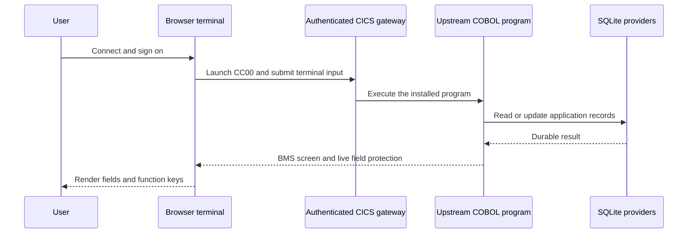
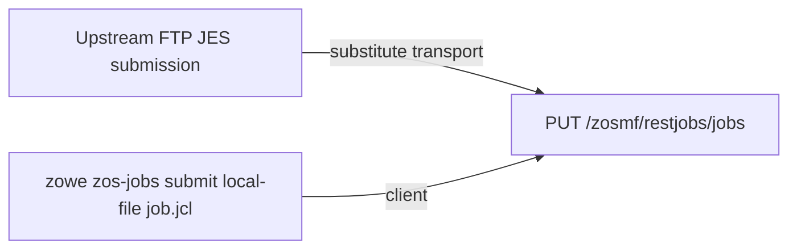

# CardDemo operator compatibility

These commands operate only on the clean corpus selected by
`CARDDEMO_CORPUS_DIR`. The full certification command also requires a disposable
PostgreSQL 18 database in `MAINFRAME_ENV_POSTGRES_TEST_URL`. The accepted
`CDV1` correction is pinned in the CardDemo workload contract.

Build the optimized runner before executing application workloads:

```bash
cargo build --locked --release -p xtask
```

Use `target/release/xtask` for the online and batch workload commands below.
The statement cycle performs thousands of durable host calls; the unoptimized
development runner can exceed the gate's two-minute job deadline. The optimized
runner uses the same source, runtime contracts, and acceptance limits.

## Run and use the application

After preparing the pinned upstream checkout below, start a persistent local
instance:

```bash
CARDDEMO_CORPUS_DIR=/path/to/carddemo target/release/xtask carddemo-serve \
  --state-dir /path/to/carddemo-state --listen 127.0.0.1:8080
```

Open <http://127.0.0.1:8080> and select **Connect**. Sign on with `USER0001`
and `PASSWORD`. Choose menu option `1`, enter account `00000000050`, and press
**Enter** to view its details. Use **F3** to return, **Tab** between input fields,
and the function-key buttons for paging and other screen actions.

Choose the **Administration** workspace before connecting to use the upstream
`ADMIN001` / `PASSWORD` account. The browser uses separate demonstration
transport identities (`WEBUSER` / `transport-password` and `WEBADM` /
`admin-transport-password`); application sign-on still runs the upstream COBOL
security program and the transport retains its RACF permissions. These are
local development accounts. Keep the default loopback listener.

The launcher installs 18 source-backed programs, 17 transactions, all 17 BMS
maps, the upstream seed datasets and alternate indexes. Browser fields use the
live terminal's protection flags, and password fields remain masked. Account,
card, user and transaction updates run through the existing CICS/provider
routes. Report submission writes the owned `JOBS` transient queue; running the
batch cycle remains a separate workload command. This launcher serves the base
online application; Db2, IMS and MQ extensions are exercised by their dedicated
commands and the full gate.

SQLite data and compiled artifacts live in `--state-dir`. Stop with Ctrl-C and
restart with the same directory to retain application edits. Use a new directory
for a fresh instance. Restarting does not invoke certification gates or reset
operator data. The process stays running until stopped, unlike the `--check`
commands below.



## Owned commands

| Intent | Command | Effect |
|---|---|---|
| install | `target/release/xtask carddemo-operator-install --check` | validates and installs the content-addressed package, CICS resources, catalog, and exact seed generation through the owned application/provider authorities |
| compile | `target/release/xtask carddemo-operator-compile --check` | compiles all pinned source closures and installs the named online/batch artifacts with owned compatibility services |
| submit | `target/release/xtask carddemo-operator-submit --check` | executes the declared initialization and operational job set through authenticated public z/OSMF Jobs routes and verifies job IDs, return codes, spool, and dataset results |
| reset | `target/release/xtask carddemo-operator-reset --check` | recreates the declared disposable CardDemo data/catalog fixtures and verifies the reset result; do not aim it at an authority containing unretained operator data |
| certify | `target/release/xtask carddemo-full --check` | derives all 20 journeys from lower-profile application runs, then executes memory overload/isolation, SQLite backup/restore, and PostgreSQL restart controls |

Run the bounded host integration gate with the same pinned checkout:

```bash
CARDDEMO_CORPUS_DIR=/path/to/carddemo target/release/xtask carddemo-host-integration --check
```

It validates the current host operands, resource definitions, and nine base
online journeys. It prints the live result and does not compare deleted
historical receipts. The full gate below is required for all 20 journeys and
PostgreSQL restart controls.

The commands are certification-safe substitutions for the pinned helper
scripts; they do not invoke the scripts, native runtime archives, Micro Focus,
UniKix, or a legacy compiler.

## FTP/JES substitutions

The repository scripts use `tnftp`, `SITE FILETYPE=JES`, and `PUT *.jcl` only
as a transport for JES submission. The selected substitution is the public
z/OSMF Jobs contract:



The pinned `FTPJCL.JCL` contains the upstream typo
`AWS.M2.CARDEMO.FTP.TEST`. The framework retains that exact spelling as
a bounded compatibility alias, but the canonical owned dataset is
`AWS.M2.CARDDEMO.FTP.TEST`. Its selected substitution is an authenticated
download through `GET /zosmf/restfiles/ds/AWS.M2.CARDDEMO.FTP.TEST`; it
preserves the dataset bytes without implementing arbitrary network FTP,
credentials, directories, or remote hosts. Other FTP commands remain
explicitly unsupported and cannot return generic success.

## Full-certification decisions

`CDV1` maps to `COCRDSEC`, but no original source or runtime object is present
in the pinned corpus. The owner-approved correction supplies bounded owned demo
source at `conformance/profiles/carddemo/fixtures/carddemo/COCRDSEC.cbl`. It displays an
explicit unavailable-contract message and returns without reading or mutating
card data. `carddemo-full` verifies the correction contract, source digest,
compiled artifact, anonymous denial, and authenticated public CICS route; no
environment override can silently change the disposition.

## Prepare the real upstream corpus

Check out the exact commit from
[the corpus inventory](../../conformance/profiles/carddemo/inventory/carddemo-corpus.json):

```bash
git clone https://github.com/aws-samples/aws-mainframe-modernization-carddemo.git /path/to/carddemo
git -C /path/to/carddemo checkout --detach 59cc6c2fd7ebd7ef7925cad552a01a4b8b6e4d5e
export CARDDEMO_CORPUS_DIR=/path/to/carddemo
cargo xtask carddemo-corpus --check
cargo xtask carddemo-source --check
cargo xtask carddemo-closure --check
cargo xtask carddemo-readacct --check
```

The corpus check requires a clean checkout, the pinned origin URL, commit, Git
tree, file counts, license, and content identities. Keep the upstream sources
outside the framework checkout and leave their bytes unchanged.

For the complete workload, provide a disposable PostgreSQL 18 database and run:

```bash
export MAINFRAME_ENV_POSTGRES_TEST_URL=postgresql://postgres@127.0.0.1:55432/mainframe_review
target/release/xtask carddemo-full --check
```

Use the connection URL for your local test database. The full gate runs 20
application journeys, memory isolation/overload, SQLite backup and restore, and
PostgreSQL restart controls. Keep run output outside Git. These local workload
checks do not establish licensed IBM equivalence.
