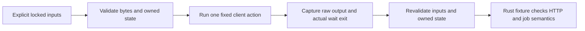

# CI supply-chain inputs

`Jenkinsfile` is the full assurance CI workflow. Its executable
inputs are governed by two reviewed locks:

- `tools/ci-inputs.lock.json` fixes the workspace and MSRV toolchains by
  release and compiler/Cargo commit, fixes every separately installed CI tool
  by an exact version, and inventories tracked action, container, and package
  installation inputs;
- `tools/jenkins/controller-plugins.lock.json` fixes the Jenkins LTS WAR and
  the complete 63-plugin closure by exact version and SHA-256.

`tools/supply_chain.py check` enumerates files with `git ls-files`. A tracked
GitHub action must use a 40-hex commit, a tracked container must use an
`@sha256:` digest, and tracked CI cannot install ambient packages. The current
inventory contains two digest-pinned sandbox base images (Rust and Python),
and no GitHub actions or package-install commands. The Jenkins controller, plugins, Rust toolchains, Cargo dependencies,
and host tools are locked inputs.

## Deliberately unsupported local files

The following names have existed as locally excluded experiments on some
workstations, but they are not in Git and are not CI authority:

- `.github/workflows/offline-dev-bundle.yml`;
- `tools/build_offline_dev_bundle.sh`;
- `tools/package_offline_bundle.sh`;
- `tools/offline_bundle_assets/`; and
- `tools/offline_dev_assets/`.

The lock records those names and the validator requires them to remain
untracked. Their remote inputs, package commands, and behavior are therefore
not claimed as pinned. Promoting any of them requires deliberately adding the
files, replacing every mutable input, updating the tracked-input inventory,
and reviewing the resulting workflow. Historical execution receipts are removed from the tracked tree.

## Install and verify Jenkins

Create the capped volume, then download the exact reviewed artifacts into it:

```bash
tools/jenkins/bootstrap-macos.sh
"$(tools/jenkins/select-python.sh)" -B tools/supply_chain.py install-jenkins \
  --home /Volumes/MainframeEnvJenkins/jenkins-home
```

The installer downloads only the versioned Jenkins WAR and versioned plugin
URLs, checks every SHA-256 before installation, verifies artifact manifest
identities, and verifies that every required plugin dependency is inside the
locked closure. It refuses an unreviewed active plugin and creates a pin marker
for every accepted plugin. `run-local.sh` verifies
the same bytes again and launches the locked WAR directly; it does not run a
package-manager shim. Jenkins also reruns repository, runtime, controller, and
plugin validation as a blocking `supply-chain` gate.

The unconditional `license-notices` gate derives the current host's CLI/server/sandbox-runtime
normal dependency closure and verifies project and third-party legal text.
Release signing and publication stages have been removed. Subsystem checks
validate current inputs; execution logs remain outside Git.

The host must already provide the exact versions in `tools/ci-inputs.lock.json`.
The lock currently requires Rust/Cargo 1.98.0, Rust/Cargo 1.95.0 for MSRV,
Python 3.12.13, Git 2.50.1, Java 21.0.12.1, cargo-deny 0.20.2,
cargo-fuzz 0.13.2, cargo-llvm-cov 0.9.1, PostgreSQL 18.6, and GitHub CLI
2.92.0. The fuzz compiler is additionally pinned as nightly-2026-09-01 by its
rustc and Cargo commits. Install Cargo tools only from their immutable locked
package coordinates:

```bash
cargo +1.98.0 install cargo-deny --version 0.20.2 --locked
cargo +1.98.0 install cargo-fuzz --version 0.13.2 --locked
cargo +1.98.0 install cargo-llvm-cov --version 0.9.1 --locked
```

Package-manager commands are workstation provisioning, not CI steps. A
different installed version fails before it can receive assurance
credit.


## Optional public client byte admission

The same CI input lock uses `mainframe-env.ci-input-lock@2` to add one explicitly
selected development profile, `public-client-linux-x86_64`. The validator also
retains the strict six-field @1 reader: @1 cannot carry development profiles.
The eight standard tools, existing runtime scopes, Jenkins selection and
cross-platform repository checks retain their requirements. Plain `check`
validates optional pin grammar without reading external profile files. Selected
profile checks require Linux x86_64; missing selected inputs fail.

Use `check --development-profile public-client-linux-x86_64`, one repeated
`--profile-file ROLE=/absolute/resolved/file` for each required role, and
`--profile-tree /absolute/resolved/root-above-package`. File roles are exactly
`node-archive`, `node`, `zowe-archive`, `bubblewrap`, `loader`, `libdl`,
`libstdcxx`, `libm`, `libgcc`, `libpthread`, `libc`, and `libnss_files`.
The tree contains `package/lib/main.js`; it is not the `package/` directory
itself. Transient paths stay in invocation arguments and external receipts.
There is no implicit PATH/environment discovery, download, installation,
extraction, native command or alternate input fallback. Adding an explicit
`--runtime` retains that scope's existing execution behavior; profile selection
alone does not select a runtime scope.

The byte validator checks nonsymlink regular inputs, stable read metadata,
ownership, write/privilege modes and file capabilities. It checks official Node
archive identity and the selected binary and LICENSE pins, and Zowe SHA-256
plus SHA-512 SRI before bounded archive parsing. Exact Zowe archive/tree
membership, modes, payloads, directory ancestry and canonical paths are required.
Empty regular leaves are valid. The retained Zowe digest uses path-component-sorted
`path`, `bytes`, `sha256`, `mode` rows, compact JSON with sorted keys, default
ASCII escaping and no newline. This preserves the historical producer's `Path`
ordering, including directory names that are prefixes of sibling filenames;
lexical ordering of complete path strings produces a different digest.
It is distinct from the existing framed
`mainframe-env.offline-tree@1` identity, which remains unchanged. The Node
LICENSE pin is in the optional lock alongside its binary pin; validator source
does not duplicate input digests.

The in-process `validate_development_inputs` entry returns only validated source
roles, the tree root and observed identities for the later fixed CI launcher.
Profile data cannot supply mount destinations, argv, host directories, plugins
or package resolution. The complete client tree stays intact. Byte admission
does not grant native launch or job execution and contributes no test workload,
official coverage, licensed, release or Foundation acceptance credit.

These pins preserve reviewed bytes, not a hermetic source build. Node release
signatures have no verified release-key trust anchor here. Zowe SRI/bundled
bytes do not establish upstream signature or deterministic source-build
equivalence. Bubblewrap and library pins are retained host observations;
bubblewrap starts outside containment and its host loader/library bootstrap
remains qualified. Namespace admission and any future native requirements need
their separately authorized existing launcher checks. No host filesystem
widening or additional library is implied by this profile.

## Finite public client command

The optional Linux test launcher is `tools/ci_assurance.py public-client-command`.
Supply `--development-profile public-client-linux-x86_64`, the same twelve
explicit `--profile-file ROLE=/absolute/resolved/file` bindings and
`--profile-tree` described above. Add a fresh `--run-dir` beneath a private owned
parent, `--action`, the real fixture listener's `--port`, and
`--timeout-seconds` greater than zero and at most ten. Selected inputs must match
the existing lock. The optional global `--root` must name the executing source
root; duplicate scalars, root options, abbreviations and surplus arguments refuse.

| Action | Additional scalars |
| --- | --- |
| `submit`, `owner-list`, `bad-password`, `other-owner-list` | none |
| `status`, `files`, `other-status`, `other-files` | `--job-id` |
| `content`, `other-content` | `--job-id`, `--file-id` |

Ports are canonical ASCII decimals 1..65535, file IDs 0..63, and job IDs use the
batch owner's canonical `JOB` plus five to eight decimal digits for a nonzero
value. No arbitrary command, credential, host, environment or mount configuration
is accepted. The fixture owns the listener and semantic assertions; this command
does not start a server or poll jobs. It uses fixed synthetic principals and JCL,
fresh owned settings and an empty child environment.



The accepted package has one readonly bind at
`/opt/client/node_modules/@zowe/cli`, with its fixed `lib/main.js` entry. This local
installation layout supports ordinary package self-resolution; the child still
disables global module lookup and native addons. Owned logs may contain only
`imperative.log`, `zowe.log` and `imperative_debug.log`, each at most 1MiB and
at most 2MiB combined. The latter is a source-proven startup-error log; its
presence never turns a failed client command into semantic success.

Each fresh run leaf retains `stdout.bin`, `stderr.bin`, `child-exit.txt` and
`supervision-error.txt`. Transport exit zero means the command completed its
capture and postchecks; the actual child can have a nonzero exit. A spawn/wait
failure has no completed child exit. Never treat launcher exit alone, a vendor
message or nonzero child exit as an authentication/job pass. Raw streams have
65536-byte individual and 131072-byte combined ceilings; infrastructure
diagnostics are separately bounded printable ASCII. Rust owns eventual cleanup.

Admission requires Linux x86_64, uid/gid 1000, the reviewed supplementary groups
and zero effective/permitted/ambient capabilities. The launcher mounts accepted
inputs readonly and owns only its finite writable state. Loopback uses inherited
network; it does not isolate egress or prove listener ownership. Bubblewrap's
host bootstrap and unverified upstream signature/source-build trust remain
qualified. Synchronous byte validation has no separate watchdog; bounded log
inspection is not a hard filesystem quota. Missing inputs fail without fallback.
The real public-client application/HTTP fixture remains a separate pending gate.

## Reviewed updates

Every input update is a normal reviewed repository change:

1. State the security, compatibility, or maintenance reason and select exact
   versions from the upstream release records.
2. Download the candidate Jenkins WAR and complete required plugin closure into
   a disposable directory. Verify upstream signatures where available, compute
   SHA-256 locally, inspect plugin manifests, and update both version and hash.
3. Update `reviewed_on`; never update only a version or only a digest, and never
   use `latest`, a moving branch, a container tag, or an unbounded package
   install.
4. Run the installer and verifier against a disposable Jenkins home, then run:

   ```bash
   "$(tools/jenkins/select-python.sh)" -B tools/supply_chain.py check --runtime ci
   cargo +1.95.0 check --workspace --all-targets --all-features --locked
   cargo test --workspace --all-features --locked --no-fail-fast
   cargo deny check
   cargo xtask license-notices --check
   ```

5. Record the change in `CHANGELOG.md`, obtain review, and update a live
   controller only after the lock change is accepted. Rollback is the prior
   lock and its already reviewed artifacts.
