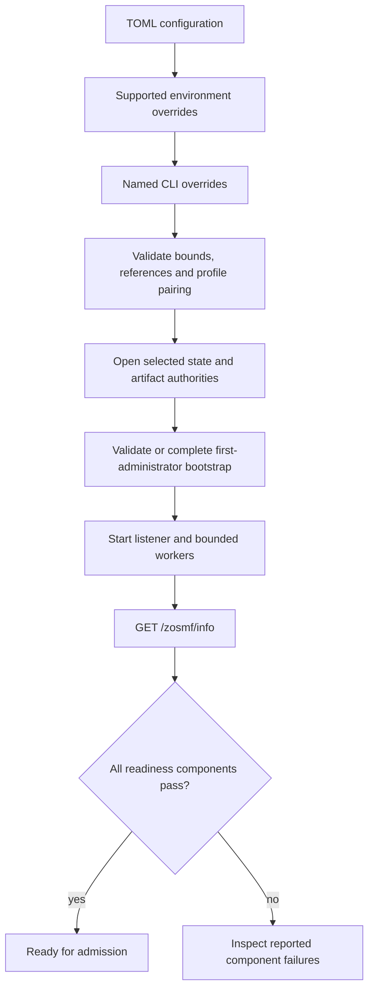

# Core-server operations

Status: **Development runbook for the current `main` binary**

The `core-server` remains a development composition rather than a turnkey
production service. Its startup inputs and health boundary are nevertheless
explicit and fail closed.

For local compilation without a server, use [getting started](../guides/GETTING-STARTED.md).
For hosted execution, select a store/artifact pairing, supply secret references,
complete first-administrator bootstrap, and inspect readiness before submitting
work. All Cargo examples below run from the repository root.



## Current operational limitations

- `ProductServer::metrics()` is an in-process API; the standalone binary does
  not yet expose a metrics exporter.
- Process-environment `env-base64:` is the standalone secret provider. An
  external vault or KMS requires an embedding application implementing the
  same bounded resolver contract.
- PostgreSQL and TLS secret rotation takes effect on a controlled restart.
  Package-verification keys are resolved afresh for each verification.
- Retention forecast/archive controls are privileged in-process APIs for an
  embedding control plane and offline subcommands of the standalone binary.
  There is no retention HTTP endpoint or background retention scheduler.

## Configuration sources

Configuration precedence is:

1. TOML (`config/mainframe-env.toml` by default, or the first positional path);
2. supported `MAINFRAME_ENV_*` environment overrides; and
3. named CLI flags, also represented by `ConfigOverrides` for embedders.

The positional path remains backward compatible. Run
`mainframe-env-server --help` for the named override set. Unknown TOML fields,
unsupported schemas, zero limits, incomplete bootstrap pairs, and an invalid
store/artifact pairing fail before the listener starts. `listen` must be a
concrete socket address with a nonzero port.

| Environment variable | Effect | Secret value? |
|---|---|---|
| `MAINFRAME_ENV_LISTEN` | Override `listen` | No |
| `MAINFRAME_ENV_STORE` | `memory`, `sqlite`, or `postgres` | No |
| `MAINFRAME_ENV_SQLITE_URL` | Override the SQLite URL | Potentially |
| `MAINFRAME_ENV_POSTGRES_URL_REF` | Override the PostgreSQL `SecretRef` | No |
| `MAINFRAME_ENV_ARTIFACT_STORE` | `local` for memory/SQLite or `shared` for PostgreSQL | No |
| `MAINFRAME_ENV_ARTIFACT_ROOT` | Override the local artifact directory | No |
| `MAINFRAME_ENV_MAX_BODY_BYTES` | Override the positive body bound | No |
| `MAINFRAME_ENV_MAX_CONCURRENCY` | Override the positive request bound | No |
| `MAINFRAME_ENV_TIMEOUT_MILLIS` | Override the positive request deadline | No |
| `MAINFRAME_ENV_SHUTDOWN_MILLIS` | Override the positive shutdown deadline | No |
| `MAINFRAME_ENV_TLS` | Enable or disable TLS | No |
| `MAINFRAME_ENV_TLS_CERTIFICATE_PATH` | Override the public certificate path | No |
| `MAINFRAME_ENV_TLS_KEY_REF` | Override the TLS private-key `SecretRef` | No |
| `MAINFRAME_ENV_BOOTSTRAP_ADMIN` | Override the first administrator | No |
| `MAINFRAME_ENV_BOOTSTRAP_SECRET_REF` | Override its credential `SecretRef` | No |
| `MAINFRAME_ENV_PACKAGE_HMAC_KEY_REFS` | JSON map of key IDs to `SecretRef` values | No |
| `MAINFRAME_ENV_SECRET_*` | Base64-encoded value resolved through an explicit reference | **Yes** |

Standalone references have the form
`env-base64:MAINFRAME_ENV_SECRET_<NAME>`. The one bounded resolver reads them on
demand and returns zeroizing bytes. Raw PostgreSQL URLs, credentials, private
keys, and package keys do not have parallel configuration variables and must
not appear in TOML, logs, evidence, shell history, or checked-in examples. The
standalone binary rejects other `SecretRef` provider schemes before listening.

## First-administrator bootstrap

A fresh store is deliberately not ready until the paired `[bootstrap]`
administrator and secret reference resolve. Before reading the credential, the
server durably claims the selected first-principal name. Concurrent attempts to
select another name fail before creating or changing a principal. The
credential is passed through a bounded ephemeral scope to the shared RACF
credential policy; it is never stored in configuration or provider state.

After the administrator attributes, profiles, and durable completion marker
commit, restart validates that marker before consulting the resolver. A partial
bootstrap resumes only when its claim matches either an empty security database
or the sole principal carrying all bootstrap-administrator attributes. An
ordinary existing user is never promoted implicitly, and a different marker or
replacement principal fails closed.

Remove the bootstrap secret from the environment after the first successful
startup; leave the reference in declarative configuration. Subsequent starts do
not resolve it. Password changes use the authenticated RACF path, not bootstrap.

## Local SQLite smoke start

Create a protected password file and use the sample configuration's reference:

`/secure/admin-password.bin` is a placeholder for a protected file you provision
with a credential satisfying the RACF policy. Do not commit it. The checked-in
default selects PostgreSQL and TLS; the overrides below deliberately select
local SQLite and loopback HTTP for this development smoke start.

```bash
export MAINFRAME_ENV_SECRET_BOOTSTRAP_ADMIN="$(base64 < /secure/admin-password.bin)"
MAINFRAME_ENV_STORE=sqlite \
MAINFRAME_ENV_ARTIFACT_STORE=local \
MAINFRAME_ENV_SQLITE_URL='sqlite://mainframe-env-dev.db?mode=rwc' \
MAINFRAME_ENV_ARTIFACT_ROOT='mainframe-env-artifacts-dev' \
MAINFRAME_ENV_TLS=false \
MAINFRAME_ENV_LISTEN='127.0.0.1:10443' \
cargo run --locked -p mainframe-env-server --bin mainframe-env-server
```

In another shell:

```bash
curl --fail --silent --show-error http://127.0.0.1:10443/zosmf/info
```

Remove `MAINFRAME_ENV_SECRET_BOOTSTRAP_ADMIN` after bootstrap. The response
reports `live`, `ready`, and each readiness component separately.

## PostgreSQL and TLS inputs

The concrete PostgreSQL URL and PEM private key are resolved only through the
references in TOML:

```bash
MAINFRAME_ENV_STORE=postgres \
MAINFRAME_ENV_ARTIFACT_STORE=shared \
MAINFRAME_ENV_SECRET_POSTGRES_URL="$(base64 < /secure/postgres-url.txt)" \
MAINFRAME_ENV_SECRET_TLS_PRIVATE_KEY="$(base64 < /secure/server.key)" \
MAINFRAME_ENV_SECRET_BOOTSTRAP_ADMIN="$(base64 < /secure/admin-password.bin)" \
MAINFRAME_ENV_TLS=true \
cargo run --locked -p mainframe-env-server --bin mainframe-env-server -- \
  /absolute/path/to/mainframe-env.toml
```

The public certificate path comes from `tls.certificate_path` or its
environment/CLI override. PostgreSQL requires the shared artifact profile and
never falls back to a node-local artifact root.

## Liveness and readiness

`GET /zosmf/info` is live whenever the process can serve it. `ready` becomes
true only when all reported checks pass:

- the selected store opened at migration head, passes collision-safe
  provider-state DML inside one rolled-back transaction, and reports bounded
  retention-capacity counters without consuming provider quota or advancing
  the provider mutation epoch;
- the durable first-administrator marker names an active credentialed
  principal with all bootstrap-administrator attributes;
- every required host capability is registered;
- the selected local/shared artifact authority passes a bounded read/write
  probe and every enforced object/byte quota has headroom; and
- exactly two shared durable worker tasks are running and each has successfully
  polled, heartbeated, or committed the JES/CICS START work lanes within three
  heartbeat intervals. A live task with a hung store operation ages out and
  fails readiness.

`retention_capacity` reports `healthy`, `low-watermark`, `high-watermark`,
`full`, or `unavailable`. Healthy and low-watermark stores remain ready, with
`retention_warning=true` at the low watermark so operators can reclaim space.
High-watermark, full, and unavailable stores fail readiness before admission.

## Offline retention procedure

The retention subcommands are filesystem/database operator controls, not
network endpoints. They validate only the durable-store/retention configuration
and open the SQLite or PostgreSQL durable state authority plus the shared
store-only planner. PostgreSQL resolves only its configured URL reference; the
command does not resolve or open TLS, bootstrap, package trust, artifacts,
Product, providers, authentication or publication recovery, caches, `listen`,
or workers. Memory and in-memory SQLite profiles are rejected because they
cannot recover state across a restart.
Commands emit one compact JSON object on stdout; failures emit JSON on stderr
and return non-zero.

For guaranteed progress, first drain **all** servers, workers, and tools that
can mutate the selected state store. For PostgreSQL, drain every node sharing
the database. Take and verify a backup before the first destructive pass. The
bounded conflict retries tolerate a small race; they do not make retention
live under continuous traffic.

1. Forecast every target in the contract's frozen dependency-safe order. Supply
   a measured row-growth rate when capacity timing matters:

   ```bash
   mainframe-env-server /etc/mainframe-env.toml retention forecast \
     --observed-growth-per-tick 10 --conflict-retries 3
   ```

2. Run one bounded pass. The command deletes only whole archive batches older
   than `archive_ticks`, cumulatively bounded by their source-row count, then
   processes each live provider/core target once in provider-first order.
   `--max-records` cannot exceed `retention.max_batch` or the contract maximum:

   ```bash
   mainframe-env-server /etc/mainframe-env.toml retention maintain \
     --max-records 1024 --conflict-retries 3
   ```

   If the command reports `oversized_archive_authorization_required`, inspect
   the exact archive ID and source-row count, then authorize only that reviewed
   indivisible archive:

   ```bash
   mainframe-env-server /etc/mainframe-env.toml retention maintain \
     --max-records 1024 \
     --authorize-oversized-archive sha256:EXACT_REVIEWED_ID
   ```

   Keep every JSON receipt with the change record. Target receipts include
   `observations_created`, `observations_reused`, and
   `stale_observations_removed`. A pass is not globally atomic: a later target
   can fail after earlier target transactions committed. The
   `mainframe-env.retention-error@2` status is then `partial` and preserves the
   failing phase, expired-archive receipt, and every completed target receipt
   in order; the process exits nonzero. Those commits are replay-safe; fix the
   reported problem and run another pass. Repeat while `eligible_records` or
   receipt counts exceed one batch.

3. Inspect protected legacy rows. This listing is cumulatively bounded across
   every target and supplies exact namespace/key/version CAS tokens:

   ```bash
   mainframe-env-server /etc/mainframe-env.toml retention legacy \
     --max-records 1024
   ```

4. Reconcile only a row whose provenance and age were independently verified.
   The `terminal-executions`, `terminal-work`, `delivered-outbox`,
   `resolved-effects`, `audit`, and `lifecycle-events` targets must omit
   `--owner-execution`; legacy Db2, IMS, MQ, and CICS replay rows require their
   exact verified owner:

   ```bash
   mainframe-env-server /etc/mainframe-env.toml retention reconcile \
     --target db2-replay --namespace db2-v1-replay --key EXACT_KEY \
     --expected-version 7 --owner-execution EXACT_EXECUTION
   ```

   Never infer an owner from a key. Provider-specific rows that cannot be
   safely reconciled through this generic contract fail closed. Re-list after
   every reconciliation; a stale version means the row changed and must be
   inspected again.

5. Run a final forecast, verify expected headroom and saturation, then restart
   the normal service invocation. Retention does not make pending outbox rows,
   unresolved effects, active work, checkpoints, corrupt provider rows, or
   unverified legacy rows eligible; repair their owning workflow instead.

## Shutdown

`SIGTERM` or `SIGINT` stops admission and new JES claims, wakes idle workers,
and waits up to `shutdown_millis` for requests and the bounded worker pool. A
worker that cannot finish is detached without completing its lease; after
expiry a new worker may recover it only with a higher fencing epoch.

## Observability

The library exposes request, failure, active-request, JES worker/healthy-worker,
queue-progress/failure, active-work, session, console, and outbox counters
through `ProductServer::metrics()`.
Install a structured redacting subscriber and exporter in production. Never
log authorization headers, bearer tokens, database URLs, private-key material,
package keys, or protected application fields.

## Troubleshooting

| Symptom | Check |
|---|---|
| Configuration is malformed | Schema, unknown fields, positive limits, paired bootstrap, TLS references, and store/artifact pairing |
| PostgreSQL startup fails | Referenced value exists, is bounded base64, decodes as UTF-8, and the artifact profile is `shared` |
| TLS startup fails | Referenced value is bounded base64 containing PEM key bytes, not a key path |
| `live=true`, `ready=false` on a fresh store | Supply the bootstrap pair and referenced credential once; inspect the readiness object |
| Worker readiness becomes false | Inspect stopped tasks and leased work; expired leases remain fenced and recoverable |
| Capacity status is low/high/full | Run an offline forecast and archive eligible rows; repair checkpoints, unresolved effects, or protected legacy rows through their owning workflows |

For SQLite recovery see [Backup and restore](BACKUP-RESTORE.md). For limits and
operator reclamation see [Capacity and recovery](CAPACITY-AND-RECOVERY.md).
